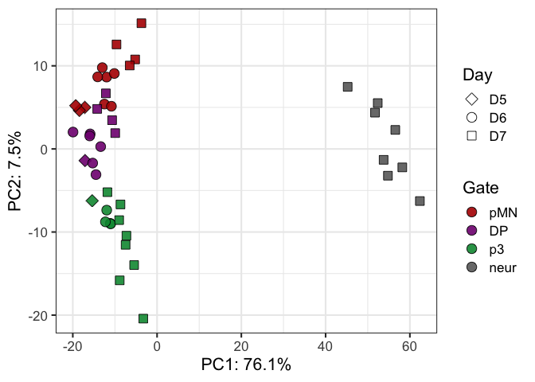
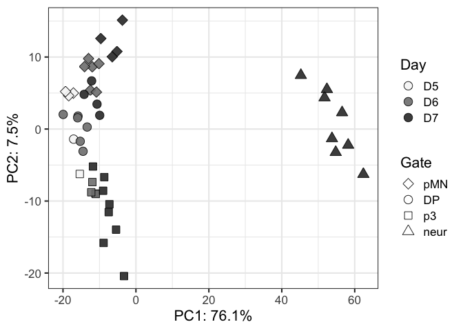
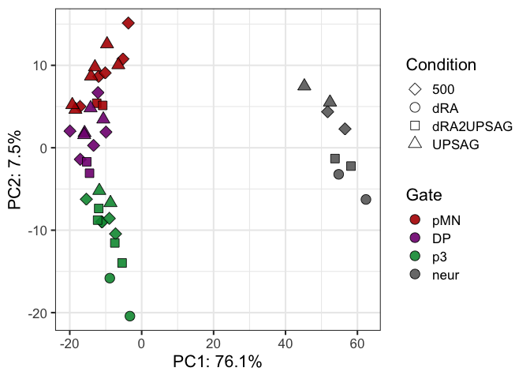
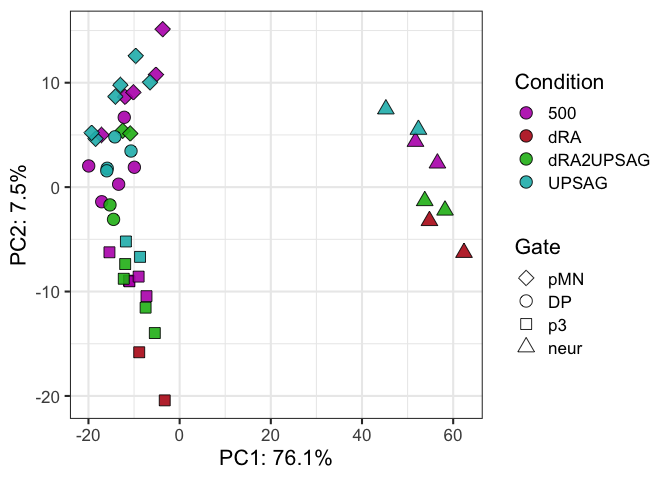
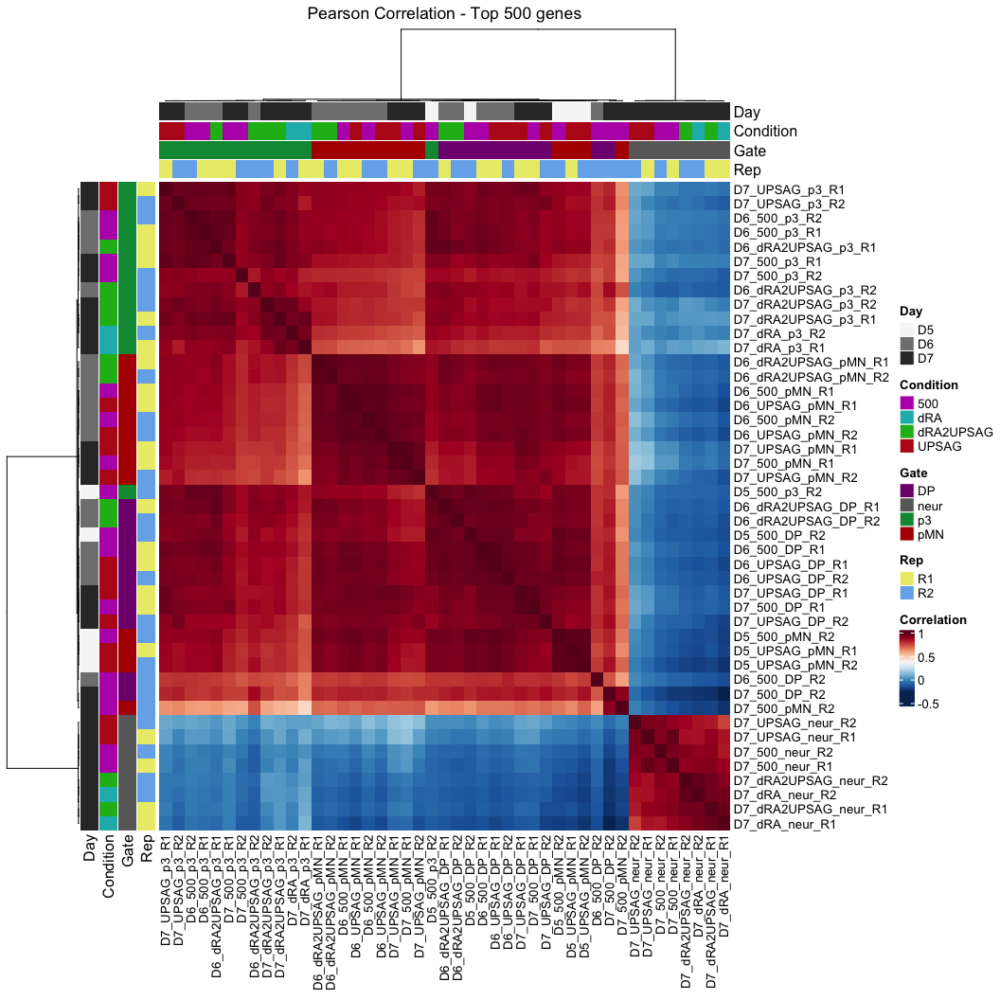
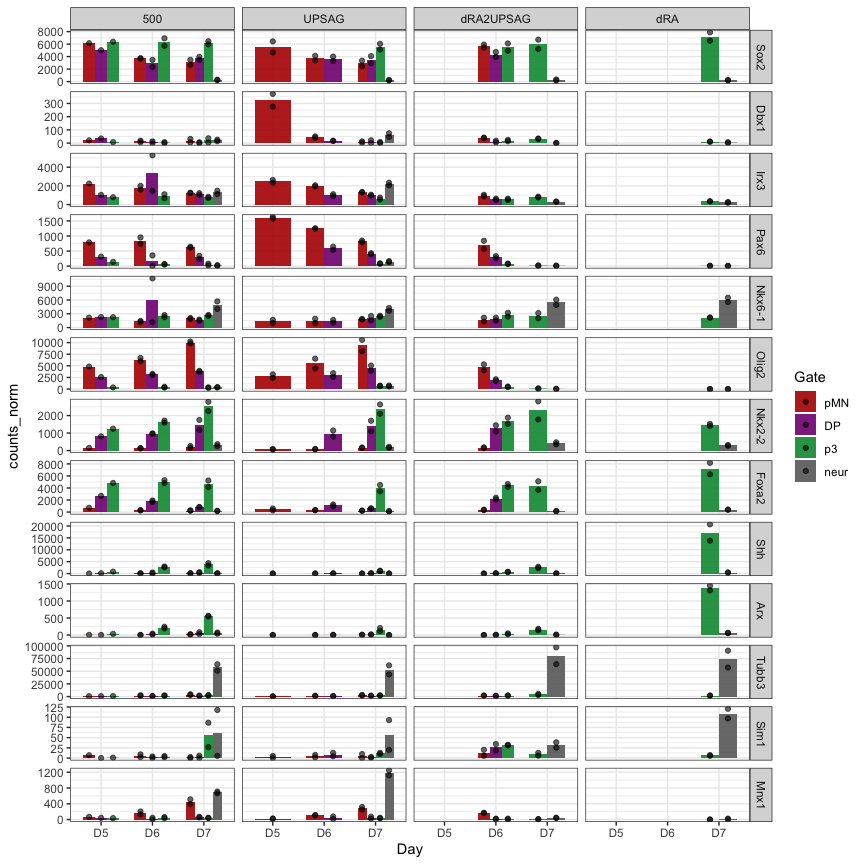

Pilot CaTS-RNA summary to share
================

## Plot PCAs

### PC1 is dominated by neurons vs progenitor

``` r
vsd_pca_plot <- vsd_pca$x %>% 
  as.data.frame %>%
  rownames_to_column("Sample") %>%
  separate(Sample,into=c("Day","Condition","Gate","Rep"), sep="_", remove=FALSE) %>%
  mutate(DayGate=factor(paste(Day,Gate,sep="_")),
         DayCondition=paste(Day,Condition),
         Experiment=paste(Condition,Rep,sep="_"),
         Gate=factor(Gate, levels=sorted_gate))

ggplot(vsd_pca_plot, aes(x=PC1,y=PC2,fill=Gate,shape=Day)) +
  scale_fill_manual(values = color_gates) +
  geom_point(size=4, alpha=0.9) +
  guides(fill = guide_legend(override.aes=list(shape=21))) +
  scale_shape_manual(values = shapes4_fill_manual) +
  labs(x=paste0("PC1: ",round(var_explained[1]*100,1),"%"),
       y=paste0("PC2: ",round(var_explained[2]*100,1),"%")) +
  theme_bw(base_size=16)
```

<!-- -->

### Compared to that, even the temporal transition is quite minimal

``` r
ggplot(vsd_pca_plot, aes(x=PC1,y=PC2,fill=Day,shape=Gate)) +
  scale_fill_manual(values = colors_greys) +
  geom_point(size=4, alpha=0.9) +
  guides(fill = guide_legend(override.aes=list(shape=21))) +
  scale_shape_manual(values = shapes4_fill_manual) +
  labs(x=paste0("PC1: ",round(var_explained[1]*100,1),"%"),
       y=paste0("PC2: ",round(var_explained[2]*100,1),"%")) +
  theme_bw(base_size=16)
```

<!-- -->

### PC2 seems to be driven by the sorted Gates

- DP nicely positioned between pMN and p3. Which condition they come
  from does not seem as critical, but they are colored in the next plot.

``` r
ggplot(vsd_pca_plot, aes(x=PC1,y=PC2,fill=Gate,shape=Condition)) +
  scale_fill_manual(values = color_gates) +
  geom_point(size=4, alpha=0.9) +
  guides(fill = guide_legend(override.aes=list(shape=21))) +
  scale_shape_manual(values = shapes4_fill_manual) +
  labs(x=paste0("PC1: ",round(var_explained[1]*100,1),"%"),
       y=paste0("PC2: ",round(var_explained[2]*100,1),"%")) +
  theme_bw(base_size=16)
```

<!-- -->

### Colored by condition

Maybe downRA is a bit more different than the rest.

``` r
ggplot(vsd_pca_plot, aes(x=PC1,y=PC2,fill=Condition,shape=Gate)) +
  scale_fill_manual(values = colors_conditions) +
  geom_point(size=4, alpha=0.9) +
  guides(fill = guide_legend(override.aes=list(shape=21))) +
  scale_shape_manual(values = shapes4_fill_manual) +
  labs(x=paste0("PC1: ",round(var_explained[1]*100,1),"%"),
       y=paste0("PC2: ",round(var_explained[2]*100,1),"%")) +
  theme_bw(base_size=16)
```

<!-- -->

### Maybe (only maybe) DP at later timepoints a bit more similar to pMN

``` r
ggplot(vsd_pca_plot, aes(x=PC1,y=PC2,fill=Gate,shape=Day)) +
  scale_fill_manual(values = color_gates) +
  geom_point(size=4, alpha=0.9) +
  guides(fill = guide_legend(override.aes=list(shape=21))) +
  scale_shape_manual(values = shapes4_fill_manual) +
  labs(x=paste0("PC1: ",round(var_explained[1]*100,1),"%"),
       y=paste0("PC2: ",round(var_explained[2]*100,1),"%")) +
  theme_bw(base_size=16)
```

<!-- -->

There might be some outliers in the other PCs but as you can see it’ll
be very little variance.

# Correlation Heatmaps - based on 500 top genes

Mainly cluster by sorted gate

``` r
Heatmap(cor_vsd, name="Correlation", col=hm_colors,
        cluster_columns = TRUE, cluster_rows = TRUE,
        #show_column_dend = FALSE,
        #row_dend_side = "right", column_dend_side = "bottom",
        # cluster methods for rows and columns
        clustering_distance_columns = function(x) as.dist(1 - cor(t(x))),
        clustering_method_columns = 'ward.D2',
        clustering_distance_rows = function(x) as.dist(1 - cor(t(x))),
        clustering_method_rows = 'ward.D2',
        column_dend_height = unit(2, "cm"), row_dend_width = unit(2, "cm"),
        row_names_gp = gpar(fontsize = 10),column_names_gp = gpar(fontsize = 10),
        left_annotation = heatmap_ann_row, top_annotation = heatmap_ann,
        column_title = "Pearson Correlation - Top 500 genes")
```

<!-- -->

## Export files

## Looking at some key genes: colored by condition

### p3 from dRA express floor plate markes: expected by reassuring.

### The rest of progenitors: express markers of their gate, regarless of condition of origin (500, upSAG, dRA2UPSAG)

### Neurons: UpSAG and 500 SAG are making Motor Neurons. What neurons are the other conditions making?

The exception is Dbx1 but remember that comes from having been in 0-SAG
for 1 day and we have seen those pMN take 1 day to lower the levels of
Pax6 (by flow). Dbx1 expression is consistent with their transitioning
from p0.

``` r
geneOI <- c("Sox2","Dbx1","Irx3","Pax6","Nkx6-1","Olig2","Nkx2-2","Foxa2","Shh","Arx","Tubb3","Sim1","Mnx1")


ggplot(dds_counts_plot %>% filter(geneid %in% geneOI) %>% mutate(geneid=factor(geneid, levels=geneOI)), 
       aes(x=Gate,y=counts_norm)) +
  stat_summary(aes(fill=Condition),
    fun = mean, geom="bar", alpha=0.9, width=0.7,position=position_dodge(0.7)) +
  geom_point(aes(fill=Condition), alpha=0.6, position = position_dodge(width = 0.7),color="black") +
  #geom_col(position="dodge",aes(fill=DayGate)) +
  scale_fill_manual(values=colors_conditions) +
  scale_color_manual(values=colors_conditions) +
  scale_shape_manual(values=shapes4_fill_manual) +
  facet_grid(geneid ~ Day, scales = "free_y") +
  theme_bw()
```

<!-- -->

## Now colored by gate

To spot differences in conditions or days.

### Apart from p3 from dRA being floor plate, I don’t see anything major.

``` r
ggplot(dds_counts_plot %>% filter(geneid %in% geneOI) %>% mutate(geneid=factor(geneid, levels=geneOI)), 
       aes(x=Day,y=counts_norm)) +
  stat_summary(aes(fill=Gate),
    fun = mean, geom="bar", alpha=0.9, width=0.7,position=position_dodge(0.7)) +
  geom_point(aes(fill=Gate), alpha=0.6, position = position_dodge(width = 0.7),color="black") +
  #geom_col(position="dodge",aes(fill=DayGate)) +
  scale_fill_manual(values=color_gates) +
  scale_color_manual(values=color_gates) +
  scale_shape_manual(values=shapes4_fill_manual) +
  facet_grid(geneid ~ Condition, scales = "free_y") +
  theme_bw()
```

<!-- -->

## What next?

- Differential expression: for conditions and gates with 2 replicates
- Interrogating other genes (i.e. the ones from Hynek’s human DP)

``` r
sessionInfo()
```

    ## R version 4.2.2 (2022-10-31)
    ## Platform: aarch64-apple-darwin20 (64-bit)
    ## Running under: macOS Ventura 13.2.1
    ## 
    ## Matrix products: default
    ## BLAS:   /Library/Frameworks/R.framework/Versions/4.2-arm64/Resources/lib/libRblas.0.dylib
    ## LAPACK: /Library/Frameworks/R.framework/Versions/4.2-arm64/Resources/lib/libRlapack.dylib
    ## 
    ## locale:
    ## [1] en_US.UTF-8/en_US.UTF-8/en_US.UTF-8/C/en_US.UTF-8/en_US.UTF-8
    ## 
    ## attached base packages:
    ## [1] grid      stats4    stats     graphics  grDevices utils     datasets 
    ## [8] methods   base     
    ## 
    ## other attached packages:
    ##  [1] tximport_1.26.1             ComplexHeatmap_2.15.4      
    ##  [3] lubridate_1.9.2             forcats_1.0.0              
    ##  [5] stringr_1.5.0               dplyr_1.1.2                
    ##  [7] purrr_1.0.1                 readr_2.1.4                
    ##  [9] tidyr_1.3.0                 tibble_3.2.1               
    ## [11] ggplot2_3.4.2               tidyverse_2.0.0            
    ## [13] RColorBrewer_1.1-3          DESeq2_1.38.3              
    ## [15] SummarizedExperiment_1.28.0 Biobase_2.58.0             
    ## [17] MatrixGenerics_1.10.0       matrixStats_1.0.0          
    ## [19] GenomicRanges_1.50.2        GenomeInfoDb_1.34.9        
    ## [21] IRanges_2.32.0              S4Vectors_0.36.2           
    ## [23] BiocGenerics_0.44.0        
    ## 
    ## loaded via a namespace (and not attached):
    ##  [1] bitops_1.0-7           bit64_4.0.5            doParallel_1.0.17     
    ##  [4] httr_1.4.6             tools_4.2.2            utf8_1.2.3            
    ##  [7] R6_2.5.1               DBI_1.1.3              colorspace_2.1-0      
    ## [10] GetoptLong_1.0.5       withr_2.5.0            tidyselect_1.2.0      
    ## [13] bit_4.0.5              compiler_4.2.2         cli_3.6.1             
    ## [16] Cairo_1.6-0            DelayedArray_0.24.0    labeling_0.4.2        
    ## [19] scales_1.2.1           digest_0.6.33          rmarkdown_2.22        
    ## [22] XVector_0.38.0         pkgconfig_2.0.3        htmltools_0.5.5       
    ## [25] highr_0.10             fastmap_1.1.1          rlang_1.1.1           
    ## [28] GlobalOptions_0.1.2    rstudioapi_0.14        RSQLite_2.3.1         
    ## [31] farver_2.1.1           shape_1.4.6            generics_0.1.3        
    ## [34] jsonlite_1.8.5         vroom_1.6.3            BiocParallel_1.32.6   
    ## [37] RCurl_1.98-1.12        magrittr_2.0.3         GenomeInfoDbData_1.2.9
    ## [40] Matrix_1.5-4.1         Rcpp_1.0.10            munsell_0.5.0         
    ## [43] fansi_1.0.4            lifecycle_1.0.3        stringi_1.7.12        
    ## [46] yaml_2.3.7             zlibbioc_1.44.0        blob_1.2.4            
    ## [49] parallel_4.2.2         crayon_1.5.2           lattice_0.21-8        
    ## [52] Biostrings_2.66.0      annotate_1.76.0        circlize_0.4.15       
    ## [55] hms_1.1.3              KEGGREST_1.38.0        magick_2.7.4          
    ## [58] locfit_1.5-9.8         knitr_1.43             pillar_1.9.0          
    ## [61] rjson_0.2.21           geneplotter_1.76.0     codetools_0.2-19      
    ## [64] XML_3.99-0.14          glue_1.6.2             evaluate_0.21         
    ## [67] png_0.1-8              vctrs_0.6.3            tzdb_0.4.0            
    ## [70] foreach_1.5.2          gtable_0.3.3           clue_0.3-64           
    ## [73] cachem_1.0.8           xfun_0.39              xtable_1.8-4          
    ## [76] iterators_1.0.14       AnnotationDbi_1.60.2   memoise_2.0.1         
    ## [79] cluster_2.1.4          timechange_0.2.0
