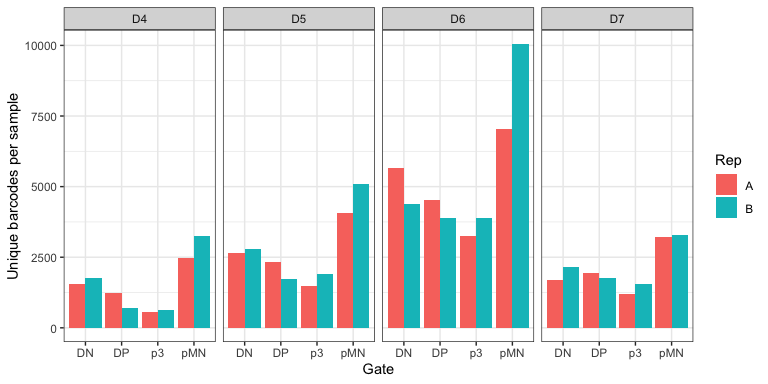
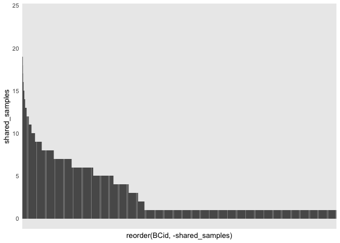
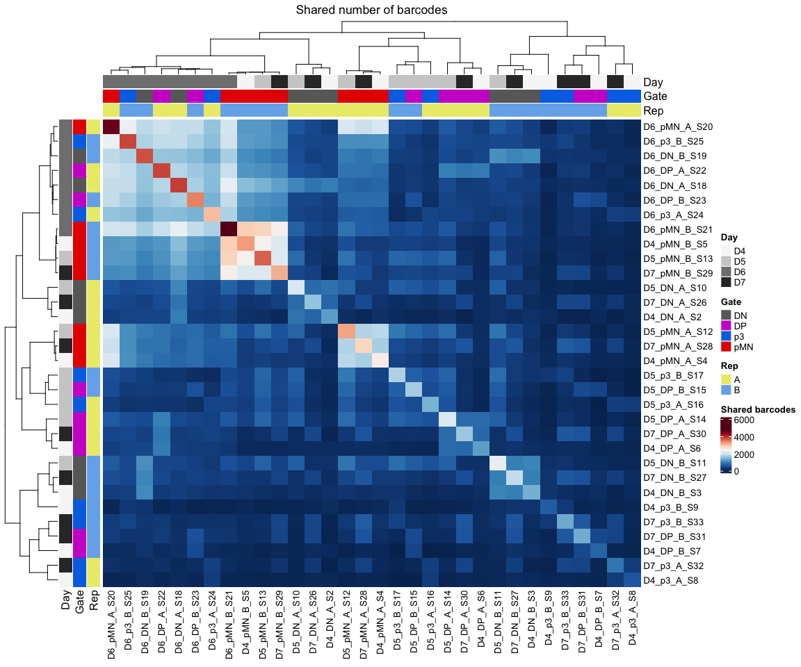
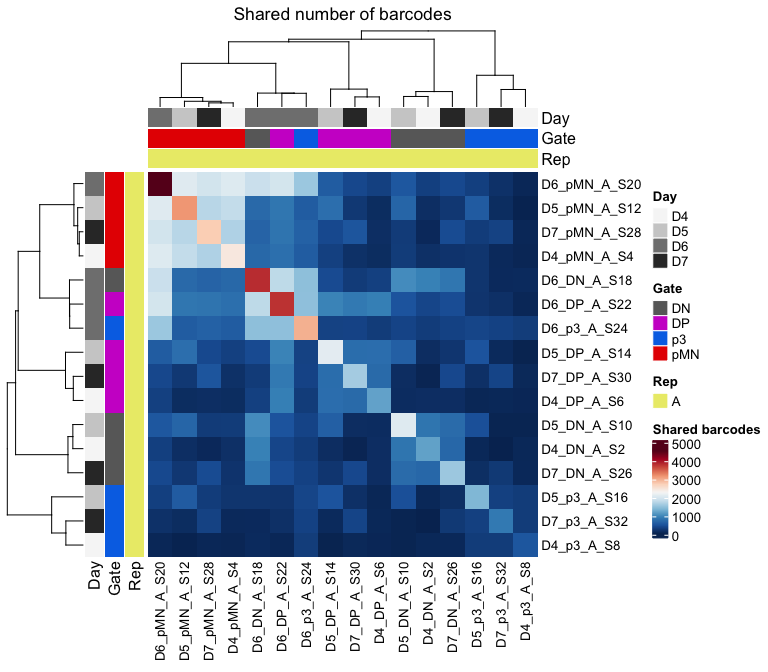
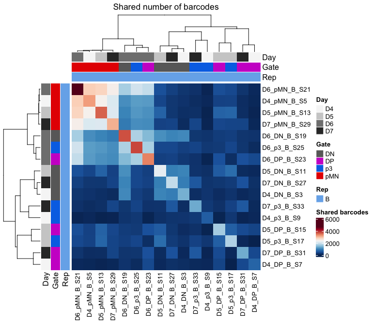
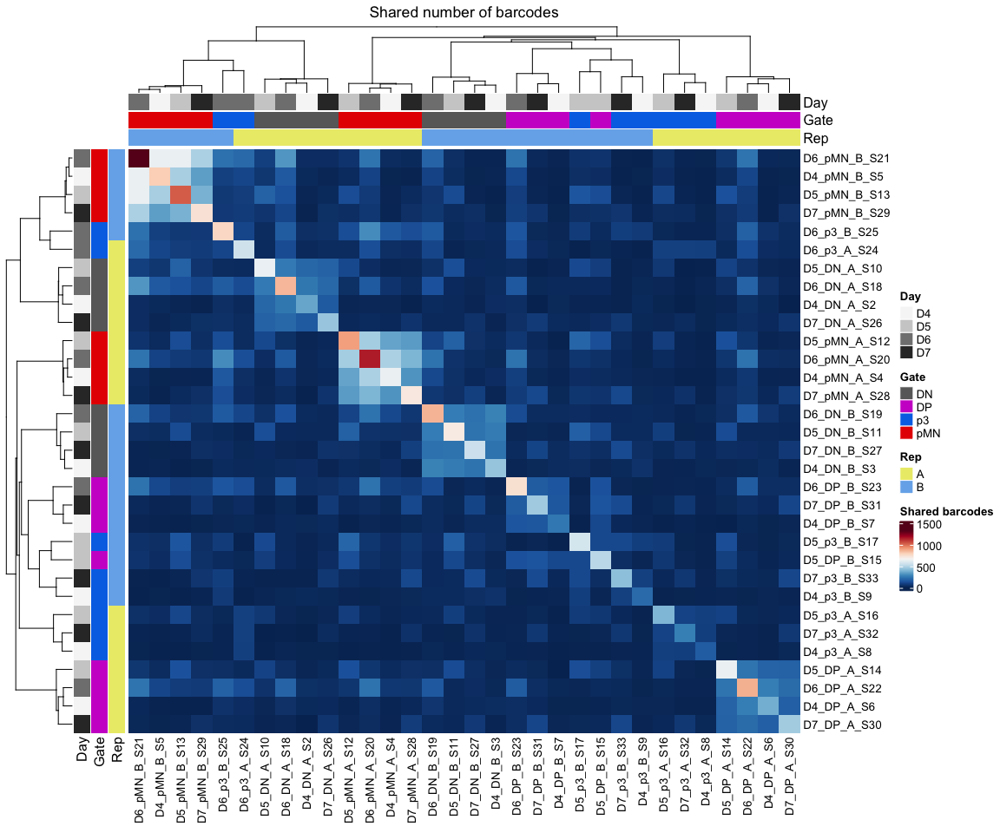

BARRY_1_230919_run
================

``` r
rm(list=ls())

library(RColorBrewer)
library(tidyverse)
library(ComplexHeatmap)
library(UpSetR)
```

# BARRY analysis

First attempt with aborted run.

### Set dirs

``` r
workingdir="~/Dropbox (The Francis Crick)/DP_cisReg/"
subworkinput="input_BARRY_1"
```

## Colors and shapes

Before more plotting, let’s get some metadata organised

``` r
sorted_gate <- c("pMN","DP","p3","DN")

shapes4_manual = c(18,15,16,17) # these are block
shapes5_manual = c(25,21,22,23,24) # these are filled
shapes4_fill_manual = c(23,21,22,24)
 

color_gates <- c("#e60000","#cd00cd","#0073e6","#696969")

# for Days
colors_greys <- c("#f6f6f6","#808080","#333333")
```

### import data

``` r
barry_data <- lapply(list.files(path=paste0(workingdir,subworkinput),pattern=".*.fastq.gz.txt", full.names=TRUE),function(x) {
  data <- read.csv(x,header=F,stringsAsFactors=F) %>% as.data.frame()
  data$sample <- gsub(paste0("/Users/delasj/Dropbox \\(The Francis Crick\\)/DP_cisReg/",subworkinput,"/"),"", x)
  data$sample <- gsub("_R1_001.fastq.gz.txt","",data$sample)
  #data <- data %>% column_to_rownames(sample)
  data
})
```

    ## Warning in read.table(file = file, header = header, sep = sep, quote = quote, :
    ## incomplete final line found by readTableHeader on '/Users/delasj/Dropbox (The
    ## Francis Crick)/DP_cisReg/input_BARRY_1/D4_DN_A_S2_R1_001.fastq.gz.txt'

    ## Warning in read.table(file = file, header = header, sep = sep, quote = quote, :
    ## incomplete final line found by readTableHeader on '/Users/delasj/Dropbox (The
    ## Francis Crick)/DP_cisReg/input_BARRY_1/D4_DN_B_S3_R1_001.fastq.gz.txt'

    ## Warning in read.table(file = file, header = header, sep = sep, quote = quote, :
    ## incomplete final line found by readTableHeader on '/Users/delasj/Dropbox (The
    ## Francis Crick)/DP_cisReg/input_BARRY_1/D4_DP_A_S6_R1_001.fastq.gz.txt'

    ## Warning in read.table(file = file, header = header, sep = sep, quote = quote, :
    ## incomplete final line found by readTableHeader on '/Users/delasj/Dropbox (The
    ## Francis Crick)/DP_cisReg/input_BARRY_1/D4_DP_B_S7_R1_001.fastq.gz.txt'

    ## Warning in read.table(file = file, header = header, sep = sep, quote = quote, :
    ## incomplete final line found by readTableHeader on '/Users/delasj/Dropbox (The
    ## Francis Crick)/DP_cisReg/input_BARRY_1/D4_p3_A_S8_R1_001.fastq.gz.txt'

    ## Warning in read.table(file = file, header = header, sep = sep, quote = quote, :
    ## incomplete final line found by readTableHeader on '/Users/delasj/Dropbox (The
    ## Francis Crick)/DP_cisReg/input_BARRY_1/D4_p3_B_S9_R1_001.fastq.gz.txt'

    ## Warning in read.table(file = file, header = header, sep = sep, quote = quote, :
    ## incomplete final line found by readTableHeader on '/Users/delasj/Dropbox (The
    ## Francis Crick)/DP_cisReg/input_BARRY_1/D4_pMN_A_S4_R1_001.fastq.gz.txt'

    ## Warning in read.table(file = file, header = header, sep = sep, quote = quote, :
    ## incomplete final line found by readTableHeader on '/Users/delasj/Dropbox (The
    ## Francis Crick)/DP_cisReg/input_BARRY_1/D4_pMN_B_S5_R1_001.fastq.gz.txt'

    ## Warning in read.table(file = file, header = header, sep = sep, quote = quote, :
    ## incomplete final line found by readTableHeader on '/Users/delasj/Dropbox (The
    ## Francis Crick)/DP_cisReg/input_BARRY_1/D5_DN_A_S10_R1_001.fastq.gz.txt'

    ## Warning in read.table(file = file, header = header, sep = sep, quote = quote, :
    ## incomplete final line found by readTableHeader on '/Users/delasj/Dropbox (The
    ## Francis Crick)/DP_cisReg/input_BARRY_1/D5_DN_B_S11_R1_001.fastq.gz.txt'

    ## Warning in read.table(file = file, header = header, sep = sep, quote = quote, :
    ## incomplete final line found by readTableHeader on '/Users/delasj/Dropbox (The
    ## Francis Crick)/DP_cisReg/input_BARRY_1/D5_DP_A_S14_R1_001.fastq.gz.txt'

    ## Warning in read.table(file = file, header = header, sep = sep, quote = quote, :
    ## incomplete final line found by readTableHeader on '/Users/delasj/Dropbox (The
    ## Francis Crick)/DP_cisReg/input_BARRY_1/D5_DP_B_S15_R1_001.fastq.gz.txt'

    ## Warning in read.table(file = file, header = header, sep = sep, quote = quote, :
    ## incomplete final line found by readTableHeader on '/Users/delasj/Dropbox (The
    ## Francis Crick)/DP_cisReg/input_BARRY_1/D5_p3_A_S16_R1_001.fastq.gz.txt'

    ## Warning in read.table(file = file, header = header, sep = sep, quote = quote, :
    ## incomplete final line found by readTableHeader on '/Users/delasj/Dropbox (The
    ## Francis Crick)/DP_cisReg/input_BARRY_1/D5_p3_B_S17_R1_001.fastq.gz.txt'

    ## Warning in read.table(file = file, header = header, sep = sep, quote = quote, :
    ## incomplete final line found by readTableHeader on '/Users/delasj/Dropbox (The
    ## Francis Crick)/DP_cisReg/input_BARRY_1/D5_pMN_A_S12_R1_001.fastq.gz.txt'

    ## Warning in read.table(file = file, header = header, sep = sep, quote = quote, :
    ## incomplete final line found by readTableHeader on '/Users/delasj/Dropbox (The
    ## Francis Crick)/DP_cisReg/input_BARRY_1/D5_pMN_B_S13_R1_001.fastq.gz.txt'

    ## Warning in read.table(file = file, header = header, sep = sep, quote = quote, :
    ## incomplete final line found by readTableHeader on '/Users/delasj/Dropbox (The
    ## Francis Crick)/DP_cisReg/input_BARRY_1/D6_DN_A_S18_R1_001.fastq.gz.txt'

    ## Warning in read.table(file = file, header = header, sep = sep, quote = quote, :
    ## incomplete final line found by readTableHeader on '/Users/delasj/Dropbox (The
    ## Francis Crick)/DP_cisReg/input_BARRY_1/D6_DN_B_S19_R1_001.fastq.gz.txt'

    ## Warning in read.table(file = file, header = header, sep = sep, quote = quote, :
    ## incomplete final line found by readTableHeader on '/Users/delasj/Dropbox (The
    ## Francis Crick)/DP_cisReg/input_BARRY_1/D6_DP_A_S22_R1_001.fastq.gz.txt'

    ## Warning in read.table(file = file, header = header, sep = sep, quote = quote, :
    ## incomplete final line found by readTableHeader on '/Users/delasj/Dropbox (The
    ## Francis Crick)/DP_cisReg/input_BARRY_1/D6_DP_B_S23_R1_001.fastq.gz.txt'

    ## Warning in read.table(file = file, header = header, sep = sep, quote = quote, :
    ## incomplete final line found by readTableHeader on '/Users/delasj/Dropbox (The
    ## Francis Crick)/DP_cisReg/input_BARRY_1/D6_p3_A_S24_R1_001.fastq.gz.txt'

    ## Warning in read.table(file = file, header = header, sep = sep, quote = quote, :
    ## incomplete final line found by readTableHeader on '/Users/delasj/Dropbox (The
    ## Francis Crick)/DP_cisReg/input_BARRY_1/D6_p3_B_S25_R1_001.fastq.gz.txt'

    ## Warning in read.table(file = file, header = header, sep = sep, quote = quote, :
    ## incomplete final line found by readTableHeader on '/Users/delasj/Dropbox (The
    ## Francis Crick)/DP_cisReg/input_BARRY_1/D6_pMN_A_S20_R1_001.fastq.gz.txt'

    ## Warning in read.table(file = file, header = header, sep = sep, quote = quote, :
    ## incomplete final line found by readTableHeader on '/Users/delasj/Dropbox (The
    ## Francis Crick)/DP_cisReg/input_BARRY_1/D6_pMN_B_S21_R1_001.fastq.gz.txt'

    ## Warning in read.table(file = file, header = header, sep = sep, quote = quote, :
    ## incomplete final line found by readTableHeader on '/Users/delasj/Dropbox (The
    ## Francis Crick)/DP_cisReg/input_BARRY_1/D7_DN_A_S26_R1_001.fastq.gz.txt'

    ## Warning in read.table(file = file, header = header, sep = sep, quote = quote, :
    ## incomplete final line found by readTableHeader on '/Users/delasj/Dropbox (The
    ## Francis Crick)/DP_cisReg/input_BARRY_1/D7_DN_B_S27_R1_001.fastq.gz.txt'

    ## Warning in read.table(file = file, header = header, sep = sep, quote = quote, :
    ## incomplete final line found by readTableHeader on '/Users/delasj/Dropbox (The
    ## Francis Crick)/DP_cisReg/input_BARRY_1/D7_DP_A_S30_R1_001.fastq.gz.txt'

    ## Warning in read.table(file = file, header = header, sep = sep, quote = quote, :
    ## incomplete final line found by readTableHeader on '/Users/delasj/Dropbox (The
    ## Francis Crick)/DP_cisReg/input_BARRY_1/D7_DP_B_S31_R1_001.fastq.gz.txt'

    ## Warning in read.table(file = file, header = header, sep = sep, quote = quote, :
    ## incomplete final line found by readTableHeader on '/Users/delasj/Dropbox (The
    ## Francis Crick)/DP_cisReg/input_BARRY_1/D7_p3_A_S32_R1_001.fastq.gz.txt'

    ## Warning in read.table(file = file, header = header, sep = sep, quote = quote, :
    ## incomplete final line found by readTableHeader on '/Users/delasj/Dropbox (The
    ## Francis Crick)/DP_cisReg/input_BARRY_1/D7_p3_B_S33_R1_001.fastq.gz.txt'

    ## Warning in read.table(file = file, header = header, sep = sep, quote = quote, :
    ## incomplete final line found by readTableHeader on '/Users/delasj/Dropbox (The
    ## Francis Crick)/DP_cisReg/input_BARRY_1/D7_pMN_A_S28_R1_001.fastq.gz.txt'

    ## Warning in read.table(file = file, header = header, sep = sep, quote = quote, :
    ## incomplete final line found by readTableHeader on '/Users/delasj/Dropbox (The
    ## Francis Crick)/DP_cisReg/input_BARRY_1/D7_pMN_B_S29_R1_001.fastq.gz.txt'

``` r
barry_results <- do.call(rbind,barry_data) %>% column_to_rownames("sample")
```

#### Convert any count \> 0 to 1

Make binary matrix for quick comparisons

``` r
# test1 <- barry_results
# test1 <- test1 %>% column_to_rownames("sample")
# test <- test1[1:3,5:15]

barry_binary <- as.matrix((barry_results>0)+0)
```

#### Some numbers

``` r
barcodes_per_sample <- rowSums(barry_binary) %>% as.data.frame() %>%
  rownames_to_column("sampleid") %>%
  separate(sampleid, into = c("Day","Gate","Rep","discard"), sep = "_", remove = FALSE) 


ggplot(barcodes_per_sample, aes(x=Gate,y=get(names(barcodes_per_sample)[6]))) +
  geom_col(aes(fill=Rep), position=position_dodge()) +
  facet_grid(~ Day) +
  ylab("Unique barcodes per sample") +
  theme_bw()
```

<!-- -->

``` r
#test_binary <- barry_binary[1:4,5:35]

barcodes_shared <- colSums(barry_binary) %>% as.data.frame() %>% 
  rownames_to_column("BCid")

colnames(barcodes_shared) <- c("BCid","shared_samples")

ggplot(barcodes_shared, aes(x=reorder(BCid,-shared_samples), y=shared_samples)) +
  geom_col() + 
  theme_minimal() +
  theme(axis.text.x=element_blank(), axis.ticks.x=element_blank())
```

<!-- -->

Product of matrix by t(matrix)

``` r
i <- (colSums(barry_binary, na.rm=T) > 1) # T if colSum > 1, F otherwise
binary_keepshared <- barry_binary[, i] # all the non-zero columns

binary_keepshared_matrix2 <- binary_keepshared%*%t(binary_keepshared)

# binary_keep_samplename <- binary_keepshared_matrix2[,5:20] %>% as.data.frame() %>%
#   rownames_to_column("sampleid") %>%
#   separate(sampleid, into = c("Day","Gate","Rep","discard"), sep = "_", remove = FALSE)
```

``` r
names(color_gates) <- sorted_gate


genecolData_first <- data.frame(Sample_ID = colnames(binary_keepshared_matrix2))

genecolData_first <- genecolData_first %>% 
  separate(Sample_ID,into=c("Day","Gate","Rep","discard"), sep="_", remove=FALSE) 

genecolData_first <- as.data.frame(unclass(genecolData_first))


phen_data <- genecolData_first %>%
  select(c("Sample_ID","Day","Gate","Rep")) %>%
  remove_rownames() %>%
  column_to_rownames("Sample_ID")
ann_color_JD <- list(Gate=color_gates, 
    Day = c(D4="#f6f6f6",D5="#cecece",D6="#808080",D7="#333333"),
  Rep = c(A="#ebeb77", B="#77b1eb"))


# Build the annotation for the complex heatmap
heatmap_ann_row <- rowAnnotation(df=phen_data, col=ann_color_JD)
heatmap_ann <- HeatmapAnnotation(df=phen_data, col=ann_color_JD, show_legend = FALSE)


# Annotated heatmap with selected colors
hm_colors = colorRampPalette(rev(brewer.pal(n = 11, name = "RdBu")))(100)


Heatmap(binary_keepshared_matrix2, name="Shared barcodes", col=hm_colors,
        cluster_columns = TRUE, cluster_rows = TRUE,
        #show_column_dend = FALSE,
        #row_dend_side = "right", column_dend_side = "bottom",
        # cluster methods for rows and columns
        clustering_distance_columns = function(x) as.dist(1 - cor(t(x))),
        clustering_method_columns = 'ward.D2',
        clustering_distance_rows = function(x) as.dist(1 - cor(t(x))),
        clustering_method_rows = 'ward.D2',
        column_dend_height = unit(2, "cm"), row_dend_width = unit(2, "cm"),
        row_names_gp = gpar(fontsize = 10),column_names_gp = gpar(fontsize = 10),
        left_annotation = heatmap_ann_row, top_annotation = heatmap_ann,
        column_title = "Shared number of barcodes")
```

<!-- -->

## For now repeat this with separeted replicates

``` r
binary_keep_repA <- binary_keepshared %>% as.data.frame() %>%
  rownames_to_column("sampleid") %>%
  separate(sampleid, into = c("Day","Gate","Rep","discard"), sep = "_", remove = FALSE) %>%
  filter(Rep=="A") %>%
  select(!c("Day","Gate","Rep","discard")) %>%
  column_to_rownames("sampleid") %>%
  as.matrix()

binary_keep_repB <- binary_keepshared %>% as.data.frame() %>%
  rownames_to_column("sampleid") %>%
  separate(sampleid, into = c("Day","Gate","Rep","discard"), sep = "_", remove = FALSE) %>%
  filter(Rep=="B") %>%
  select(!c("Day","Gate","Rep","discard")) %>%
  column_to_rownames("sampleid") %>%
  as.matrix()


binary_keepshared_matrixA <- binary_keep_repA%*%t(binary_keep_repA)
binary_keepshared_matrixB <- binary_keep_repB%*%t(binary_keep_repB)
```

``` r
names(color_gates) <- sorted_gate


genecolData_first <- data.frame(Sample_ID = colnames(binary_keepshared_matrixA))

genecolData_first <- genecolData_first %>% 
  separate(Sample_ID,into=c("Day","Gate","Rep","discard"), sep="_", remove=FALSE) 

genecolData_first <- as.data.frame(unclass(genecolData_first))


phen_data <- genecolData_first %>%
  select(c("Sample_ID","Day","Gate","Rep")) %>%
  remove_rownames() %>%
  column_to_rownames("Sample_ID")
ann_color_JD <- list(Gate=color_gates,
    Day = c(D4="#f6f6f6",D5="#cecece",D6="#808080",D7="#333333"),
  Rep = c(A="#ebeb77", B="#77b1eb"))


# Build the annotation for the complex heatmap
heatmap_ann_row <- rowAnnotation(df=phen_data, col=ann_color_JD)
heatmap_ann <- HeatmapAnnotation(df=phen_data, col=ann_color_JD, show_legend = FALSE)


# Annotated heatmap with selected colors
hm_colors = colorRampPalette(rev(brewer.pal(n = 11, name = "RdBu")))(100)


Heatmap(binary_keepshared_matrixA, name="Shared barcodes", col=hm_colors,
        cluster_columns = TRUE, cluster_rows = TRUE,
        #show_column_dend = FALSE,
        #row_dend_side = "right", column_dend_side = "bottom",
        # cluster methods for rows and columns
        clustering_distance_columns = function(x) as.dist(1 - cor(t(x))),
        clustering_method_columns = 'ward.D2',
        clustering_distance_rows = function(x) as.dist(1 - cor(t(x))),
        clustering_method_rows = 'ward.D2',
        column_dend_height = unit(2, "cm"), row_dend_width = unit(2, "cm"),
        row_names_gp = gpar(fontsize = 10),column_names_gp = gpar(fontsize = 10),
        left_annotation = heatmap_ann_row, top_annotation = heatmap_ann,
        column_title = "Shared number of barcodes")
```

<!-- -->

``` r
names(color_gates) <- sorted_gate


genecolData_first <- data.frame(Sample_ID = colnames(binary_keepshared_matrixB))

genecolData_first <- genecolData_first %>% 
  separate(Sample_ID,into=c("Day","Gate","Rep","discard"), sep="_", remove=FALSE) 

genecolData_first <- as.data.frame(unclass(genecolData_first))


phen_data <- genecolData_first %>%
  select(c("Sample_ID","Day","Gate","Rep")) %>%
  remove_rownames() %>%
  column_to_rownames("Sample_ID")
ann_color_JD <- list(Gate=color_gates, 
    Day = c(D4="#f6f6f6",D5="#cecece",D6="#808080",D7="#333333"),
  Rep = c(A="#ebeb77", B="#77b1eb"))


# Build the annotation for the complex heatmap
heatmap_ann_row <- rowAnnotation(df=phen_data, col=ann_color_JD)
heatmap_ann <- HeatmapAnnotation(df=phen_data, col=ann_color_JD, show_legend = FALSE)


# Annotated heatmap with selected colors
hm_colors = colorRampPalette(rev(brewer.pal(n = 11, name = "RdBu")))(100)


Heatmap(binary_keepshared_matrixB, name="Shared barcodes", col=hm_colors,
        cluster_columns = TRUE, cluster_rows = TRUE,
        #show_column_dend = FALSE,
        #row_dend_side = "right", column_dend_side = "bottom",
        # cluster methods for rows and columns
        clustering_distance_columns = function(x) as.dist(1 - cor(t(x))),
        clustering_method_columns = 'ward.D2',
        clustering_distance_rows = function(x) as.dist(1 - cor(t(x))),
        clustering_method_rows = 'ward.D2',
        column_dend_height = unit(2, "cm"), row_dend_width = unit(2, "cm"),
        row_names_gp = gpar(fontsize = 10),column_names_gp = gpar(fontsize = 10),
        left_annotation = heatmap_ann_row, top_annotation = heatmap_ann,
        column_title = "Shared number of barcodes")
```

<!-- -->

### just to try

remove barcodes shared across many populations

``` r
i <- (colSums(barry_binary, na.rm=T) > 1 & colSums(barry_binary, na.rm=T) < 6 ) # T if colSum > 1, F otherwise
binary_keepshared <- barry_binary[, i] # all the non-zero columns

binary_keepshared_matrix2 <- binary_keepshared%*%t(binary_keepshared)
```

``` r
names(color_gates) <- sorted_gate


genecolData_first <- data.frame(Sample_ID = colnames(binary_keepshared_matrix2))

genecolData_first <- genecolData_first %>% 
  separate(Sample_ID,into=c("Day","Gate","Rep","discard"), sep="_", remove=FALSE) 

genecolData_first <- as.data.frame(unclass(genecolData_first))


phen_data <- genecolData_first %>%
  select(c("Sample_ID","Day","Gate","Rep")) %>%
  remove_rownames() %>%
  column_to_rownames("Sample_ID")
ann_color_JD <- list(Gate=color_gates, 
    Day = c(D4="#f6f6f6",D5="#cecece",D6="#808080",D7="#333333"),
  Rep = c(A="#ebeb77", B="#77b1eb"))


# Build the annotation for the complex heatmap
heatmap_ann_row <- rowAnnotation(df=phen_data, col=ann_color_JD)
heatmap_ann <- HeatmapAnnotation(df=phen_data, col=ann_color_JD, show_legend = FALSE)


# Annotated heatmap with selected colors
hm_colors = colorRampPalette(rev(brewer.pal(n = 11, name = "RdBu")))(100)


Heatmap(binary_keepshared_matrix2, name="Shared barcodes", col=hm_colors,
        cluster_columns = TRUE, cluster_rows = TRUE,
        #show_column_dend = FALSE,
        #row_dend_side = "right", column_dend_side = "bottom",
        # cluster methods for rows and columns
        clustering_distance_columns = function(x) as.dist(1 - cor(t(x))),
        clustering_method_columns = 'ward.D2',
        clustering_distance_rows = function(x) as.dist(1 - cor(t(x))),
        clustering_method_rows = 'ward.D2',
        column_dend_height = unit(2, "cm"), row_dend_width = unit(2, "cm"),
        row_names_gp = gpar(fontsize = 10),column_names_gp = gpar(fontsize = 10),
        left_annotation = heatmap_ann_row, top_annotation = heatmap_ann,
        column_title = "Shared number of barcodes")
```

<!-- -->

``` r
sessionInfo()
```

    ## R version 4.2.2 (2022-10-31)
    ## Platform: aarch64-apple-darwin20 (64-bit)
    ## Running under: macOS Ventura 13.2.1
    ## 
    ## Matrix products: default
    ## BLAS:   /Library/Frameworks/R.framework/Versions/4.2-arm64/Resources/lib/libRblas.0.dylib
    ## LAPACK: /Library/Frameworks/R.framework/Versions/4.2-arm64/Resources/lib/libRlapack.dylib
    ## 
    ## locale:
    ## [1] en_US.UTF-8/en_US.UTF-8/en_US.UTF-8/C/en_US.UTF-8/en_US.UTF-8
    ## 
    ## attached base packages:
    ## [1] grid      stats     graphics  grDevices utils     datasets  methods  
    ## [8] base     
    ## 
    ## other attached packages:
    ##  [1] UpSetR_1.4.0          ComplexHeatmap_2.15.4 lubridate_1.9.2      
    ##  [4] forcats_1.0.0         stringr_1.5.0         dplyr_1.1.2          
    ##  [7] purrr_1.0.1           readr_2.1.4           tidyr_1.3.0          
    ## [10] tibble_3.2.1          ggplot2_3.4.2         tidyverse_2.0.0      
    ## [13] RColorBrewer_1.1-3   
    ## 
    ## loaded via a namespace (and not attached):
    ##  [1] Rcpp_1.0.10         circlize_0.4.15     png_0.1-8          
    ##  [4] digest_0.6.33       foreach_1.5.2       utf8_1.2.3         
    ##  [7] R6_2.5.1            plyr_1.8.8          stats4_4.2.2       
    ## [10] evaluate_0.21       highr_0.10          pillar_1.9.0       
    ## [13] GlobalOptions_0.1.2 rlang_1.1.1         rstudioapi_0.14    
    ## [16] magick_2.7.4        S4Vectors_0.36.2    GetoptLong_1.0.5   
    ## [19] rmarkdown_2.22      labeling_0.4.2      munsell_0.5.0      
    ## [22] compiler_4.2.2      xfun_0.39           pkgconfig_2.0.3    
    ## [25] BiocGenerics_0.44.0 shape_1.4.6         htmltools_0.5.5    
    ## [28] tidyselect_1.2.0    gridExtra_2.3       IRanges_2.32.0     
    ## [31] codetools_0.2-19    matrixStats_1.0.0   fansi_1.0.4        
    ## [34] crayon_1.5.2        tzdb_0.4.0          withr_2.5.0        
    ## [37] gtable_0.3.3        lifecycle_1.0.3     magrittr_2.0.3     
    ## [40] scales_1.2.1        cli_3.6.1           stringi_1.7.12     
    ## [43] farver_2.1.1        doParallel_1.0.17   generics_0.1.3     
    ## [46] vctrs_0.6.3         rjson_0.2.21        iterators_1.0.14   
    ## [49] tools_4.2.2         Cairo_1.6-0         glue_1.6.2         
    ## [52] hms_1.1.3           parallel_4.2.2      fastmap_1.1.1      
    ## [55] yaml_2.3.7          timechange_0.2.0    clue_0.3-64        
    ## [58] colorspace_2.1-0    cluster_2.1.4       knitr_1.43
