R_Deseq_PCA_Heatmaps
================

# RNA analysis April 2024

Re-analysis after nf-core/rnaseq 3.5

``` r
rm(list=ls())

library(DESeq2)
library(RColorBrewer)
library(tidyverse)
library(ComplexHeatmap)
```

### Set dirs

``` r
workingdir="~/Dropbox (The Francis Crick)/DP_cisReg/"
subworkinput="inputs_CaTSATAC/"

outdir="outputs_CaTSATAC_1/"
ifelse(!dir.exists(file.path(workingdir,outdir)), dir.create(file.path(workingdir,outdir)), "Directory exists")
```

    ## [1] "Directory exists"

## Load data

``` r
count.table <- read.table(paste0(workingdir,subworkinput,"consensus_peaks.mLb.clN.featureCounts.txt"), header = TRUE, sep="\t")

# clean colnames
colnames(count.table) <- gsub(".mLb.clN.sorted.bam","",colnames(count.table))

# we do not need coordinates
count.table <- count.table %>%
  select("Geneid", starts_with("D"))


## Annotation table
ann_table <- read.table(file=paste0(workingdir,subworkinput,"consensus_peaks.mLb.clN.annotatePeaks.txt"), header=TRUE, stringsAsFactors = FALSE, sep = "\t")
colnames(ann_table)[1] <- "Peakid"


ann_table_clean <- ann_table %>% 
  select(c("Peakid","Chr","Start","End","Strand","Annotation","Distance.to.TSS","Nearest.PromoterID")) %>%
  separate(Annotation, into = "Annotation_brief", sep = " ", remove = FALSE)
```

    ## Warning: Expected 1 pieces. Additional pieces discarded in 65829 rows [1, 2, 3, 4, 5, 9,
    ## 14, 15, 16, 17, 18, 19, 20, 21, 22, 25, 26, 27, 28, 29, ...].

genes named Geneid

## qc samples - all counts

``` r
# sums.counts <- count.table %>% as.data.frame() %>%
#   gather(sampleid,counts,starts_with("D")) %>%
#   group_by(sampleid) %>%
#   summarise(totalcounts = sum(counts))
# 
# 
# ggplot(sums.counts, aes(y=sampleid, x=totalcounts)) +
#   geom_bar(stat="identity")
```

## Colors and shapes

Before more plotting, let’s get some metadata organised

``` r
sorted_gate <- c("pMN","DP","p3","neurons")
sorted_conditions <- c("500","UPSAG","dRA2UPSAG","dRA")

# sorted.DayGate <- c("D5_p1","D5_p2","D5_pM",
#                     "D7_p1","D7_p2","D7_pM",
#                     "D9_p1","D9_p2","D9_pM",
#                     "D11_p1","D11_p2","D11_pM")
# sorted.day <- c("D5","D7","D9","D11")
# sorted.dayNfia <- c("D5_NFIAn_WT","D5_NFIAn_MUT",
#                     "D7_NFIAn_WT","D7_NFIAn_MUT",
#                     "D9_NFIAn_WT","D9_NFIAp_WT","D9_NFIAn_MUT",
#                     "D11_NFIAp_WT","D11_NFIAn_MUT")
# 

# 
# nfiaStatus_order <- c("NFIAn_WT","NFIAp_WT","NFIAn_MUT")

shapes4_manual = c(18,15,16,17) # these are block
shapes5_manual = c(25,21,22,23,24) # these are filled
shapes4_fill_manual = c(23,21,22,24)
 

color_gates <- c("#e60000","#cd00cd","#0073e6","#696969")

# for Days
colors_greys <- c("#f6f6f6","#808080","#333333")

# conditions

colors_conditions <- c("#e67300","#4d9a00","#cdcd00","#0073e6")
```

## Differential analysis

``` r
count.matrix <- count.table %>%
  column_to_rownames("Geneid")


## Make metadata file for DESeq

genecolData_first <- data.frame(Sample_ID = colnames(count.matrix))

genecolData_first <- genecolData_first %>% 
  separate(Sample_ID,into=c("Day","Condition","Gate","Rep"), sep="_", remove=FALSE) 

genecolData_first <- as.data.frame(unclass(genecolData_first))


dds <- DESeqDataSetFromMatrix(countData = count.matrix,
                              colData = genecolData_first,
                              design = Condition ~ Gate)
```

    ## Warning in DESeqDataSet(se, design = design, ignoreRank): some variables in
    ## design formula are characters, converting to factors

``` r
dds <- DESeq(dds)
```

    ## estimating size factors

    ## estimating dispersions

    ## gene-wise dispersion estimates

    ## mean-dispersion relationship

    ## final dispersion estimates

    ## fitting model and testing

    ## -- replacing outliers and refitting for 8 genes
    ## -- DESeq argument 'minReplicatesForReplace' = 7 
    ## -- original counts are preserved in counts(dds)

    ## estimating dispersions

    ## fitting model and testing

``` r
vsd <- varianceStabilizingTransformation(dds,blind = FALSE)

# Export normalized tables for plotting elsewhere
dds_counts <- counts(dds, normalized = TRUE)
vsd_data <- assay(vsd)
```

Removing Outliers

## Plot PCAs

``` r
## to get more than 2 components

## to go it in the top ntop variable genes 
# calculate the variance for each gene
rv <- rowVars(vsd_data)
# select the ntop genes by variance
ntop=30000
select <- order(rv, decreasing=TRUE)[seq_len(min(ntop, length(rv)))]

#pca <- prcomp(t(assay(object)[select,]))
t_vsd <- t(vsd_data[select,])
vsd_pca <- prcomp(t_vsd, retx=TRUE, scale. = FALSE)

names(vsd_pca)
```

    ## [1] "sdev"     "rotation" "center"   "scale"    "x"

``` r
# How many PC to explain enough variance?
#summary(vsd_pca)

var_explained <-vsd_pca$sdev^2/sum(vsd_pca$sdev^2)
plot(var_explained)
```

<!-- -->

``` r
vsd_pca_plot <- vsd_pca$x %>% 
  as.data.frame %>%
  rownames_to_column("Sample") %>%
  separate(Sample,into=c("Day","Condition","Gate","Rep"), sep="_", remove=FALSE) %>%
  mutate(DayGate=factor(paste(Day,Gate,sep="_")),
         DayCondition=paste(Day,Condition),
         Experiment=paste(Condition,Rep,sep="_"),
         Gate=factor(Gate, levels=sorted_gate))
  
ggplot(vsd_pca_plot, aes(x=PC1,y=PC2,fill=Day,shape=Gate)) +
  scale_fill_manual(values = colors_greys) +
  geom_point(size=4, alpha=0.9) +
  guides(fill = guide_legend(override.aes=list(shape=21))) +
  scale_shape_manual(values = shapes4_fill_manual) +
  labs(x=paste0("PC1: ",round(var_explained[1]*100,1),"%"),
       y=paste0("PC2: ",round(var_explained[2]*100,1),"%")) +
  theme_bw(base_size=16)
```

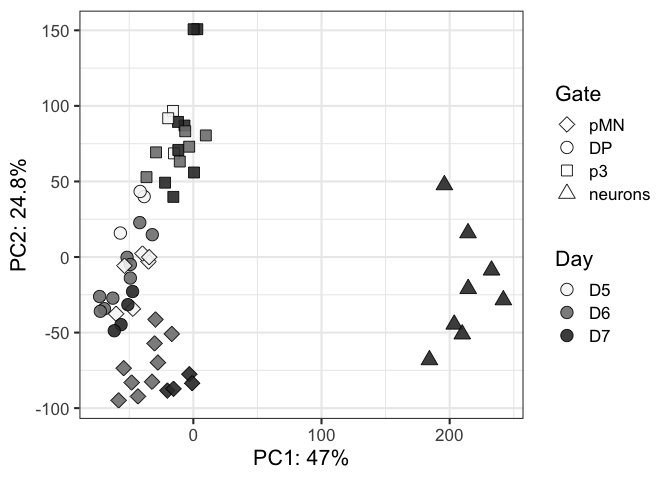<!-- -->

``` r
ggplot(vsd_pca_plot, aes(x=PC1,y=PC2,fill=Gate,shape=Day)) +
  scale_fill_manual(values = color_gates) +
  geom_point(size=4, alpha=0.9) +
  guides(fill = guide_legend(override.aes=list(shape=21))) +
  scale_shape_manual(values = shapes4_fill_manual) +
  labs(x=paste0("PC1: ",round(var_explained[1]*100,1),"%"),
       y=paste0("PC2: ",round(var_explained[2]*100,1),"%")) +
  theme_bw(base_size=16)
```

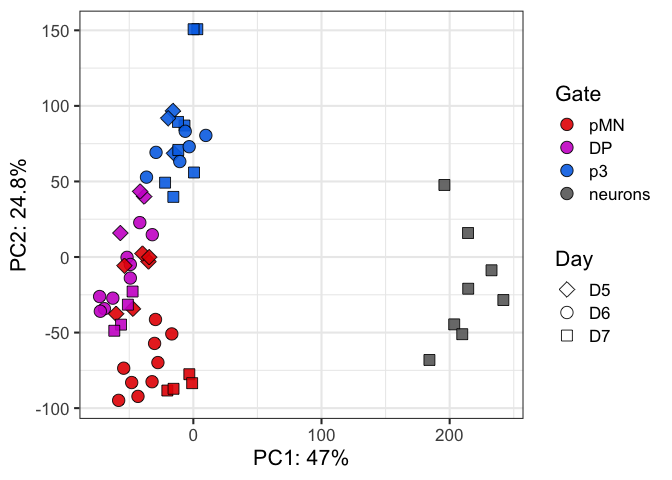<!-- -->

``` r
ggplot(vsd_pca_plot, aes(x=PC1,y=PC2,fill=Condition,shape=Gate)) +
  scale_fill_manual(values = colors_conditions) +
  geom_point(size=4, alpha=0.9) +
  guides(fill = guide_legend(override.aes=list(shape=21))) +
  scale_shape_manual(values = shapes4_fill_manual) +
  labs(x=paste0("PC1: ",round(var_explained[1]*100,1),"%"),
       y=paste0("PC2: ",round(var_explained[2]*100,1),"%")) +
  theme_bw(base_size=16)
```

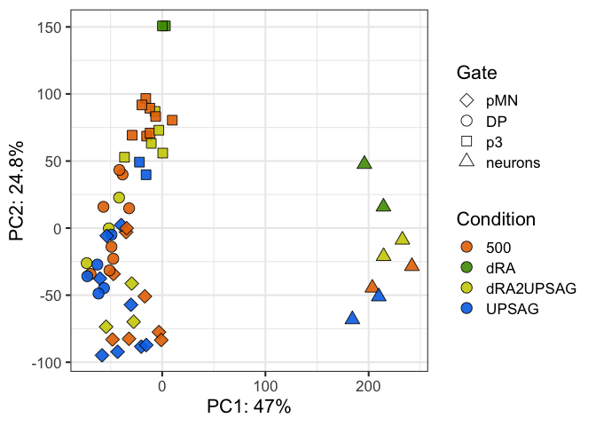<!-- -->

``` r
ggplot(vsd_pca_plot, aes(x=PC1,y=PC2,fill=Gate,shape=Condition)) +
  scale_fill_manual(values = color_gates) +
  geom_point(size=4, alpha=0.9) +
  guides(fill = guide_legend(override.aes=list(shape=21))) +
  scale_shape_manual(values = shapes4_fill_manual) +
  labs(x=paste0("PC1: ",round(var_explained[1]*100,1),"%"),
       y=paste0("PC2: ",round(var_explained[2]*100,1),"%")) +
  theme_bw(base_size=16)
```

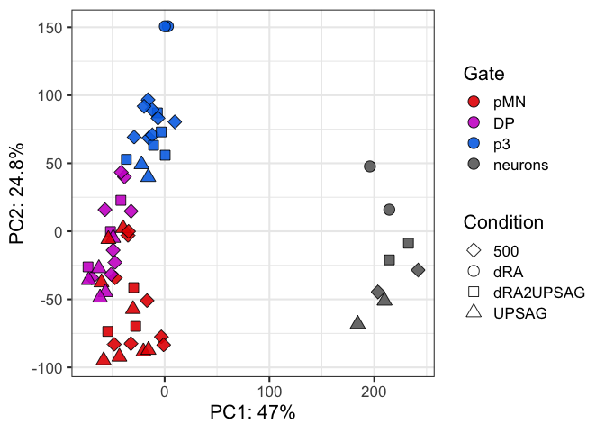<!-- -->

``` r
ggplot(vsd_pca_plot, aes(x=PC1,y=PC2,fill=DayGate,shape=Condition)) +
  geom_point(size=4, alpha=0.9) +
  guides(fill = guide_legend(override.aes=list(shape=21))) +
  scale_shape_manual(values = shapes4_fill_manual) +
  labs(x=paste0("PC1: ",round(var_explained[1]*100,1),"%"),
       y=paste0("PC2: ",round(var_explained[2]*100,1),"%")) +
  theme_bw(base_size=16)
```

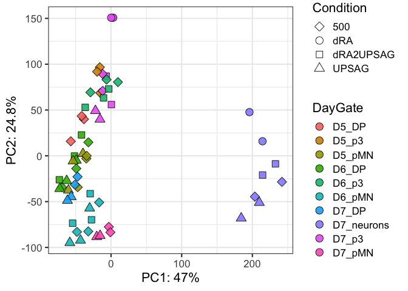<!-- -->

``` r
ggplot(vsd_pca_plot, aes(x=PC1,y=PC2,fill=DayCondition,shape=Gate)) +
  geom_point(size=4, alpha=0.9) +
  guides(fill = guide_legend(override.aes=list(shape=21))) +
  scale_shape_manual(values = shapes4_fill_manual) +
  labs(x=paste0("PC1: ",round(var_explained[1]*100,1),"%"),
       y=paste0("PC2: ",round(var_explained[2]*100,1),"%")) +
  theme_bw(base_size=16)
```

<!-- -->

``` r
ggplot(vsd_pca_plot, aes(x=PC1,y=PC2,fill=Rep,shape=Gate)) +
  #scale_fill_manual(values = color_gates) +
  geom_point(size=4, alpha=0.9) +
  guides(fill = guide_legend(override.aes=list(shape=21))) +
  scale_shape_manual(values = shapes4_fill_manual) +
  labs(x=paste0("PC1: ",round(var_explained[1]*100,1),"%"),
       y=paste0("PC2: ",round(var_explained[2]*100,1),"%")) +
  theme_bw(base_size=16)
```

<!-- -->

``` r
colorIZ <- c("#abdff4","#f1df9a","#f19aac",
             "#55bee8","#e6c444","#e64466",
            "#1a91c1","#c19e1a","#c11a3d",
            "#0e506b","#6b570e","#7c1127")
ggplot(vsd_pca_plot, aes(x=PC1,y=PC2,fill=Experiment,shape=Gate)) +
  scale_fill_manual(values = colorIZ) +
  geom_point(size=4, alpha=0.9) +
  guides(fill = guide_legend(override.aes=list(shape=21))) +
  scale_shape_manual(values = shapes4_fill_manual) +
  labs(x=paste0("PC1: ",round(var_explained[1]*100,1),"%"),
       y=paste0("PC2: ",round(var_explained[2]*100,1),"%")) +
  theme_bw(base_size=16)
```

<!-- -->

``` r
ggplot(vsd_pca_plot, aes(x=PC1,y=PC2,fill=Experiment,shape=Day)) +
  scale_fill_manual(values = colorIZ) +
  geom_point(size=4, alpha=0.9) +
  guides(fill = guide_legend(override.aes=list(shape=21))) +
  scale_shape_manual(values = shapes4_fill_manual) +
  labs(x=paste0("PC1: ",round(var_explained[1]*100,1),"%"),
       y=paste0("PC2: ",round(var_explained[2]*100,1),"%")) +
  theme_bw(base_size=16)
```

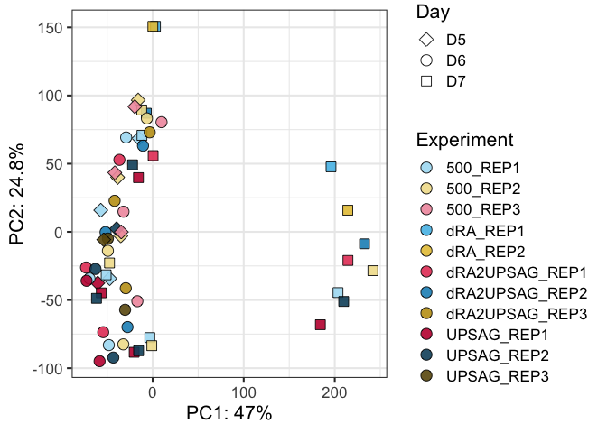<!-- -->

## Plot more components

``` r
ggplot(vsd_pca_plot, aes(x=PC1,y=PC2,fill=Gate,shape=Condition)) +
  geom_point(size=4, alpha=0.9) +
  guides(fill = guide_legend(override.aes=list(shape=21))) +
  scale_shape_manual(values = shapes4_fill_manual) +
  labs(x=paste0("PC1: ",round(var_explained[1]*100,1),"%"),
       y=paste0("PC2: ",round(var_explained[2]*100,1),"%")) +
  theme_bw(base_size=16)
```

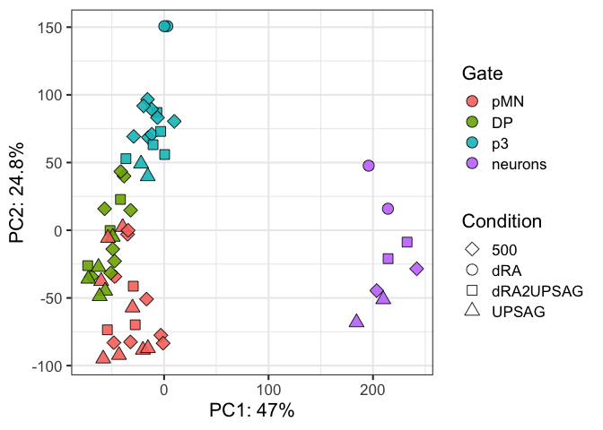<!-- -->

``` r
ggplot(vsd_pca_plot, aes(x=PC1,y=PC2,fill=Experiment,shape=Gate)) +
  scale_fill_manual(values = colorIZ) +
  geom_point(size=4, alpha=0.9) +
  guides(fill = guide_legend(override.aes=list(shape=21))) +
  scale_shape_manual(values = shapes4_fill_manual) +
  labs(x=paste0("PC1: ",round(var_explained[1]*100,1),"%"),
       y=paste0("PC2: ",round(var_explained[2]*100,1),"%")) +
  theme_bw(base_size=16)
```

<!-- -->

``` r
ggplot(vsd_pca_plot, aes(x=PC1,y=PC3,fill=Experiment,shape=Gate)) +
  scale_fill_manual(values = colorIZ) +
  geom_point(size=4, alpha=0.9) +
  guides(fill = guide_legend(override.aes=list(shape=21))) +
  scale_shape_manual(values = shapes5_manual) +
  labs(x=paste0("PC1: ",round(var_explained[1]*100,1),"%"),
       y=paste0("PC3: ",round(var_explained[3]*100,1),"%")) +
  theme_bw(base_size=16)
```

<!-- -->

``` r
# ggplot(vsd_pca_plot, aes(x=PC1,y=PC3,fill=Day,shape=Condition)) +
#   scale_fill_manual(values = colors_greys) +
#   geom_point(size=4, alpha=0.9) +
#   guides(fill = guide_legend(override.aes=list(shape=21))) +
#   scale_shape_manual(values = shapes5_manual) +
#   labs(x=paste0("PC1: ",round(var_explained[1]*100,1),"%"),
#        y=paste0("PC3: ",round(var_explained[3]*100,1),"%")) +
#   theme_bw(base_size=16)

ggplot(vsd_pca_plot, aes(x=PC2,y=PC3,fill=Experiment,shape=Gate)) +
  scale_fill_manual(values = colorIZ) +
  geom_point(size=4, alpha=0.9) +
  guides(fill = guide_legend(override.aes=list(shape=21))) +
  scale_shape_manual(values = shapes5_manual) +
  labs(x=paste0("PC2: ",round(var_explained[2]*100,1),"%"),
       y=paste0("PC3: ",round(var_explained[3]*100,1),"%")) +
  theme_bw(base_size=16)
```

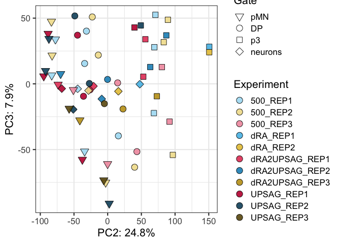<!-- -->

``` r
ggplot(vsd_pca_plot, aes(x=PC1,y=PC3,fill=Experiment,shape=Gate, label=Rep)) +
  scale_fill_manual(values = colorIZ) +
  geom_point(size=4, alpha=0.9) +
  geom_text(nudge_x = 15) +
  guides(fill = guide_legend(override.aes=list(shape=21))) +
  scale_shape_manual(values = shapes4_fill_manual) +
  labs(x=paste0("PC1: ",round(var_explained[1]*100,1),"%"),
       y=paste0("PC3: ",round(var_explained[3]*100,1),"%")) +
  theme_bw(base_size=16)
```

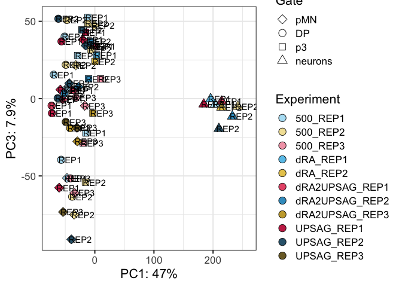<!-- -->

``` r
ggplot(vsd_pca_plot, aes(x=PC4,y=PC2,fill=Gate,shape=Day)) +
  scale_fill_manual(values = color_gates) +
  geom_point(size=4, alpha=0.9) +
  guides(fill = guide_legend(override.aes=list(shape=21))) +
  scale_shape_manual(values = shapes5_manual) +
  labs(x=paste0("PC4: ",round(var_explained[4]*100,1),"%"),
       y=paste0("PC2: ",round(var_explained[2]*100,1),"%")) +
  theme_bw(base_size=16)
```

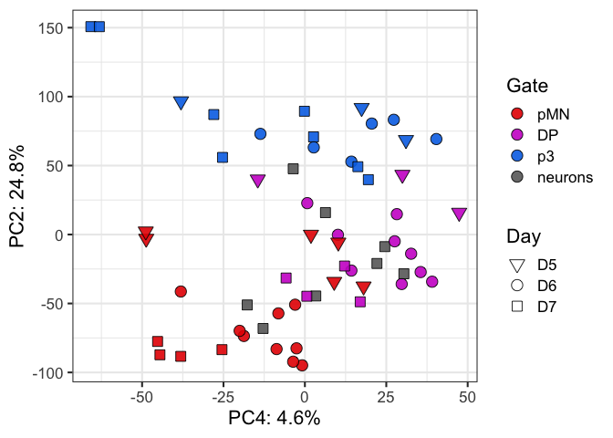<!-- -->

``` r
ggplot(vsd_pca_plot, aes(x=PC4,y=PC5,fill=Condition,shape=Day)) +
  #scale_fill_manual(values = color_gates) +
  geom_point(size=4, alpha=0.9) +
  guides(fill = guide_legend(override.aes=list(shape=21))) +
  scale_shape_manual(values = shapes4_fill_manual) +
  labs(x=paste0("PC4: ",round(var_explained[4]*100,1),"%"),
       y=paste0("PC5: ",round(var_explained[5]*100,1),"%")) +
  theme_bw(base_size=16)
```

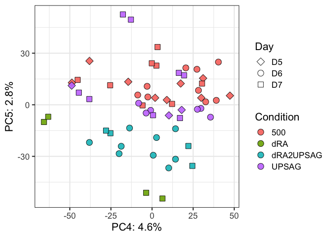<!-- -->

# Correlation Heatmaps - all elements

``` r
cor_vsd <-cor(vsd_data)

names(color_gates) <- sorted_gate
names(colors_conditions) <- sorted_conditions

phen_data <- genecolData_first %>%
  select(c("Sample_ID","Day","Condition","Gate","Rep")) %>%
  remove_rownames() %>%
  column_to_rownames("Sample_ID")
ann_color_JD <- list(Gate=color_gates, Condition=colors_conditions,
    Day = c(D5="#f6f6f6",D6="#808080",D7="#333333"),
  Rep = c(REP1="#ebeb77", REP2="#77b1eb", REP3="#EE4B2B"))


# Build the annotation for the complex heatmap
heatmap_ann_row <- rowAnnotation(df=phen_data, col=ann_color_JD)
heatmap_ann <- HeatmapAnnotation(df=phen_data, col=ann_color_JD, show_legend = FALSE)


# Annotated heatmap with selected colors
hm_colors = colorRampPalette(rev(brewer.pal(n = 11, name = "RdBu")))(100)


Heatmap(cor_vsd, name="Correlation", col=hm_colors,
        cluster_columns = TRUE, cluster_rows = TRUE,
        #show_column_dend = FALSE,
        #row_dend_side = "right", column_dend_side = "bottom",
        # cluster methods for rows and columns
        clustering_distance_columns = function(x) as.dist(1 - cor(t(x))),
        clustering_method_columns = 'ward.D2',
        clustering_distance_rows = function(x) as.dist(1 - cor(t(x))),
        clustering_method_rows = 'ward.D2',
        column_dend_height = unit(2, "cm"), row_dend_width = unit(2, "cm"),
        row_names_gp = gpar(fontsize = 10),column_names_gp = gpar(fontsize = 10),
        left_annotation = heatmap_ann_row, top_annotation = heatmap_ann,
        column_title = "Pearson Correlation - All elements")
```

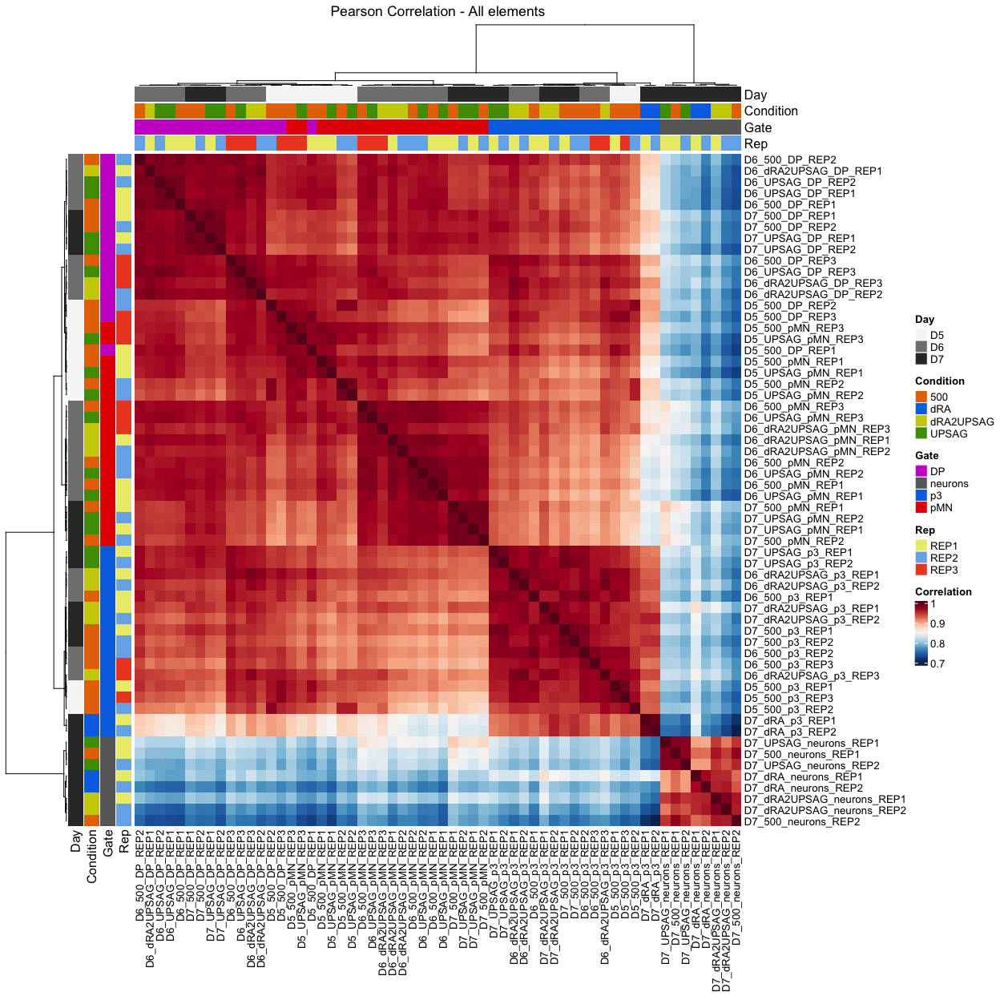<!-- -->

# Correlation Heatmaps - by genomic annotation

Merge annotation and vsd

``` r
ann_vsd <- as.data.frame(vsd_data) %>%
  rownames_to_column("Peakid") %>%
  left_join(ann_table_clean, by="Peakid")
```

Some annotation stats first

``` r
ggplot(ann_table_clean, aes(x=Annotation_brief, fill=Annotation_brief)) +
  geom_bar()
```

<!-- -->

``` r
vsd_stats <- as.data.frame(vsd_data)
vsd_stats$ave_vsd = rowMeans(vsd_data)
vsd_stats$row_var = rowVars(as.matrix(vsd_data))
```

``` r
ann_vsd_stat <- vsd_stats %>%
  rownames_to_column("Peakid") %>%
  left_join(ann_table_clean, by="Peakid")

orderVar <- order(vsd_stats$row_var, decreasing = TRUE)

#get the variation threshold for the top xx elements
threshold_var <- vsd_stats[orderVar[100000],"row_var"]

ggplot(ann_vsd_stat, aes(x=Annotation_brief, y=ave_vsd, fill=Annotation_brief)) +
  geom_violin()
```

<!-- -->

``` r
ggplot(ann_vsd_stat, aes(x=Annotation_brief, y=row_var, fill=Annotation_brief)) +
  geom_violin() +
  geom_hline(yintercept =threshold_var, linetype="dashed")
```

<!-- -->

``` r
#subset most variable for later
ann_vsd_topvar <- ann_vsd_stat %>%
  filter(row_var>threshold_var)
```

### Annotated heatmap of Intergenic

``` r
ann_vsd_Intergenic <- ann_vsd %>%
  filter(Annotation_brief=="Intergenic")

ann_vsd_Intergenic_hm <- ann_vsd_Intergenic %>%
  remove_rownames() %>%
  column_to_rownames("Peakid") %>%
  select(starts_with(c("D"))) %>%
  select(-"Distance.to.TSS")

cor_vsd_interg <- cor(ann_vsd_Intergenic_hm)

Heatmap(cor_vsd_interg, name="Correlation", col=hm_colors,
        cluster_columns = TRUE, cluster_rows = TRUE,
        #show_column_dend = FALSE,
        #row_dend_side = "right", column_dend_side = "bottom",
        clustering_distance_columns = function(x) as.dist(1 - cor(t(x))),
        clustering_method_columns = 'ward.D2',
        clustering_distance_rows = function(x) as.dist(1 - cor(t(x))),
        clustering_method_rows = 'ward.D2',
        column_dend_height = unit(2, "cm"), row_dend_width = unit(2, "cm"),
        row_names_gp = gpar(fontsize = 10),column_names_gp = gpar(fontsize = 10),
        left_annotation = heatmap_ann_row, top_annotation = heatmap_ann,
        column_title = "Pearson Correlation - Intergenic")
```

<!-- -->

## Export files

``` r
# Export normalized tables for plotting elsewhere
dds_counts <- counts(dds, normalized = TRUE)
vsd_data <- assay(vsd)

write.table(dds_counts, file = paste0(workingdir,outdir,"featurecounts.normCounts.txt"), quote = FALSE, row.names = TRUE)
write.csv(vsd_data, file = paste0(workingdir,outdir,"featurecounts.vsd.csv"), quote = FALSE)
```

# Analysis without neurons

``` r
gates=c("_pMN_","_p3_","_DP_")

sub_counts <- count.table %>% 
  as.data.frame() %>%
  dplyr::select(contains(gates))

## Make metadata file for DESeq

genecolData_first <- data.frame(Sample_ID = colnames(sub_counts))

genecolData_first <- genecolData_first %>% 
  separate(Sample_ID,into=c("Day","Condition","Gate","Rep"), sep="_", remove=FALSE) 

genecolData_first <- as.data.frame(unclass(genecolData_first))


dds <- DESeqDataSetFromMatrix(countData =  round(sub_counts),
                                  colData = genecolData_first,
                                  design = ~ Gate)
```

    ## converting counts to integer mode

    ## Warning in DESeqDataSet(se, design = design, ignoreRank): some variables in
    ## design formula are characters, converting to factors

``` r
dds <- DESeq(dds)
```

    ## estimating size factors

    ## estimating dispersions

    ## gene-wise dispersion estimates

    ## mean-dispersion relationship

    ## final dispersion estimates

    ## fitting model and testing

    ## -- replacing outliers and refitting for 19 genes
    ## -- DESeq argument 'minReplicatesForReplace' = 7 
    ## -- original counts are preserved in counts(dds)

    ## estimating dispersions

    ## fitting model and testing

``` r
vsd <- varianceStabilizingTransformation(dds,blind = FALSE)

# Export normalized tables for plotting elsewhere
dds_counts <- counts(dds, normalized = TRUE)
vsd_data <- assay(vsd)
```

## Plot PCAs

``` r
## to get more than 2 components

## to go it in the top ntop variable genes 
# calculate the variance for each gene
rv <- rowVars(vsd_data)
# select the ntop genes by variance
ntop=30000
select <- order(rv, decreasing=TRUE)[seq_len(min(ntop, length(rv)))]

#pca <- prcomp(t(assay(object)[select,]))
t_vsd <- t(vsd_data[select,])
vsd_pca <- prcomp(t_vsd, retx=TRUE, scale. = FALSE)

names(vsd_pca)
```

    ## [1] "sdev"     "rotation" "center"   "scale"    "x"

``` r
# How many PC to explain enough variance?
#summary(vsd_pca)

var_explained <-vsd_pca$sdev^2/sum(vsd_pca$sdev^2)
plot(var_explained)
```

<!-- -->

``` r
vsd_pca_plot <- vsd_pca$x %>% 
  as.data.frame %>%
  rownames_to_column("Sample") %>%
  separate(Sample,into=c("Day","Condition","Gate","Rep"), sep="_", remove=FALSE) %>%
  mutate(DayGate=factor(paste(Day,Gate,sep="_")),
         DayCondition=paste(Day,Condition),
         Experiment=paste(Condition,Rep,sep="_"),
         Gate=factor(Gate, levels=sorted_gate))
  
ggplot(vsd_pca_plot, aes(x=PC1,y=PC2,fill=Day,shape=Gate)) +
  scale_fill_manual(values = colors_greys) +
  geom_point(size=4, alpha=0.9) +
  guides(fill = guide_legend(override.aes=list(shape=21))) +
  scale_shape_manual(values = shapes4_fill_manual) +
  labs(x=paste0("PC1: ",round(var_explained[1]*100,1),"%"),
       y=paste0("PC2: ",round(var_explained[2]*100,1),"%")) +
  theme_bw(base_size=16)
```

<!-- -->

``` r
ggplot(vsd_pca_plot, aes(x=PC1,y=PC2,fill=Gate,shape=Day)) +
  scale_fill_manual(values = color_gates) +
  geom_point(size=4, alpha=0.9) +
  guides(fill = guide_legend(override.aes=list(shape=21))) +
  scale_shape_manual(values = shapes4_fill_manual) +
  labs(x=paste0("PC1: ",round(var_explained[1]*100,1),"%"),
       y=paste0("PC2: ",round(var_explained[2]*100,1),"%")) +
  theme_bw(base_size=16)
```

<!-- -->

``` r
ggplot(vsd_pca_plot, aes(x=PC1,y=PC2,fill=Condition,shape=Gate)) +
  scale_fill_manual(values = colors_conditions) +
  geom_point(size=4, alpha=0.9) +
  guides(fill = guide_legend(override.aes=list(shape=21))) +
  scale_shape_manual(values = shapes4_fill_manual) +
  labs(x=paste0("PC1: ",round(var_explained[1]*100,1),"%"),
       y=paste0("PC2: ",round(var_explained[2]*100,1),"%")) +
  theme_bw(base_size=16)
```

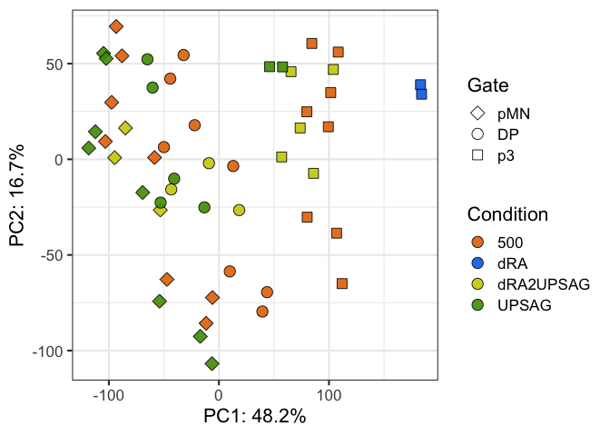<!-- -->

``` r
ggplot(vsd_pca_plot, aes(x=PC1,y=PC2,fill=Gate,shape=Condition)) +
  scale_fill_manual(values = color_gates) +
  geom_point(size=4, alpha=0.9) +
  guides(fill = guide_legend(override.aes=list(shape=21))) +
  scale_shape_manual(values = shapes4_fill_manual) +
  labs(x=paste0("PC1: ",round(var_explained[1]*100,1),"%"),
       y=paste0("PC2: ",round(var_explained[2]*100,1),"%")) +
  theme_bw(base_size=16)
```

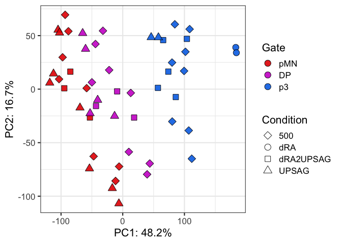<!-- -->

``` r
ggplot(vsd_pca_plot, aes(x=PC1,y=PC2,fill=DayGate,shape=Condition)) +
  geom_point(size=4, alpha=0.9) +
  guides(fill = guide_legend(override.aes=list(shape=21))) +
  scale_shape_manual(values = shapes4_fill_manual) +
  labs(x=paste0("PC1: ",round(var_explained[1]*100,1),"%"),
       y=paste0("PC2: ",round(var_explained[2]*100,1),"%")) +
  theme_bw(base_size=16)
```

<!-- -->

``` r
ggplot(vsd_pca_plot, aes(x=PC1,y=PC2,fill=DayCondition,shape=Gate)) +
  geom_point(size=4, alpha=0.9) +
  guides(fill = guide_legend(override.aes=list(shape=21))) +
  scale_shape_manual(values = shapes4_fill_manual) +
  labs(x=paste0("PC1: ",round(var_explained[1]*100,1),"%"),
       y=paste0("PC2: ",round(var_explained[2]*100,1),"%")) +
  theme_bw(base_size=16)
```

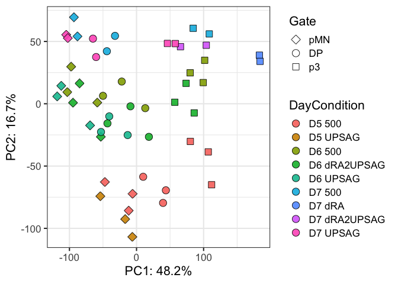<!-- -->

``` r
ggplot(vsd_pca_plot, aes(x=PC1,y=PC2,fill=Gate,shape=Rep)) +
  scale_fill_manual(values = color_gates) +
  geom_point(size=4, alpha=0.9) +
  guides(fill = guide_legend(override.aes=list(shape=21))) +
  scale_shape_manual(values = shapes4_fill_manual) +
  labs(x=paste0("PC1: ",round(var_explained[1]*100,1),"%"),
       y=paste0("PC2: ",round(var_explained[2]*100,1),"%")) +
  theme_bw(base_size=16)
```

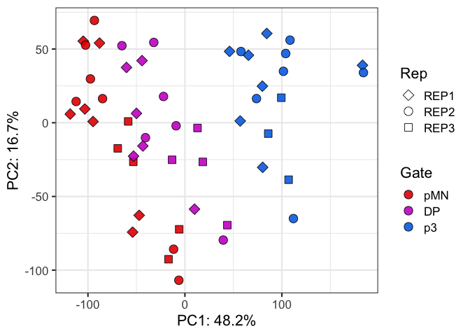<!-- -->

``` r
ggplot(vsd_pca_plot, aes(x=PC1,y=PC2,fill=Experiment,shape=Gate)) +
  #scale_fill_manual(values = color_gates) +
  geom_point(size=4, alpha=0.9) +
  guides(fill = guide_legend(override.aes=list(shape=21))) +
  scale_shape_manual(values = shapes4_fill_manual) +
  labs(x=paste0("PC1: ",round(var_explained[1]*100,1),"%"),
       y=paste0("PC2: ",round(var_explained[2]*100,1),"%")) +
  theme_bw(base_size=16)
```

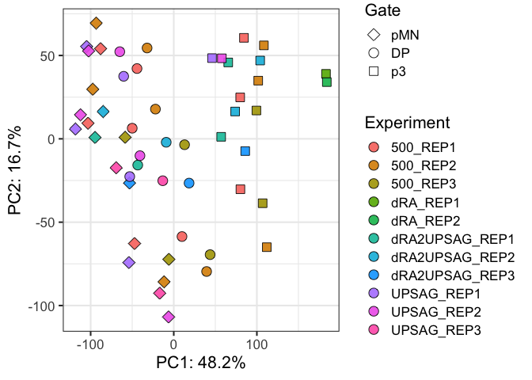<!-- -->
\## More components

``` r
ggplot(vsd_pca_plot, aes(x=PC1,y=PC2,fill=Gate,shape=Condition)) +
  geom_point(size=4, alpha=0.9) +
  guides(fill = guide_legend(override.aes=list(shape=21))) +
  scale_shape_manual(values = shapes4_fill_manual) +
  labs(x=paste0("PC1: ",round(var_explained[1]*100,1),"%"),
       y=paste0("PC2: ",round(var_explained[2]*100,1),"%")) +
  theme_bw(base_size=16)
```

<!-- -->

``` r
ggplot(vsd_pca_plot, aes(x=PC1,y=PC3,fill=Gate,shape=Condition)) +
  scale_fill_manual(values = color_gates) +
  geom_point(size=4, alpha=0.9) +
  guides(fill = guide_legend(override.aes=list(shape=21))) +
  scale_shape_manual(values = shapes5_manual) +
  labs(x=paste0("PC1: ",round(var_explained[1]*100,1),"%"),
       y=paste0("PC3: ",round(var_explained[3]*100,1),"%")) +
  theme_bw(base_size=16)
```

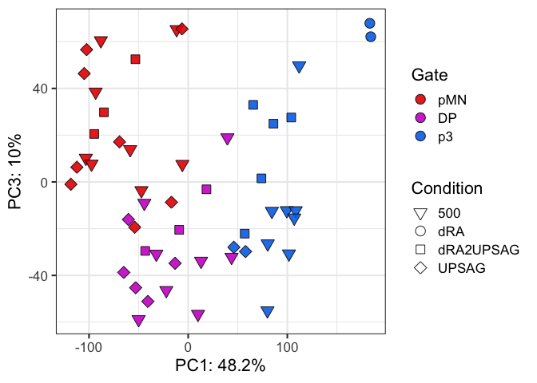<!-- -->

``` r
ggplot(vsd_pca_plot, aes(x=PC1,y=PC3,fill=Day,shape=Condition)) +
  scale_fill_manual(values = colors_greys) +
  geom_point(size=4, alpha=0.9) +
  guides(fill = guide_legend(override.aes=list(shape=21))) +
  scale_shape_manual(values = shapes5_manual) +
  labs(x=paste0("PC1: ",round(var_explained[1]*100,1),"%"),
       y=paste0("PC3: ",round(var_explained[3]*100,1),"%")) +
  theme_bw(base_size=16)
```

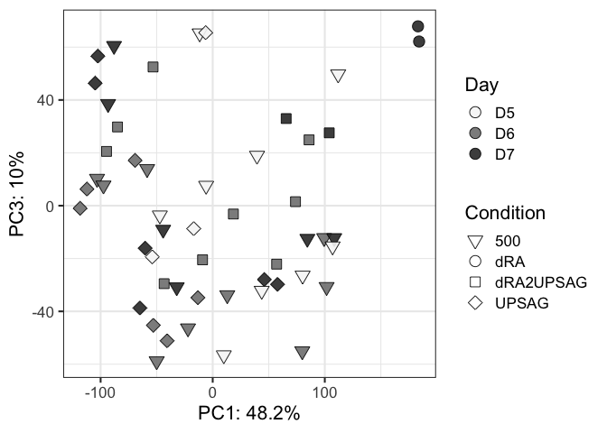<!-- -->

``` r
ggplot(vsd_pca_plot, aes(x=PC2,y=PC3,fill=Gate,shape=Condition)) +
  scale_fill_manual(values = color_gates) +
  geom_point(size=4, alpha=0.9) +
  guides(fill = guide_legend(override.aes=list(shape=21))) +
  scale_shape_manual(values = shapes5_manual) +
  labs(x=paste0("PC2: ",round(var_explained[2]*100,1),"%"),
       y=paste0("PC3: ",round(var_explained[3]*100,1),"%")) +
  theme_bw(base_size=16)
```

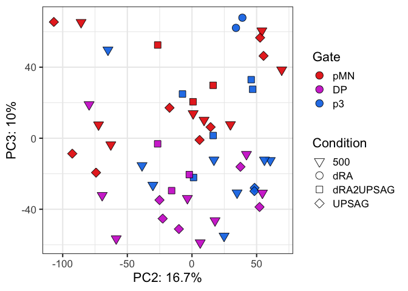<!-- -->

``` r
ggplot(vsd_pca_plot, aes(x=PC2,y=PC3,fill=Gate,shape=Condition,label=Sample)) +
  scale_fill_manual(values = color_gates) +
  geom_point(size=4, alpha=0.9) +
  geom_text(nudge_x = 10) +
  guides(fill = guide_legend(override.aes=list(shape=21))) +
  scale_shape_manual(values = shapes5_manual) +
  labs(x=paste0("PC2: ",round(var_explained[2]*100,1),"%"),
       y=paste0("PC3: ",round(var_explained[3]*100,1),"%")) +
  theme_bw(base_size=16)
```

<!-- -->

``` r
ggplot(vsd_pca_plot, aes(x=PC1,y=PC3,fill=Rep,shape=Gate, label=Condition)) +
  geom_point(size=4, alpha=0.9) +
  geom_text(nudge_x = 5) +
  guides(fill = guide_legend(override.aes=list(shape=21))) +
  scale_shape_manual(values = shapes4_fill_manual) +
  labs(x=paste0("PC1: ",round(var_explained[1]*100,1),"%"),
       y=paste0("PC3: ",round(var_explained[3]*100,1),"%")) +
  theme_bw(base_size=16)
```

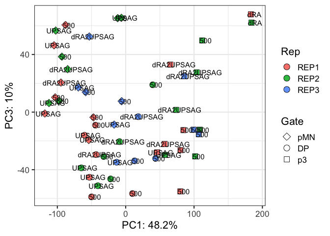<!-- -->

``` r
ggplot(vsd_pca_plot, aes(x=PC4,y=PC2,fill=Condition,shape=Day)) +
  #scale_fill_manual(values = colorIZ) +
  geom_point(size=4, alpha=0.9) +
  guides(fill = guide_legend(override.aes=list(shape=21))) +
  scale_shape_manual(values = shapes5_manual) +
  labs(x=paste0("PC4: ",round(var_explained[4]*100,1),"%"),
       y=paste0("PC2: ",round(var_explained[2]*100,1),"%")) +
  theme_bw(base_size=16)
```

<!-- -->

``` r
ggplot(vsd_pca_plot, aes(x=PC4,y=PC5,fill=DayCondition,shape=Gate, label=Gate)) +
  geom_point(size=4, alpha=0.9) +
  geom_text(nudge_x = 5) +
  guides(fill = guide_legend(override.aes=list(shape=21))) +
  scale_shape_manual(values = shapes4_fill_manual) +
  labs(x=paste0("PC4: ",round(var_explained[4]*100,1),"%"),
       y=paste0("PC5: ",round(var_explained[5]*100,1),"%")) +
  theme_bw(base_size=16)
```

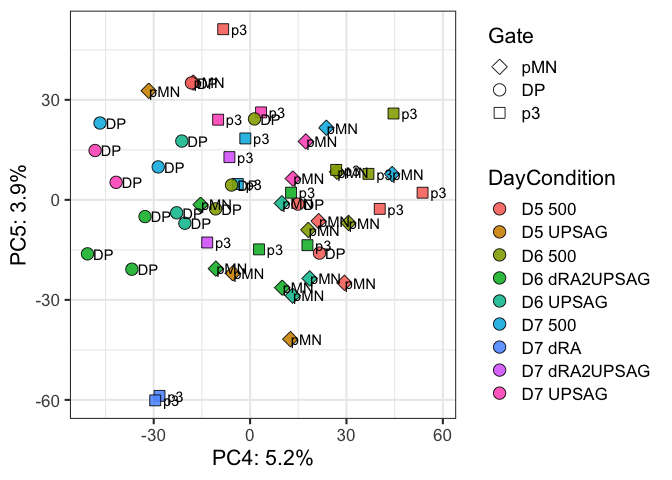<!-- -->

``` r
sessionInfo()
```

    ## R version 4.3.3 (2024-02-29)
    ## Platform: aarch64-apple-darwin20 (64-bit)
    ## Running under: macOS Sonoma 14.4.1
    ## 
    ## Matrix products: default
    ## BLAS:   /Library/Frameworks/R.framework/Versions/4.3-arm64/Resources/lib/libRblas.0.dylib 
    ## LAPACK: /Library/Frameworks/R.framework/Versions/4.3-arm64/Resources/lib/libRlapack.dylib;  LAPACK version 3.11.0
    ## 
    ## locale:
    ## [1] en_US.UTF-8/en_US.UTF-8/en_US.UTF-8/C/en_US.UTF-8/en_US.UTF-8
    ## 
    ## time zone: Europe/London
    ## tzcode source: internal
    ## 
    ## attached base packages:
    ## [1] grid      stats4    stats     graphics  grDevices utils     datasets 
    ## [8] methods   base     
    ## 
    ## other attached packages:
    ##  [1] ComplexHeatmap_2.18.0       lubridate_1.9.3            
    ##  [3] forcats_1.0.0               stringr_1.5.1              
    ##  [5] dplyr_1.1.4                 purrr_1.0.2                
    ##  [7] readr_2.1.5                 tidyr_1.3.1                
    ##  [9] tibble_3.2.1                ggplot2_3.5.0              
    ## [11] tidyverse_2.0.0             RColorBrewer_1.1-3         
    ## [13] DESeq2_1.42.1               SummarizedExperiment_1.32.0
    ## [15] Biobase_2.62.0              MatrixGenerics_1.14.0      
    ## [17] matrixStats_1.2.0           GenomicRanges_1.54.1       
    ## [19] GenomeInfoDb_1.38.8         IRanges_2.36.0             
    ## [21] S4Vectors_0.40.2            BiocGenerics_0.48.1        
    ## 
    ## loaded via a namespace (and not attached):
    ##  [1] tidyselect_1.2.1        farver_2.1.1            bitops_1.0-7           
    ##  [4] fastmap_1.1.1           RCurl_1.98-1.14         digest_0.6.35          
    ##  [7] timechange_0.3.0        lifecycle_1.0.4         cluster_2.1.6          
    ## [10] magrittr_2.0.3          compiler_4.3.3          rlang_1.1.3            
    ## [13] tools_4.3.3             utf8_1.2.4              yaml_2.3.8             
    ## [16] knitr_1.45              labeling_0.4.3          S4Arrays_1.2.1         
    ## [19] DelayedArray_0.28.0     abind_1.4-5             BiocParallel_1.36.0    
    ## [22] withr_3.0.0             fansi_1.0.6             colorspace_2.1-0       
    ## [25] scales_1.3.0            iterators_1.0.14        cli_3.6.2              
    ## [28] rmarkdown_2.26          crayon_1.5.2            generics_0.1.3         
    ## [31] rstudioapi_0.16.0       tzdb_0.4.0              rjson_0.2.21           
    ## [34] zlibbioc_1.48.2         parallel_4.3.3          XVector_0.42.0         
    ## [37] vctrs_0.6.5             Matrix_1.6-5            hms_1.1.3              
    ## [40] GetoptLong_1.0.5        clue_0.3-65             locfit_1.5-9.9         
    ## [43] foreach_1.5.2           glue_1.7.0              codetools_0.2-20       
    ## [46] stringi_1.8.3           gtable_0.3.4            shape_1.4.6.1          
    ## [49] munsell_0.5.1           pillar_1.9.0            htmltools_0.5.8        
    ## [52] GenomeInfoDbData_1.2.11 circlize_0.4.16         R6_2.5.1               
    ## [55] doParallel_1.0.17       evaluate_0.23           lattice_0.22-6         
    ## [58] highr_0.10              png_0.1-8               Rcpp_1.0.12            
    ## [61] SparseArray_1.2.4       xfun_0.43               pkgconfig_2.0.3        
    ## [64] GlobalOptions_0.1.2
