R_Deseq_PCA_Heatmaps
================

# RNA analysis April 2024

Re-analysis after nf-core/rnaseq 3.5

``` r
rm(list=ls())

library(DESeq2)
library(RColorBrewer)
library(tidyverse)
library(ComplexHeatmap)
library(tximport)
```

### Set dirs

``` r
workingdir="~/Dropbox (The Francis Crick)/DP_cisReg/"
subworkinput="inputs_CaTSRNA/"

outdir="outputs_CaTSRNA_1/"
ifelse(!dir.exists(file.path(workingdir,outdir)), dir.create(file.path(workingdir,outdir)), "Directory exists")
```

    ## [1] "Directory exists"

## Load data

I am using the output of star_salmon so the import to deseq is a bit
more complicated.

``` r
#salmon counts from pipeline, import
path_files =  list.files(paste0(workingdir,subworkinput)) 
samples = data.frame(run=path_files, stringsAsFactors = FALSE) %>%
  filter(str_detect(run, "^D"))

files <- file.path(paste0(workingdir,subworkinput), samples$run, "quant.sf")
names(files) <- samples$run
all(file.exists(files))
```

    ## [1] TRUE

``` r
#from pipeline
tx2gene = read_tsv(paste0(paste0(workingdir,subworkinput),"/salmon_tx2gene.tsv"))
```

    ## New names:
    ## Rows: 35118 Columns: 3
    ## ── Column specification
    ## ──────────────────────────────────────────────────────── Delimiter: "\t" chr
    ## (3): NM_001011874, Xkr4...2, Xkr4...3
    ## ℹ Use `spec()` to retrieve the full column specification for this data. ℹ
    ## Specify the column types or set `show_col_types = FALSE` to quiet this message.
    ## • `Xkr4` -> `Xkr4...2`
    ## • `Xkr4` -> `Xkr4...3`

``` r
txi.salmon <- tximport(files, type = "salmon", tx2gene = tx2gene)
```

    ## reading in files with read_tsv
    ## 1 2 3 4 5 6 7 8 9 10 11 12 13 14 15 16 17 18 19 20 21 22 23 24 25 26 27 28 29 30 31 32 33 34 35 36 37 38 39 40 41 42 43 44 45 46 47 48 49 50 51 52 53 54 
    ## transcripts missing from tx2gene: 1
    ## summarizing abundance
    ## summarizing counts
    ## summarizing length

``` r
#head(txi.salmon$counts)
```

genes named Geneid

## qc samples - all counts

``` r
count.table <- txi.salmon$counts


sums.counts <- count.table %>% as.data.frame() %>%
  gather(sampleid,counts,starts_with("D")) %>%
  group_by(sampleid) %>%
  summarise(totalcounts = sum(counts))


ggplot(sums.counts, aes(y=sampleid, x=totalcounts)) +
  geom_bar(stat="identity")
```

<!-- -->

## Colors and shapes

Before more plotting, let’s get some metadata organised

``` r
sorted_gate <- c("pMN","DP","p3","neurons")
sorted_conditions <- c("500","UPSAG","dRA2UPSAG","dRA")

# sorted.DayGate <- c("D5_p1","D5_p2","D5_pM",
#                     "D7_p1","D7_p2","D7_pM",
#                     "D9_p1","D9_p2","D9_pM",
#                     "D11_p1","D11_p2","D11_pM")
# sorted.day <- c("D5","D7","D9","D11")
# sorted.dayNfia <- c("D5_NFIAn_WT","D5_NFIAn_MUT",
#                     "D7_NFIAn_WT","D7_NFIAn_MUT",
#                     "D9_NFIAn_WT","D9_NFIAp_WT","D9_NFIAn_MUT",
#                     "D11_NFIAp_WT","D11_NFIAn_MUT")
# 

# 
# nfiaStatus_order <- c("NFIAn_WT","NFIAp_WT","NFIAn_MUT")

shapes4_manual = c(18,15,16,17) # these are block
shapes5_manual = c(25,21,22,23,24) # these are filled
shapes4_fill_manual = c(23,21,22,24)
 

color_gates <- c("#e60000","#cd00cd","#0073e6","#696969")

# for Days
colors_greys <- c("#f6f6f6","#808080","#333333")

# conditions

colors_conditions <- c("#e67300","#4d9a00","#cdcd00","#0073e6")
```

## Differential analysis

This normalization includes ERCC. I use it later samples don’t cluster
in any special way just with ERCC correlations.

``` r
count.matrix <- count.table

## Make metadata file for DESeq

genecolData_first <- data.frame(Sample_ID = colnames(count.matrix))

genecolData_first <- genecolData_first %>% 
  separate(Sample_ID,into=c("Day","Condition","Gate","Rep"), sep="_", remove=FALSE) 

genecolData_first <- as.data.frame(unclass(genecolData_first))


dds <- DESeqDataSetFromTximport(txi = txi.salmon,
                              colData = genecolData_first,
                              design = Condition ~ Gate)
```

    ## Warning in DESeqDataSet(se, design = design, ignoreRank): some variables in
    ## design formula are characters, converting to factors

    ## using counts and average transcript lengths from tximport

``` r
dds <- DESeq(dds)
```

    ## estimating size factors

    ## using 'avgTxLength' from assays(dds), correcting for library size

    ## estimating dispersions

    ## gene-wise dispersion estimates

    ## mean-dispersion relationship

    ## final dispersion estimates

    ## fitting model and testing

    ## -- replacing outliers and refitting for 8 genes
    ## -- DESeq argument 'minReplicatesForReplace' = 7 
    ## -- original counts are preserved in counts(dds)

    ## estimating dispersions

    ## fitting model and testing

``` r
vsd <- varianceStabilizingTransformation(dds,blind = FALSE)

# Export normalized tables for plotting elsewhere
dds_counts <- counts(dds, normalized = TRUE)
vsd_data <- assay(vsd)
```

## Plot PCAs

``` r
## to get more than 2 components

## to go it in the top ntop variable genes 
# calculate the variance for each gene
rv <- rowVars(vsd_data)
# select the ntop genes by variance
ntop=500
select <- order(rv, decreasing=TRUE)[seq_len(min(ntop, length(rv)))]

#pca <- prcomp(t(assay(object)[select,]))
t_vsd <- t(vsd_data[select,])
vsd_pca <- prcomp(t_vsd, retx=TRUE, scale. = FALSE)

names(vsd_pca)
```

    ## [1] "sdev"     "rotation" "center"   "scale"    "x"

``` r
# How many PC to explain enough variance?
#summary(vsd_pca)

var_explained <-vsd_pca$sdev^2/sum(vsd_pca$sdev^2)
plot(var_explained)
```

<!-- -->

``` r
vsd_pca_plot <- vsd_pca$x %>% 
  as.data.frame %>%
  rownames_to_column("Sample") %>%
  separate(Sample,into=c("Day","Condition","Gate","Rep"), sep="_", remove=FALSE) %>%
  mutate(DayGate=factor(paste(Day,Gate,sep="_")),
         DayCondition=paste(Day,Condition),
         Experiment=paste(Condition,Rep,sep="_"),
         Gate=factor(Gate, levels=sorted_gate))
  
ggplot(vsd_pca_plot, aes(x=PC1,y=PC2,fill=Day,shape=Gate)) +
  scale_fill_manual(values = colors_greys) +
  geom_point(size=4, alpha=0.9) +
  guides(fill = guide_legend(override.aes=list(shape=21))) +
  scale_shape_manual(values = shapes4_fill_manual) +
  labs(x=paste0("PC1: ",round(var_explained[1]*100,1),"%"),
       y=paste0("PC2: ",round(var_explained[2]*100,1),"%")) +
  theme_bw(base_size=16)
```

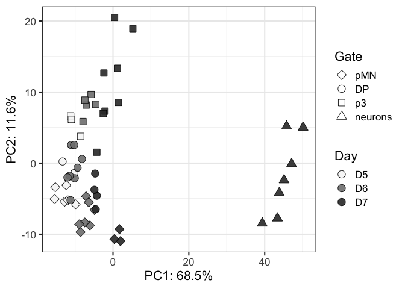<!-- -->

``` r
ggplot(vsd_pca_plot, aes(x=PC1,y=PC2,fill=Gate,shape=Day)) +
  scale_fill_manual(values = color_gates) +
  geom_point(size=4, alpha=0.9) +
  guides(fill = guide_legend(override.aes=list(shape=21))) +
  scale_shape_manual(values = shapes4_fill_manual) +
  labs(x=paste0("PC1: ",round(var_explained[1]*100,1),"%"),
       y=paste0("PC2: ",round(var_explained[2]*100,1),"%")) +
  theme_bw(base_size=16)
```

<!-- -->

``` r
ggplot(vsd_pca_plot, aes(x=PC1,y=PC2,fill=Condition,shape=Gate)) +
  scale_fill_manual(values = colors_conditions) +
  geom_point(size=4, alpha=0.9) +
  guides(fill = guide_legend(override.aes=list(shape=21))) +
  scale_shape_manual(values = shapes4_fill_manual) +
  labs(x=paste0("PC1: ",round(var_explained[1]*100,1),"%"),
       y=paste0("PC2: ",round(var_explained[2]*100,1),"%")) +
  theme_bw(base_size=16)
```

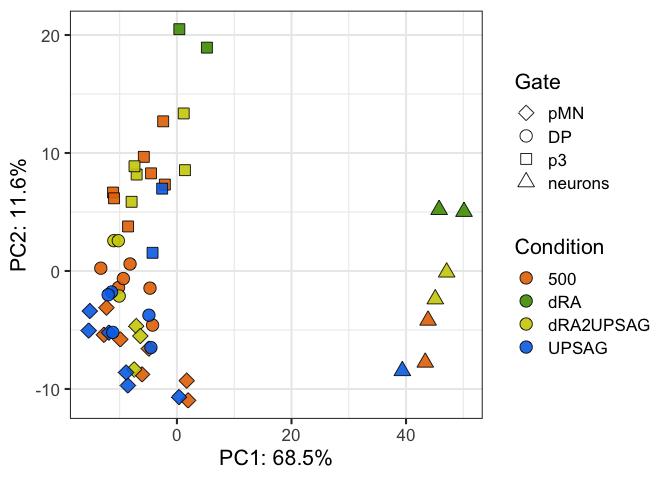<!-- -->

``` r
ggplot(vsd_pca_plot, aes(x=PC1,y=PC2,fill=Gate,shape=Condition)) +
  scale_fill_manual(values = color_gates) +
  geom_point(size=4, alpha=0.9) +
  guides(fill = guide_legend(override.aes=list(shape=21))) +
  scale_shape_manual(values = shapes4_fill_manual) +
  labs(x=paste0("PC1: ",round(var_explained[1]*100,1),"%"),
       y=paste0("PC2: ",round(var_explained[2]*100,1),"%")) +
  theme_bw(base_size=16)
```

<!-- -->

``` r
ggplot(vsd_pca_plot, aes(x=PC1,y=PC2,fill=DayGate,shape=Condition)) +
  geom_point(size=4, alpha=0.9) +
  guides(fill = guide_legend(override.aes=list(shape=21))) +
  scale_shape_manual(values = shapes4_fill_manual) +
  labs(x=paste0("PC1: ",round(var_explained[1]*100,1),"%"),
       y=paste0("PC2: ",round(var_explained[2]*100,1),"%")) +
  theme_bw(base_size=16)
```

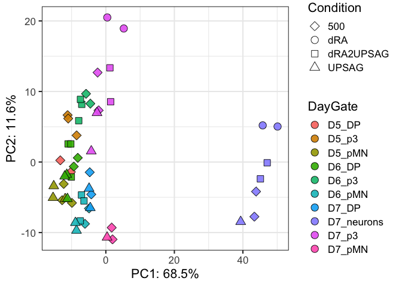<!-- -->

``` r
ggplot(vsd_pca_plot, aes(x=PC1,y=PC2,fill=DayCondition,shape=Gate)) +
  geom_point(size=4, alpha=0.9) +
  guides(fill = guide_legend(override.aes=list(shape=21))) +
  scale_shape_manual(values = shapes4_fill_manual) +
  labs(x=paste0("PC1: ",round(var_explained[1]*100,1),"%"),
       y=paste0("PC2: ",round(var_explained[2]*100,1),"%")) +
  theme_bw(base_size=16)
```

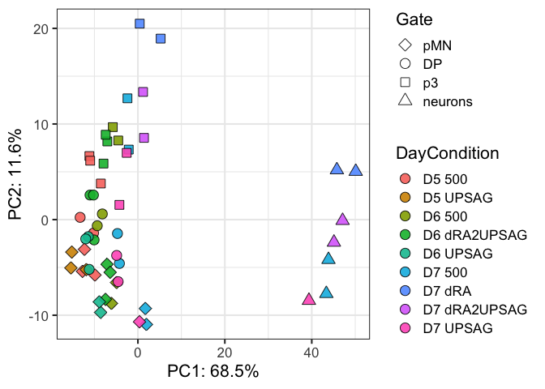<!-- -->

``` r
ggplot(vsd_pca_plot, aes(x=PC1,y=PC2,fill=Gate,shape=Rep)) +
  scale_fill_manual(values = color_gates) +
  geom_point(size=4, alpha=0.9) +
  guides(fill = guide_legend(override.aes=list(shape=21))) +
  scale_shape_manual(values = shapes4_fill_manual) +
  labs(x=paste0("PC1: ",round(var_explained[1]*100,1),"%"),
       y=paste0("PC2: ",round(var_explained[2]*100,1),"%")) +
  theme_bw(base_size=16)
```

<!-- -->

## Plot more components

``` r
ggplot(vsd_pca_plot, aes(x=PC1,y=PC2,fill=Gate,shape=Condition)) +
  geom_point(size=4, alpha=0.9) +
  guides(fill = guide_legend(override.aes=list(shape=21))) +
  scale_shape_manual(values = shapes4_fill_manual) +
  labs(x=paste0("PC1: ",round(var_explained[1]*100,1),"%"),
       y=paste0("PC2: ",round(var_explained[2]*100,1),"%")) +
  theme_bw(base_size=16)
```

<!-- -->

``` r
ggplot(vsd_pca_plot, aes(x=PC1,y=PC3,fill=Gate,shape=Condition)) +
  scale_fill_manual(values = color_gates) +
  geom_point(size=4, alpha=0.9) +
  guides(fill = guide_legend(override.aes=list(shape=21))) +
  scale_shape_manual(values = shapes5_manual) +
  labs(x=paste0("PC1: ",round(var_explained[1]*100,1),"%"),
       y=paste0("PC3: ",round(var_explained[3]*100,1),"%")) +
  theme_bw(base_size=16)
```

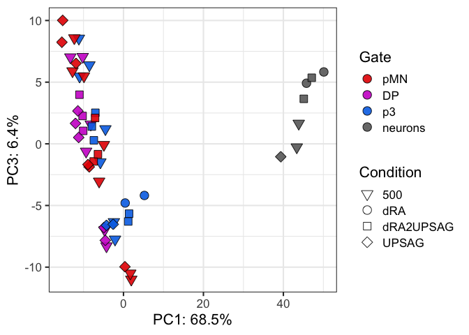<!-- -->

``` r
ggplot(vsd_pca_plot, aes(x=PC1,y=PC3,fill=Day,shape=Condition)) +
  scale_fill_manual(values = colors_greys) +
  geom_point(size=4, alpha=0.9) +
  guides(fill = guide_legend(override.aes=list(shape=21))) +
  scale_shape_manual(values = shapes5_manual) +
  labs(x=paste0("PC1: ",round(var_explained[1]*100,1),"%"),
       y=paste0("PC3: ",round(var_explained[3]*100,1),"%")) +
  theme_bw(base_size=16)
```

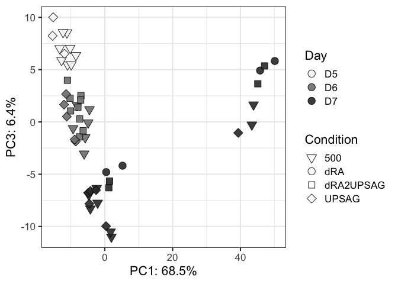<!-- -->

``` r
ggplot(vsd_pca_plot, aes(x=PC2,y=PC3,fill=Gate,shape=Condition)) +
  scale_fill_manual(values = color_gates) +
  geom_point(size=4, alpha=0.9) +
  guides(fill = guide_legend(override.aes=list(shape=21))) +
  scale_shape_manual(values = shapes5_manual) +
  labs(x=paste0("PC2: ",round(var_explained[2]*100,1),"%"),
       y=paste0("PC3: ",round(var_explained[3]*100,1),"%")) +
  theme_bw(base_size=16)
```

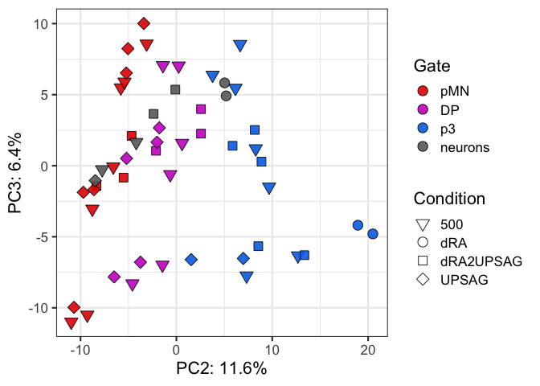<!-- -->

``` r
ggplot(vsd_pca_plot, aes(x=PC1,y=PC3,fill=Rep,shape=Gate, label=Condition)) +
  geom_point(size=4, alpha=0.9) +
  geom_text(nudge_x = 5) +
  guides(fill = guide_legend(override.aes=list(shape=21))) +
  scale_shape_manual(values = shapes4_fill_manual) +
  labs(x=paste0("PC1: ",round(var_explained[1]*100,1),"%"),
       y=paste0("PC3: ",round(var_explained[3]*100,1),"%")) +
  theme_bw(base_size=16)
```

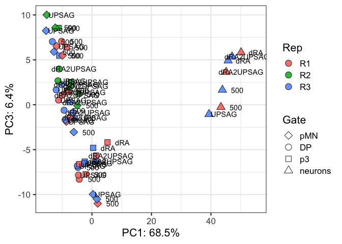<!-- -->

``` r
ggplot(vsd_pca_plot, aes(x=PC4,y=PC2,fill=Condition,shape=Day)) +
  #scale_fill_manual(values = colorIZ) +
  geom_point(size=4, alpha=0.9) +
  guides(fill = guide_legend(override.aes=list(shape=21))) +
  scale_shape_manual(values = shapes5_manual) +
  labs(x=paste0("PC4: ",round(var_explained[4]*100,1),"%"),
       y=paste0("PC2: ",round(var_explained[2]*100,1),"%")) +
  theme_bw(base_size=16)
```

<!-- -->

``` r
ggplot(vsd_pca_plot, aes(x=PC4,y=PC5,fill=DayCondition,shape=Gate, label=Gate)) +
  geom_point(size=4, alpha=0.9) +
  geom_text(nudge_x = 5) +
  guides(fill = guide_legend(override.aes=list(shape=21))) +
  scale_shape_manual(values = shapes4_fill_manual) +
  labs(x=paste0("PC4: ",round(var_explained[4]*100,1),"%"),
       y=paste0("PC5: ",round(var_explained[5]*100,1),"%")) +
  theme_bw(base_size=16)
```

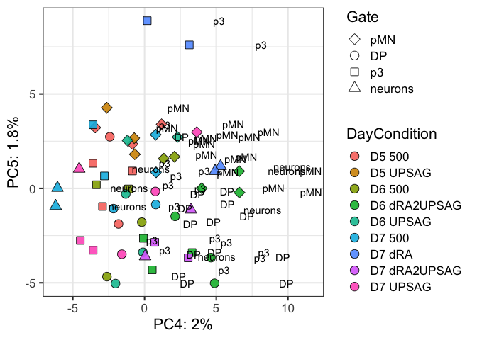<!-- -->

# Correlation Heatmaps - based on 500 top genes

## Export files

``` r
# Export normalized tables for plotting elsewhere
dds_counts <- counts(dds, normalized = TRUE)
vsd_data <- assay(vsd)

write.table(dds_counts, file = paste0(workingdir,outdir,"featurecounts.normCounts.txt"), quote = FALSE, row.names = TRUE)
write.csv(vsd_data, file = paste0(workingdir,outdir,"featurecounts.vsd.csv"), quote = FALSE)
```

## Genes to look at

``` r
dds_counts_plot <- dds_counts %>% 
  as.data.frame() %>%
  rownames_to_column("geneid") %>%
  gather(sampleid, counts_norm, starts_with("D")) %>%
  separate(sampleid,into=c("Day","Condition","Gate","Rep"), sep="_", remove=FALSE) %>%
  mutate(DayGate=factor(paste(Day,Gate,sep="_")),
         DayCondition=paste(Day,Condition),
         Gate=factor(Gate, levels=sorted_gate),
         Condition=factor(Condition, levels=sorted_conditions))
```

``` r
geneOI <- c("Sox2","Dbx1","Irx3","Pax6","Nkx6-1","Olig2","Nkx2-2","Foxa2","Shh","Arx","Tubb3","Sim1","Mnx1")


ggplot(dds_counts_plot %>% filter(geneid %in% geneOI) %>% mutate(geneid=factor(geneid, levels=geneOI)), 
       aes(x=Gate,y=counts_norm)) +
  stat_summary(aes(fill=Condition),
    fun = mean, geom="bar", alpha=0.9, width=0.7,position=position_dodge(0.7)) +
  geom_point(aes(fill=Condition), alpha=0.6, position = position_dodge(width = 0.7),color="black") +
  #geom_col(position="dodge",aes(fill=DayGate)) +
  scale_fill_manual(values=colors_conditions) +
  scale_color_manual(values=colors_conditions) +
  scale_shape_manual(values=shapes4_fill_manual) +
  facet_grid(geneid ~ Day, scales = "free_y") +
  theme_bw()
```

<!-- -->

``` r
ggplot(dds_counts_plot %>% filter(geneid %in% geneOI) %>% mutate(geneid=factor(geneid, levels=geneOI)), 
       aes(x=Day,y=counts_norm)) +
  stat_summary(aes(fill=Gate),
    fun = mean, geom="bar", alpha=0.9, width=0.7,position=position_dodge(0.7)) +
  geom_point(aes(fill=Gate), alpha=0.6, position = position_dodge(width = 0.7),color="black") +
  #geom_col(position="dodge",aes(fill=DayGate)) +
  scale_fill_manual(values=color_gates) +
  scale_color_manual(values=color_gates) +
  scale_shape_manual(values=shapes4_fill_manual) +
  facet_grid(geneid ~ Condition, scales = "free_y") +
  theme_bw()
```

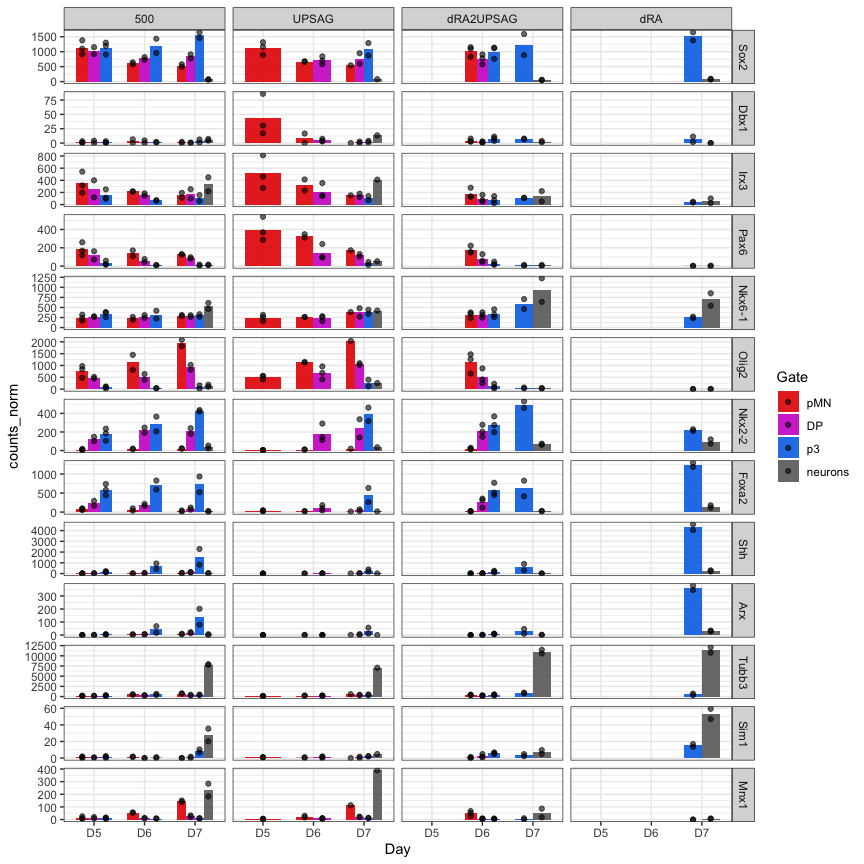<!-- -->

``` r
geneOI_2 <- c("Nkx2-9")


ggplot(dds_counts_plot %>% filter(geneid %in% geneOI_2) %>% mutate(geneid=factor(geneid, levels=geneOI_2)), 
       aes(x=Gate,y=counts_norm)) +
  stat_summary(aes(fill=Condition),
    fun = mean, geom="bar", alpha=0.9, width=0.7,position=position_dodge(0.7)) +
  geom_point(aes(fill=Condition), alpha=0.6, position = position_dodge(width = 0.7),color="black") +
  #geom_col(position="dodge",aes(fill=DayGate)) +
  scale_fill_manual(values=colors_conditions) +
  scale_color_manual(values=colors_conditions) +
  scale_shape_manual(values=shapes4_fill_manual) +
  facet_grid(geneid ~ Day, scales = "free_y") +
  theme_bw()
```

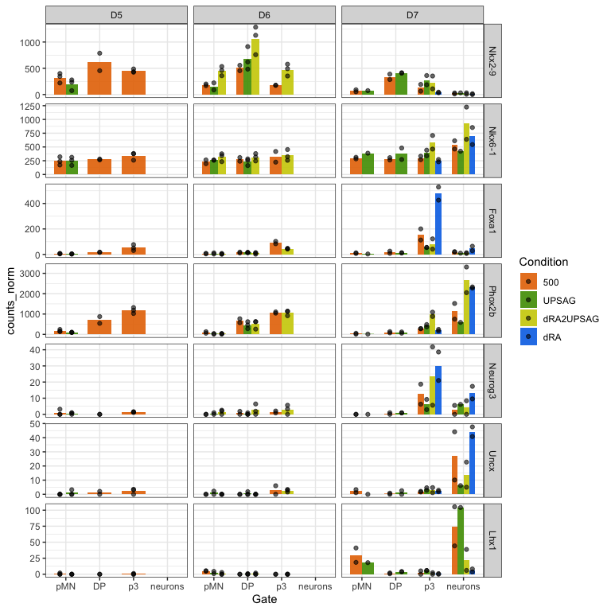<!-- -->

# RA Response Genes

``` r
geneOI_RAR <- c("Rara","Rarb","Rarg","Cyp26b1","Cyp26a1","Cyp26c1","Crabp2","Crabp1","Aldh1a2","Aldh1a1","Aldh1a3","Capn6","Nrarp","Pard6g","Mrpl41","Smu1")


ggplot(dds_counts_plot %>% filter(geneid %in% geneOI_RAR) %>% mutate(geneid=factor(geneid, levels=geneOI_RAR)), 
       aes(x=Gate,y=counts_norm)) +
  stat_summary(aes(fill=Condition),
    fun = mean, geom="bar", alpha=0.9, width=0.7,position=position_dodge(0.7)) +
  geom_point(aes(fill=Condition), alpha=0.6, position = position_dodge(width = 0.7),color="black") +
  #geom_col(position="dodge",aes(fill=DayGate)) +
  scale_fill_manual(values=colors_conditions) +
  scale_color_manual(values=colors_conditions) +
  scale_shape_manual(values=shapes4_fill_manual) +
  facet_grid(geneid ~ Day, scales = "free_y") +
  theme_bw()
```

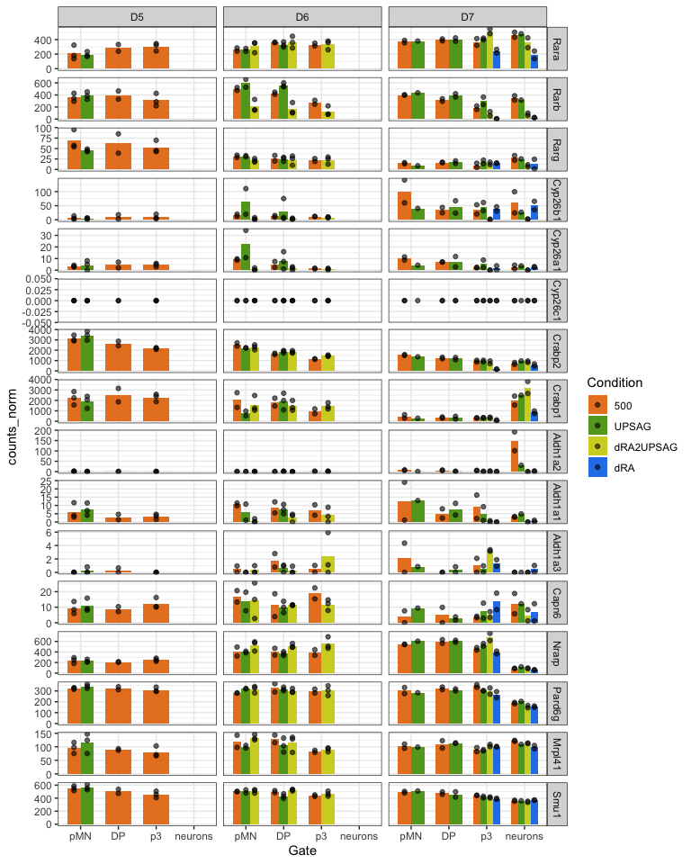<!-- -->

# Analysis without neurons

``` r
gates=c("_pMN_","_p3_","_DP_")

sub_counts <- count.table %>% 
  as.data.frame() %>%
  dplyr::select(contains(gates))

## Make metadata file for DESeq

genecolData_first <- data.frame(Sample_ID = colnames(sub_counts))

genecolData_first <- genecolData_first %>% 
  separate(Sample_ID,into=c("Day","Condition","Gate","Rep"), sep="_", remove=FALSE) 

genecolData_first <- as.data.frame(unclass(genecolData_first))


dds <- DESeqDataSetFromMatrix(countData =  round(sub_counts),
                                  colData = genecolData_first,
                                  design = ~ Gate)
```

    ## converting counts to integer mode

    ## Warning in DESeqDataSet(se, design = design, ignoreRank): some variables in
    ## design formula are characters, converting to factors

``` r
dds <- DESeq(dds)
```

    ## estimating size factors

    ## estimating dispersions

    ## gene-wise dispersion estimates

    ## mean-dispersion relationship

    ## final dispersion estimates

    ## fitting model and testing

    ## -- replacing outliers and refitting for 68 genes
    ## -- DESeq argument 'minReplicatesForReplace' = 7 
    ## -- original counts are preserved in counts(dds)

    ## estimating dispersions

    ## fitting model and testing

``` r
vsd <- varianceStabilizingTransformation(dds,blind = FALSE)

# Export normalized tables for plotting elsewhere
dds_counts <- counts(dds, normalized = TRUE)
vsd_data <- assay(vsd)
```

## Plot PCAs

``` r
## to get more than 2 components

## to go it in the top ntop variable genes 
# calculate the variance for each gene
rv <- rowVars(vsd_data)
# select the ntop genes by variance
ntop=500
select <- order(rv, decreasing=TRUE)[seq_len(min(ntop, length(rv)))]

#pca <- prcomp(t(assay(object)[select,]))
t_vsd <- t(vsd_data[select,])
vsd_pca <- prcomp(t_vsd, retx=TRUE, scale. = FALSE)

names(vsd_pca)
```

    ## [1] "sdev"     "rotation" "center"   "scale"    "x"

``` r
# How many PC to explain enough variance?
#summary(vsd_pca)

var_explained <-vsd_pca$sdev^2/sum(vsd_pca$sdev^2)
plot(var_explained)
```

<!-- -->

``` r
vsd_pca_plot <- vsd_pca$x %>% 
  as.data.frame %>%
  rownames_to_column("Sample") %>%
  separate(Sample,into=c("Day","Condition","Gate","Rep"), sep="_", remove=FALSE) %>%
  mutate(DayGate=factor(paste(Day,Gate,sep="_")),
         DayCondition=paste(Day,Condition),
         Experiment=paste(Condition,Rep,sep="_"),
         Gate=factor(Gate, levels=sorted_gate))
  
ggplot(vsd_pca_plot, aes(x=PC1,y=PC2,fill=Day,shape=Gate)) +
  scale_fill_manual(values = colors_greys) +
  geom_point(size=4, alpha=0.9) +
  guides(fill = guide_legend(override.aes=list(shape=21))) +
  scale_shape_manual(values = shapes4_fill_manual) +
  labs(x=paste0("PC1: ",round(var_explained[1]*100,1),"%"),
       y=paste0("PC2: ",round(var_explained[2]*100,1),"%")) +
  theme_bw(base_size=16)
```

<!-- -->

``` r
ggplot(vsd_pca_plot, aes(x=PC1,y=PC2,fill=Gate,shape=Day)) +
  scale_fill_manual(values = color_gates) +
  geom_point(size=4, alpha=0.9) +
  guides(fill = guide_legend(override.aes=list(shape=21))) +
  scale_shape_manual(values = shapes4_fill_manual) +
  labs(x=paste0("PC1: ",round(var_explained[1]*100,1),"%"),
       y=paste0("PC2: ",round(var_explained[2]*100,1),"%")) +
  theme_bw(base_size=16)
```

<!-- -->

``` r
ggplot(vsd_pca_plot, aes(x=PC1,y=PC2,fill=Condition,shape=Gate)) +
  scale_fill_manual(values = colors_conditions) +
  geom_point(size=4, alpha=0.9) +
  guides(fill = guide_legend(override.aes=list(shape=21))) +
  scale_shape_manual(values = shapes4_fill_manual) +
  labs(x=paste0("PC1: ",round(var_explained[1]*100,1),"%"),
       y=paste0("PC2: ",round(var_explained[2]*100,1),"%")) +
  theme_bw(base_size=16)
```

<!-- -->

``` r
ggplot(vsd_pca_plot, aes(x=PC1,y=PC2,fill=Gate,shape=Condition)) +
  scale_fill_manual(values = color_gates) +
  geom_point(size=4, alpha=0.9) +
  guides(fill = guide_legend(override.aes=list(shape=21))) +
  scale_shape_manual(values = shapes4_fill_manual) +
  labs(x=paste0("PC1: ",round(var_explained[1]*100,1),"%"),
       y=paste0("PC2: ",round(var_explained[2]*100,1),"%")) +
  theme_bw(base_size=16)
```

<!-- -->

``` r
ggplot(vsd_pca_plot, aes(x=PC1,y=PC2,fill=DayGate,shape=Condition)) +
  geom_point(size=4, alpha=0.9) +
  guides(fill = guide_legend(override.aes=list(shape=21))) +
  scale_shape_manual(values = shapes4_fill_manual) +
  labs(x=paste0("PC1: ",round(var_explained[1]*100,1),"%"),
       y=paste0("PC2: ",round(var_explained[2]*100,1),"%")) +
  theme_bw(base_size=16)
```

<!-- -->

``` r
ggplot(vsd_pca_plot, aes(x=PC1,y=PC2,fill=DayCondition,shape=Gate)) +
  geom_point(size=4, alpha=0.9) +
  guides(fill = guide_legend(override.aes=list(shape=21))) +
  scale_shape_manual(values = shapes4_fill_manual) +
  labs(x=paste0("PC1: ",round(var_explained[1]*100,1),"%"),
       y=paste0("PC2: ",round(var_explained[2]*100,1),"%")) +
  theme_bw(base_size=16)
```

<!-- -->

``` r
ggplot(vsd_pca_plot, aes(x=PC1,y=PC2,fill=Gate,shape=Rep)) +
  scale_fill_manual(values = color_gates) +
  geom_point(size=4, alpha=0.9) +
  guides(fill = guide_legend(override.aes=list(shape=21))) +
  scale_shape_manual(values = shapes4_fill_manual) +
  labs(x=paste0("PC1: ",round(var_explained[1]*100,1),"%"),
       y=paste0("PC2: ",round(var_explained[2]*100,1),"%")) +
  theme_bw(base_size=16)
```

<!-- --> \##
More components

``` r
ggplot(vsd_pca_plot, aes(x=PC1,y=PC2,fill=Gate,shape=Condition)) +
  geom_point(size=4, alpha=0.9) +
  guides(fill = guide_legend(override.aes=list(shape=21))) +
  scale_shape_manual(values = shapes4_fill_manual) +
  labs(x=paste0("PC1: ",round(var_explained[1]*100,1),"%"),
       y=paste0("PC2: ",round(var_explained[2]*100,1),"%")) +
  theme_bw(base_size=16)
```

<!-- -->

``` r
ggplot(vsd_pca_plot, aes(x=PC1,y=PC3,fill=Gate,shape=Condition)) +
  scale_fill_manual(values = color_gates) +
  geom_point(size=4, alpha=0.9) +
  guides(fill = guide_legend(override.aes=list(shape=21))) +
  scale_shape_manual(values = shapes5_manual) +
  labs(x=paste0("PC1: ",round(var_explained[1]*100,1),"%"),
       y=paste0("PC3: ",round(var_explained[3]*100,1),"%")) +
  theme_bw(base_size=16)
```

<!-- -->

``` r
ggplot(vsd_pca_plot, aes(x=PC1,y=PC3,fill=Day,shape=Condition)) +
  scale_fill_manual(values = colors_greys) +
  geom_point(size=4, alpha=0.9) +
  guides(fill = guide_legend(override.aes=list(shape=21))) +
  scale_shape_manual(values = shapes5_manual) +
  labs(x=paste0("PC1: ",round(var_explained[1]*100,1),"%"),
       y=paste0("PC3: ",round(var_explained[3]*100,1),"%")) +
  theme_bw(base_size=16)
```

<!-- -->

``` r
ggplot(vsd_pca_plot, aes(x=PC2,y=PC3,fill=Gate,shape=Condition)) +
  scale_fill_manual(values = color_gates) +
  geom_point(size=4, alpha=0.9) +
  guides(fill = guide_legend(override.aes=list(shape=21))) +
  scale_shape_manual(values = shapes5_manual) +
  labs(x=paste0("PC2: ",round(var_explained[2]*100,1),"%"),
       y=paste0("PC3: ",round(var_explained[3]*100,1),"%")) +
  theme_bw(base_size=16)
```

<!-- -->

``` r
ggplot(vsd_pca_plot, aes(x=PC2,y=PC3,fill=Gate,shape=Condition,label=Sample)) +
  scale_fill_manual(values = color_gates) +
  geom_point(size=4, alpha=0.9) +
  geom_text(nudge_x = 10) +
  guides(fill = guide_legend(override.aes=list(shape=21))) +
  scale_shape_manual(values = shapes5_manual) +
  labs(x=paste0("PC2: ",round(var_explained[2]*100,1),"%"),
       y=paste0("PC3: ",round(var_explained[3]*100,1),"%")) +
  theme_bw(base_size=16)
```

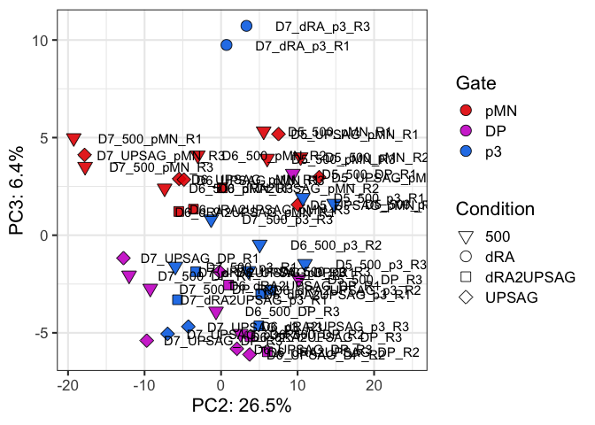<!-- -->

``` r
ggplot(vsd_pca_plot, aes(x=PC1,y=PC3,fill=Rep,shape=Gate, label=Condition)) +
  geom_point(size=4, alpha=0.9) +
  geom_text(nudge_x = 5) +
  guides(fill = guide_legend(override.aes=list(shape=21))) +
  scale_shape_manual(values = shapes4_fill_manual) +
  labs(x=paste0("PC1: ",round(var_explained[1]*100,1),"%"),
       y=paste0("PC3: ",round(var_explained[3]*100,1),"%")) +
  theme_bw(base_size=16)
```

<!-- -->

``` r
ggplot(vsd_pca_plot, aes(x=PC4,y=PC2,fill=Condition,shape=Day)) +
  #scale_fill_manual(values = colorIZ) +
  geom_point(size=4, alpha=0.9) +
  guides(fill = guide_legend(override.aes=list(shape=21))) +
  scale_shape_manual(values = shapes5_manual) +
  labs(x=paste0("PC4: ",round(var_explained[4]*100,1),"%"),
       y=paste0("PC2: ",round(var_explained[2]*100,1),"%")) +
  theme_bw(base_size=16)
```

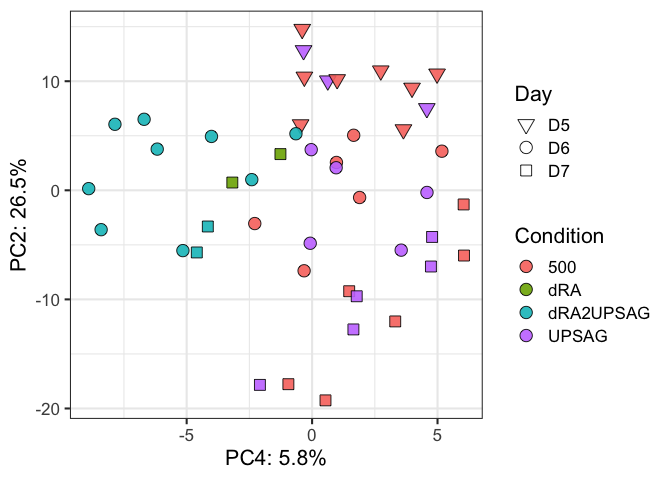<!-- -->

``` r
ggplot(vsd_pca_plot, aes(x=PC4,y=PC5,fill=DayCondition,shape=Gate, label=Gate)) +
  geom_point(size=4, alpha=0.9) +
  geom_text(nudge_x = 5) +
  guides(fill = guide_legend(override.aes=list(shape=21))) +
  scale_shape_manual(values = shapes4_fill_manual) +
  labs(x=paste0("PC4: ",round(var_explained[4]*100,1),"%"),
       y=paste0("PC5: ",round(var_explained[5]*100,1),"%")) +
  theme_bw(base_size=16)
```

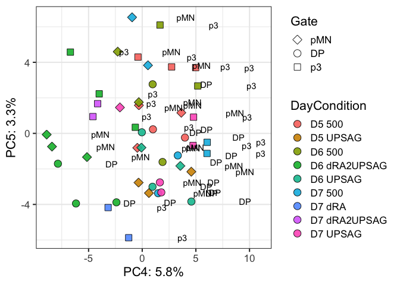<!-- -->

``` r
sessionInfo()
```

    ## R version 4.3.3 (2024-02-29)
    ## Platform: aarch64-apple-darwin20 (64-bit)
    ## Running under: macOS Sonoma 14.4.1
    ## 
    ## Matrix products: default
    ## BLAS:   /Library/Frameworks/R.framework/Versions/4.3-arm64/Resources/lib/libRblas.0.dylib 
    ## LAPACK: /Library/Frameworks/R.framework/Versions/4.3-arm64/Resources/lib/libRlapack.dylib;  LAPACK version 3.11.0
    ## 
    ## locale:
    ## [1] en_US.UTF-8/en_US.UTF-8/en_US.UTF-8/C/en_US.UTF-8/en_US.UTF-8
    ## 
    ## time zone: Europe/London
    ## tzcode source: internal
    ## 
    ## attached base packages:
    ## [1] grid      stats4    stats     graphics  grDevices utils     datasets 
    ## [8] methods   base     
    ## 
    ## other attached packages:
    ##  [1] tximport_1.30.0             ComplexHeatmap_2.18.0      
    ##  [3] lubridate_1.9.3             forcats_1.0.0              
    ##  [5] stringr_1.5.1               dplyr_1.1.4                
    ##  [7] purrr_1.0.2                 readr_2.1.5                
    ##  [9] tidyr_1.3.1                 tibble_3.2.1               
    ## [11] ggplot2_3.5.0               tidyverse_2.0.0            
    ## [13] RColorBrewer_1.1-3          DESeq2_1.42.1              
    ## [15] SummarizedExperiment_1.32.0 Biobase_2.62.0             
    ## [17] MatrixGenerics_1.14.0       matrixStats_1.2.0          
    ## [19] GenomicRanges_1.54.1        GenomeInfoDb_1.38.8        
    ## [21] IRanges_2.36.0              S4Vectors_0.40.2           
    ## [23] BiocGenerics_0.48.1        
    ## 
    ## loaded via a namespace (and not attached):
    ##  [1] tidyselect_1.2.1        farver_2.1.1            bitops_1.0-7           
    ##  [4] fastmap_1.1.1           RCurl_1.98-1.14         digest_0.6.35          
    ##  [7] timechange_0.3.0        lifecycle_1.0.4         cluster_2.1.6          
    ## [10] magrittr_2.0.3          compiler_4.3.3          rlang_1.1.3            
    ## [13] tools_4.3.3             utf8_1.2.4              yaml_2.3.8             
    ## [16] knitr_1.45              labeling_0.4.3          S4Arrays_1.2.1         
    ## [19] bit_4.0.5               DelayedArray_0.28.0     abind_1.4-5            
    ## [22] BiocParallel_1.36.0     withr_3.0.0             fansi_1.0.6            
    ## [25] colorspace_2.1-0        scales_1.3.0            iterators_1.0.14       
    ## [28] cli_3.6.2               rmarkdown_2.26          crayon_1.5.2           
    ## [31] generics_0.1.3          rstudioapi_0.16.0       tzdb_0.4.0             
    ## [34] rjson_0.2.21            zlibbioc_1.48.2         parallel_4.3.3         
    ## [37] XVector_0.42.0          vctrs_0.6.5             Matrix_1.6-5           
    ## [40] jsonlite_1.8.8          hms_1.1.3               GetoptLong_1.0.5       
    ## [43] bit64_4.0.5             clue_0.3-65             locfit_1.5-9.9         
    ## [46] foreach_1.5.2           glue_1.7.0              codetools_0.2-20       
    ## [49] stringi_1.8.3           gtable_0.3.4            shape_1.4.6.1          
    ## [52] munsell_0.5.1           pillar_1.9.0            htmltools_0.5.8        
    ## [55] GenomeInfoDbData_1.2.11 circlize_0.4.16         R6_2.5.1               
    ## [58] doParallel_1.0.17       vroom_1.6.5             evaluate_0.23          
    ## [61] lattice_0.22-6          highr_0.10              png_0.1-8              
    ## [64] Rcpp_1.0.12             SparseArray_1.2.4       xfun_0.43              
    ## [67] pkgconfig_2.0.3         GlobalOptions_0.1.2
