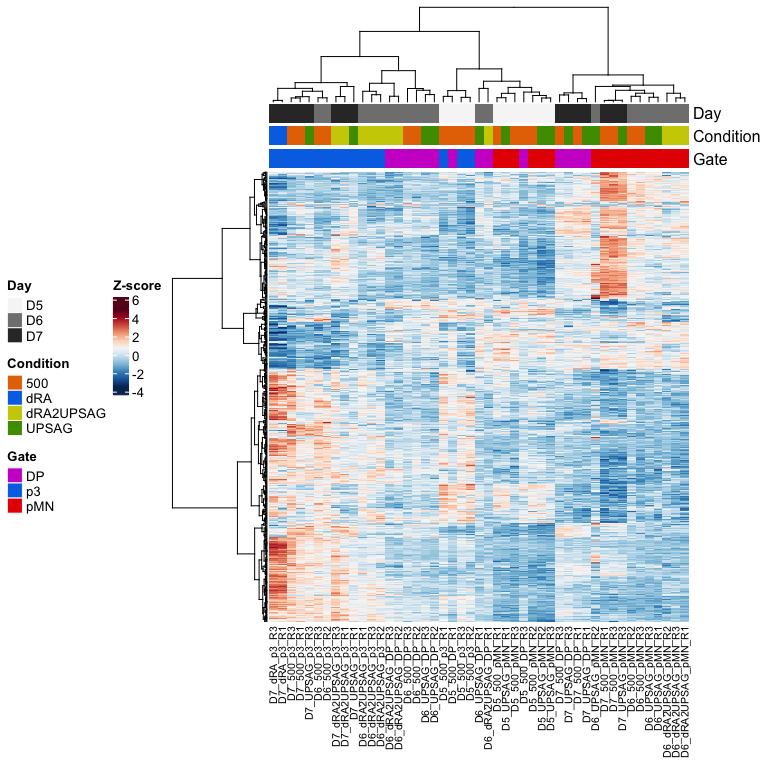
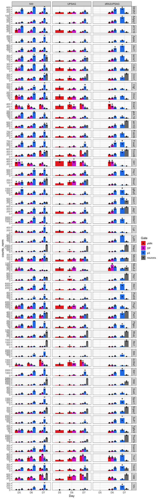
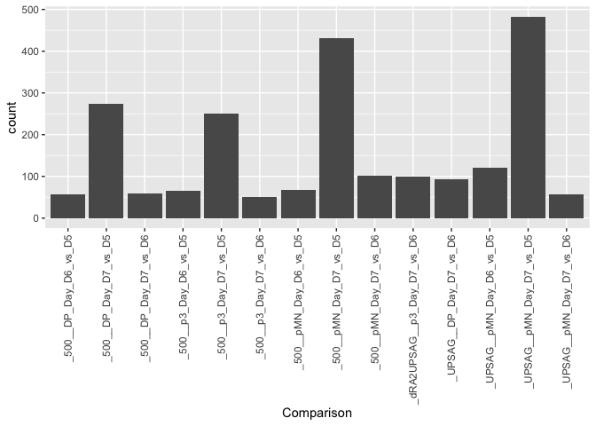
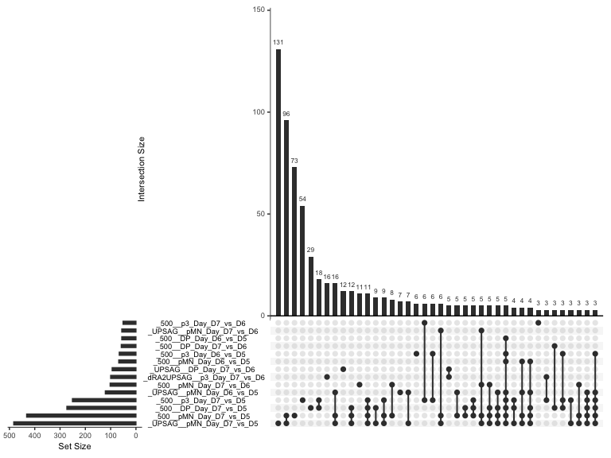
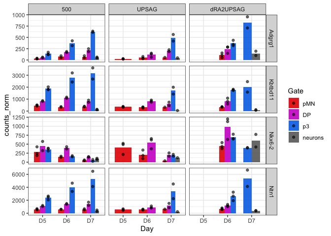
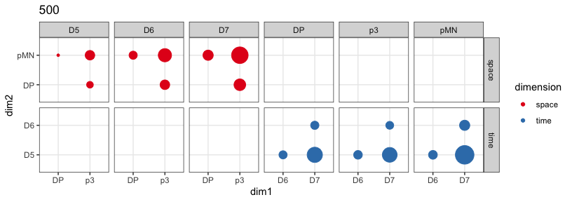

RNA_4_diffexpression_import
================

# ATAC analysis

Differential accessibility in groups of samples

Generate the comparison and export the data.

Start the analysis in the next script by importing these data so it is
more efficient.

``` r
rm(list=ls())

library(DESeq2)
library(RColorBrewer)
library(tidyverse)
library(ComplexHeatmap)
library(UpSetR)
```

### Set dirs

``` r
workingdir="~/Dropbox (The Francis Crick)/DP_cisReg/"
subworkinput="outputs_CaTSRNA_3_diffexpression/"

suboutdir1="output_between_gates/"
suboutdir2="output_between_timepoints/"
suboutdir3="output_between_conditions/"
suboutdir4="output_between_gates_ignoringothers/"
```

## Load data

Load the diff expression from previous script.

## Colors and shapes

``` r
sorted_gate <- c("pMN","DP","p3","neur")
sorted_conditions <- c("500","UPSAG","dRA2UPSAG","dRA")


shapes4_manual = c(18,15,16,17) # these are block
shapes5_manual = c(25,21,22,23,24) # these are filled
shapes4_fill_manual = c(23,21,22,24)
 

color_gates <- c("#e60000","#cd00cd","#0073e6","#696969")

# for Days
colors_greys <- c("#f6f6f6","#808080","#333333")

# conditions

colors_conditions <- c("#e67300","#4d9a00","#cdcd00","#0073e6")
```

## Load vsd to plot heatmaps later

``` r
count_vsd <- read.csv(file=paste0(workingdir,"outputs_RNApilot_1/","featurecounts.vsd.csv"),header=TRUE, stringsAsFactors = FALSE)

dds_counts <- read.table(file=paste0(workingdir,"outputs_RNApilot_1/","featurecounts.normCounts.txt"),header=TRUE, stringsAsFactors = FALSE)
```

## Differential analysis between domains for a given timepoint and condition

- For a given timepoint and a given condition
- Differential gene expression between domains

re importing does not work because the ~/ gets converted to full name of
the dir

Change working dir to local and it’ll be fine. For not, this is the
patch.

``` r
PairWiseDEseq_domain <- lapply(list.files(path=paste0(workingdir,subworkinput,suboutdir1),pattern="Results_DESeq*", full.names=FALSE),function(x) {
  data <- read.table(paste0(workingdir,subworkinput,suboutdir1,x),header=T,stringsAsFactors=F) %>% as.data.frame() %>% rownames_to_column("Geneid")
  data$Comparison <- gsub("Results_DESeq_","", x)
  data$Comparison <- gsub(".txt","",data$Comparison)
  data
})

results_deseq_domain <- do.call(rbind,PairWiseDEseq_domain)
```

## Differential analysis between timepoints for each domain and condition

- For a given domain and a given condition
- Differential gene expression between timepoints

``` r
PairWiseDEseq_days <- lapply(list.files(path=paste0(workingdir,subworkinput,suboutdir2),pattern="Results_DESeq*", full.names=FALSE),function(x) {
  data <- read.table(paste0(workingdir,subworkinput,suboutdir2,x),header=T,stringsAsFactors=F) %>% as.data.frame() %>% rownames_to_column("Geneid")
  data$Comparison <- gsub("Results_DESeq_","", x)
  data$Comparison <- gsub(".txt","",data$Comparison)
  data
})

results_deseq_days <- do.call(rbind,PairWiseDEseq_days)
```

## Differential analysis between conditions for each domain and timepoint

- For a given timepoint and a given domain
- Differential gene expression between conditions

``` r
PairWiseDEseq_conditions <- lapply(list.files(path=paste0(workingdir,subworkinput,suboutdir3),pattern="Results_DESeq*", full.names=FALSE),function(x) {
  data <- read.table(paste0(workingdir,subworkinput,suboutdir3,x),header=T,stringsAsFactors=F) %>% as.data.frame() %>% rownames_to_column("Geneid")
  data$Comparison <- gsub("Results_DESeq_","", x)
  data$Comparison <- gsub(".txt","",data$Comparison)
  data
})

results_deseq_conditions <- do.call(rbind,PairWiseDEseq_days)
```

### How many diff acc elements between domains?

``` r
adjusted_pval = 0.05

log2FC = 1

minBaseMean = 80
```

``` r
top_domain_comparisons <- results_deseq_domain %>%
  as.data.frame() %>%
  filter(padj < adjusted_pval & abs(log2FoldChange) > log2FC & baseMean > minBaseMean)

 
ggplot(top_domain_comparisons, aes(x=Comparison)) +
  geom_bar() +
  theme(axis.text.x = element_text(angle = 90, vjust = 0.5, hjust=1))
```

<!-- -->

### Are they the same ones?

``` r
comparison_vector <- top_domain_comparisons$Comparison %>% unique()

list_test <- lapply(comparison_vector, function(x) {
  top_domain_comparisons[top_domain_comparisons$Comparison==x,"Geneid"]
})
names(list_test) <- comparison_vector

#upset(fromList(list_test), sets=comparison_vector, order.by = "degree")
upset(fromList(list_test), sets=comparison_vector, order.by = "freq")
```

<!-- -->

### Plot the elements in heatmap to visualize trends?

``` r
gene_subset <- top_domain_comparisons$Geneid %>% unique()

# filter elements
vsd_hm <- count_vsd %>%
  filter(X %in% gene_subset) %>%
  column_to_rownames("X") %>%
  select(!contains("_neur_"))

dim(vsd_hm)
```

    ## [1] 468  36

``` r
# z score
vsd_hm_z <- t(scale(t(vsd_hm))) 


names(color_gates) <- sorted_gate
names(colors_conditions) <- sorted_conditions

# metadata for the heatmap
genecolData_first <- data.frame(Sample_ID = colnames(vsd_hm))

genecolData_first <- genecolData_first %>% 
  separate(Sample_ID,into=c("Day","Condition","Gate","Rep"), sep="_", remove=FALSE) 

genecolData_first <- as.data.frame(unclass(genecolData_first))

phen_data <- genecolData_first %>%
  select(c("Sample_ID","Day","Condition","Gate")) %>%
  remove_rownames() %>%
  column_to_rownames("Sample_ID")
ann_color_JD <- list(Gate=color_gates, Condition=colors_conditions,
    Day = c(D5="#f6f6f6",D6="#808080",D7="#333333"))

# Annotated heatmap with selected colors
hm_colors = colorRampPalette(rev(brewer.pal(n = 11, name = "RdBu")))(100)


# Build the annotation for the complex heatmap
colAnn <- HeatmapAnnotation(
    df = phen_data,
    which = 'col', # 'col' (samples) or 'row' (gene) annotation?
    na_col = 'white', # default colour for any NA values in the annotation data-frame, 'ann'
    col = ann_color_JD,
    annotation_height = 0.6,
    annotation_width = unit(1, 'cm'),
    gap = unit(1, 'mm'))


hmap <- Heatmap(vsd_hm_z,

    name = 'Z-score',

    col = hm_colors,

    # row (gene) parameters
      cluster_rows = TRUE,
      show_row_dend = TRUE,
      #row_title = 'Statistically significant genes',
      row_title_side = 'left',
      row_title_gp = gpar(fontsize = 12,  fontface = 'bold'),
      row_title_rot = 90,
      show_row_names = FALSE,
      row_names_gp = gpar(fontsize = 10, fontface = 'bold'),
      row_names_side = 'left',
      row_dend_width = unit(25,'mm'),

    # column (sample) parameters
      cluster_columns = TRUE,
      show_column_dend = TRUE,
      column_title = '',
      column_title_side = 'bottom',
      column_title_gp = gpar(fontsize = 12, fontface = 'bold'),
      column_title_rot = 0,
      show_column_names = TRUE,
      column_names_gp = gpar(fontsize = 8),
      column_names_max_height = unit(10, 'cm'),
      column_dend_height = unit(25,'mm'),

    # cluster methods for rows and columns
      clustering_distance_columns = function(x) as.dist(1 - cor(t(x))),
      clustering_method_columns = 'ward.D2',
      clustering_distance_rows = function(x) as.dist(1 - cor(t(x))),
      clustering_method_rows = 'ward.D2',

    # specify top and bottom annotations
      top_annotation = colAnn)
```

``` r
draw(hmap,
    heatmap_legend_side = 'left',
    annotation_legend_side = 'left',
    row_sub_title_side = 'left')
```

<!-- -->

#### Which genes are shared?

``` r
p3_vs_DP <- intersect(intersect(top_domain_comparisons[top_domain_comparisons$Comparison=="_500__D7_Gate_p3_vs_DP","Geneid"],
top_domain_comparisons[top_domain_comparisons$Comparison=="_dRA2UPSAG__D6_Gate_p3_vs_DP","Geneid"]),
top_domain_comparisons[top_domain_comparisons$Comparison=="_UPSAG__D7_Gate_p3_vs_DP","Geneid"])

DP_vs_pMN <- intersect(top_domain_comparisons[top_domain_comparisons$Comparison=="_500__D7_Gate_DP_vs_pMN","Geneid"],
top_domain_comparisons[top_domain_comparisons$Comparison=="_dRA2UPSAG__D6_Gate_DP_vs_pMN","Geneid"])
```

``` r
dds_counts_plot <- dds_counts %>% 
  as.data.frame() %>%
  rownames_to_column("geneid") %>%
  gather(sampleid, counts_norm, starts_with("D")) %>%
  separate(sampleid,into=c("Day","Condition","Gate","Rep"), sep="_", remove=FALSE) %>%
  mutate(DayGate=factor(paste(Day,Gate,sep="_")),
         DayCondition=paste(Day,Condition),
         Gate=factor(Gate, levels=sorted_gate),
         Condition=factor(Condition, levels=sorted_conditions))

geneOI <- DP_vs_pMN

ggplot(dds_counts_plot %>% filter(geneid %in% geneOI & Day %in% c("D5","D6","D7") & Condition %in% c("500","UPSAG","dRA2UPSAG")) %>% 
         mutate(geneid=factor(geneid, levels=geneOI)), 
       aes(x=Day,y=counts_norm)) +
  stat_summary(aes(fill=Gate),
    fun = mean, geom="bar", alpha=0.9, width=0.7,position=position_dodge(0.7)) +
  geom_point(aes(fill=Gate), alpha=0.6, position = position_dodge(width = 0.7),color="black") +
  #geom_col(position="dodge",aes(fill=DayGate)) +
  scale_fill_manual(values=color_gates) +
  scale_color_manual(values=color_gates) +
  scale_shape_manual(values=shapes4_fill_manual) +
  facet_grid(geneid ~ Condition, scales = "free_y") +
  theme_bw()
```

    ## Warning: No shared levels found between `names(values)` of the manual scale and the
    ## data's colour values.

<!-- -->

``` r
geneOI <- p3_vs_DP

ggplot(dds_counts_plot %>% filter(geneid %in% geneOI & Day %in% c("D5","D6","D7") & Condition %in% c("500","UPSAG","dRA2UPSAG")) %>% 
         mutate(geneid=factor(geneid, levels=geneOI)), 
       aes(x=Day,y=counts_norm)) +
  stat_summary(aes(fill=Gate),
    fun = mean, geom="bar", alpha=0.9, width=0.7,position=position_dodge(0.7)) +
  geom_point(aes(fill=Gate), alpha=0.6, position = position_dodge(width = 0.7),color="black") +
  #geom_col(position="dodge",aes(fill=DayGate)) +
  scale_fill_manual(values=color_gates) +
  scale_color_manual(values=color_gates) +
  scale_shape_manual(values=shapes4_fill_manual) +
  facet_grid(geneid ~ Condition, scales = "free_y") +
  theme_bw()
```

    ## Warning: No shared levels found between `names(values)` of the manual scale and the
    ## data's colour values.

<!-- -->

### How many diff acc elements between timepoints?

``` r
top_days_comparisons <- results_deseq_days %>%
  as.data.frame() %>%
  filter(padj < 0.01 & abs(log2FoldChange) > 2 & baseMean > 100)


ggplot(top_days_comparisons, aes(x=Comparison)) +
  geom_bar() +
  theme(axis.text.x = element_text(angle = 90, vjust = 0.5, hjust=1))
```

<!-- -->

### Are they the same ones?

``` r
comparison_vector <- top_days_comparisons$Comparison %>% unique()

list_test <- lapply(comparison_vector, function(x) {
  top_days_comparisons[top_days_comparisons$Comparison==x,"Geneid"]
})
names(list_test) <- comparison_vector

#upset(fromList(list_test), sets=comparison_vector, order.by = "degree")
upset(fromList(list_test), sets=comparison_vector, order.by = "freq")
```

<!-- -->

### Plot the elements in heatmap to visualize trends?

``` r
gene_subset <- top_days_comparisons$Geneid %>% unique()

# filter elements
vsd_hm <- count_vsd %>%
  filter(X %in% gene_subset) %>%
  column_to_rownames("X") %>%
  select(!contains("_neur_"))

dim(vsd_hm)
```

    ## [1] 154  36

``` r
# z score
vsd_hm_z <- t(scale(t(vsd_hm))) 


names(color_gates) <- sorted_gate
names(colors_conditions) <- sorted_conditions

# metadata for the heatmap
genecolData_first <- data.frame(Sample_ID = colnames(vsd_hm))

genecolData_first <- genecolData_first %>% 
  separate(Sample_ID,into=c("Day","Condition","Gate","Rep"), sep="_", remove=FALSE) 

genecolData_first <- as.data.frame(unclass(genecolData_first))

phen_data <- genecolData_first %>%
  select(c("Sample_ID","Day","Condition","Gate")) %>%
  remove_rownames() %>%
  column_to_rownames("Sample_ID")
ann_color_JD <- list(Gate=color_gates, Condition=colors_conditions,
    Day = c(D5="#f6f6f6",D6="#808080",D7="#333333"))

# Annotated heatmap with selected colors
hm_colors = colorRampPalette(rev(brewer.pal(n = 11, name = "RdBu")))(100)


# Build the annotation for the complex heatmap
colAnn <- HeatmapAnnotation(
    df = phen_data,
    which = 'col', # 'col' (samples) or 'row' (gene) annotation?
    na_col = 'white', # default colour for any NA values in the annotation data-frame, 'ann'
    col = ann_color_JD,
    annotation_height = 0.6,
    annotation_width = unit(1, 'cm'),
    gap = unit(1, 'mm'))

hmap <- Heatmap(vsd_hm_z,

    name = 'Z-score',

    col = hm_colors,

    # row (gene) parameters
      cluster_rows = TRUE,
      show_row_dend = TRUE,
      #row_title = 'Statistically significant genes',
      row_title_side = 'left',
      row_title_gp = gpar(fontsize = 12,  fontface = 'bold'),
      row_title_rot = 90,
      show_row_names = FALSE,
      row_names_gp = gpar(fontsize = 10, fontface = 'bold'),
      row_names_side = 'left',
      row_dend_width = unit(25,'mm'),

    # column (sample) parameters
      cluster_columns = TRUE,
      show_column_dend = TRUE,
      column_title = '',
      column_title_side = 'bottom',
      column_title_gp = gpar(fontsize = 12, fontface = 'bold'),
      column_title_rot = 0,
      show_column_names = TRUE,
      column_names_gp = gpar(fontsize = 8),
      column_names_max_height = unit(10, 'cm'),
      column_dend_height = unit(25,'mm'),

    # cluster methods for rows and columns
      clustering_distance_columns = function(x) as.dist(1 - cor(t(x))),
      clustering_method_columns = 'ward.D2',
      clustering_distance_rows = function(x) as.dist(1 - cor(t(x))),
      clustering_method_rows = 'ward.D2',

    # specify top and bottom annotations
      top_annotation = colAnn)
```

``` r
draw(hmap,
    heatmap_legend_side = 'left',
    annotation_legend_side = 'left',
    row_sub_title_side = 'left')
```

<!-- -->

## Plot number of elements changing between domains and over time

For this to work, export of the condition must be fixed.

``` r
# head(top_days_comparisons)
# head(top_domain_comparisons)

top_days_comparisons$dimension <- "time"
top_domain_comparisons$dimension <- "space"

top_combined_comparsisons <- rbind(top_days_comparisons,top_domain_comparisons)

#tidy
top_combined_comparsisons <- top_combined_comparsisons %>%
  separate(Comparison, into = c("condition","time_space"), sep = "__") %>%
  separate(time_space, into= c("faceting","DayorGate","dim1","vs","dim2"), sep = "_")
  # mutate(dim2=factor(dim2, levels=c("D11_","D9_","D7_","p2_","p1_")),
  #        dim1=factor(dim1, levels=c("pM","p1","D5","D7","D9")))

ggplot(top_combined_comparsisons %>% filter(condition=="_500"), aes(x=dim1, y=dim2)) +
  geom_count(aes(color=dimension)) +
  scale_colour_brewer(palette = "Set1") +
  scale_size(range = c(1,9), breaks = seq(0,10000, by=1000)) + 
  facet_grid(dimension ~ faceting, scales = "free") +
  ggtitle("500") +
  theme_bw()
```

<!-- -->

``` r
ggplot(top_combined_comparsisons %>% filter(condition=="_UPSAG"), aes(x=dim1, y=dim2)) +
  geom_count(aes(color=dimension)) +
  scale_colour_brewer(palette = "Set1") +
  scale_size(range = c(1,9), breaks = seq(0,10000, by=1000)) + 
  facet_grid(dimension ~ faceting, scales = "free") +
  ggtitle("UPSAG") +
  theme_bw()
```

<!-- -->

``` r
ggplot(top_combined_comparsisons %>% filter(condition=="_dRA2UPSAG"), aes(x=dim1, y=dim2)) +
  geom_count(aes(color=dimension)) +
  scale_colour_brewer(palette = "Set1") +
  scale_size(range = c(1,9), breaks = seq(0,10000, by=1000)) + 
  facet_grid(dimension ~ faceting, scales = "free") +
  ggtitle("_dRA2UPSAG") +
  theme_bw()
```

<!-- -->

``` r
sessionInfo()
```

    ## R version 4.3.3 (2024-02-29)
    ## Platform: aarch64-apple-darwin20 (64-bit)
    ## Running under: macOS Sonoma 14.4.1
    ## 
    ## Matrix products: default
    ## BLAS:   /Library/Frameworks/R.framework/Versions/4.3-arm64/Resources/lib/libRblas.0.dylib 
    ## LAPACK: /Library/Frameworks/R.framework/Versions/4.3-arm64/Resources/lib/libRlapack.dylib;  LAPACK version 3.11.0
    ## 
    ## locale:
    ## [1] en_US.UTF-8/en_US.UTF-8/en_US.UTF-8/C/en_US.UTF-8/en_US.UTF-8
    ## 
    ## time zone: Europe/London
    ## tzcode source: internal
    ## 
    ## attached base packages:
    ## [1] grid      stats4    stats     graphics  grDevices utils     datasets 
    ## [8] methods   base     
    ## 
    ## other attached packages:
    ##  [1] UpSetR_1.4.0                ComplexHeatmap_2.18.0      
    ##  [3] lubridate_1.9.3             forcats_1.0.0              
    ##  [5] stringr_1.5.1               dplyr_1.1.4                
    ##  [7] purrr_1.0.2                 readr_2.1.5                
    ##  [9] tidyr_1.3.1                 tibble_3.2.1               
    ## [11] ggplot2_3.5.0               tidyverse_2.0.0            
    ## [13] RColorBrewer_1.1-3          DESeq2_1.42.1              
    ## [15] SummarizedExperiment_1.32.0 Biobase_2.62.0             
    ## [17] MatrixGenerics_1.14.0       matrixStats_1.2.0          
    ## [19] GenomicRanges_1.54.1        GenomeInfoDb_1.38.8        
    ## [21] IRanges_2.36.0              S4Vectors_0.40.2           
    ## [23] BiocGenerics_0.48.1        
    ## 
    ## loaded via a namespace (and not attached):
    ##  [1] tidyselect_1.2.1        farver_2.1.1            bitops_1.0-7           
    ##  [4] fastmap_1.1.1           RCurl_1.98-1.14         digest_0.6.35          
    ##  [7] timechange_0.3.0        lifecycle_1.0.4         cluster_2.1.6          
    ## [10] magrittr_2.0.3          compiler_4.3.3          rlang_1.1.3            
    ## [13] tools_4.3.3             utf8_1.2.4              yaml_2.3.8             
    ## [16] knitr_1.45              labeling_0.4.3          S4Arrays_1.2.1         
    ## [19] DelayedArray_0.28.0     plyr_1.8.9              abind_1.4-5            
    ## [22] BiocParallel_1.36.0     withr_3.0.0             fansi_1.0.6            
    ## [25] colorspace_2.1-0        scales_1.3.0            iterators_1.0.14       
    ## [28] cli_3.6.2               rmarkdown_2.26          crayon_1.5.2           
    ## [31] generics_0.1.3          rstudioapi_0.16.0       tzdb_0.4.0             
    ## [34] rjson_0.2.21            zlibbioc_1.48.2         parallel_4.3.3         
    ## [37] XVector_0.42.0          vctrs_0.6.5             Matrix_1.6-5           
    ## [40] hms_1.1.3               GetoptLong_1.0.5        clue_0.3-65            
    ## [43] locfit_1.5-9.9          foreach_1.5.2           glue_1.7.0             
    ## [46] codetools_0.2-20        stringi_1.8.3           gtable_0.3.4           
    ## [49] shape_1.4.6.1           munsell_0.5.1           pillar_1.9.0           
    ## [52] htmltools_0.5.8         GenomeInfoDbData_1.2.11 circlize_0.4.16        
    ## [55] R6_2.5.1                doParallel_1.0.17       evaluate_0.23          
    ## [58] lattice_0.22-6          highr_0.10              png_0.1-8              
    ## [61] Rcpp_1.0.12             gridExtra_2.3           SparseArray_1.2.4      
    ## [64] xfun_0.43               pkgconfig_2.0.3         GlobalOptions_0.1.2
