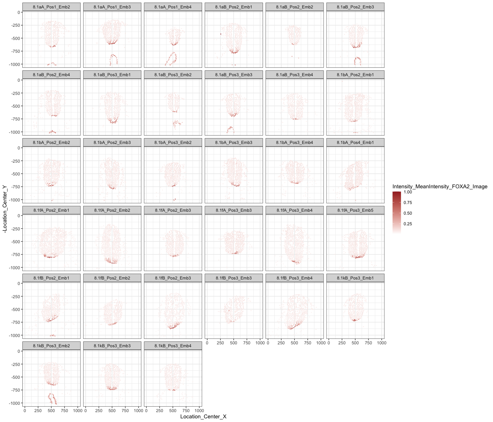
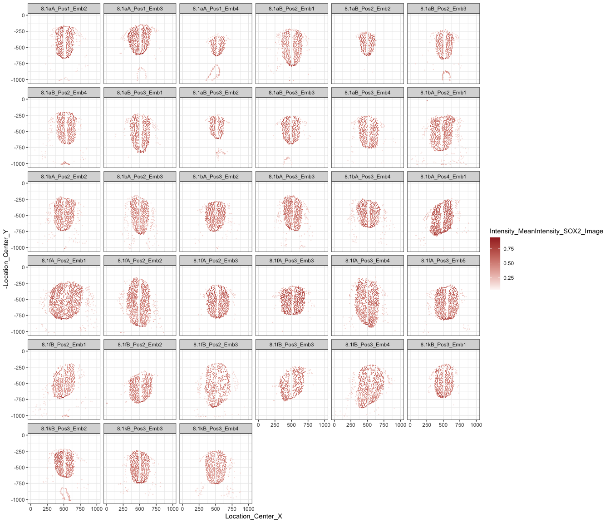
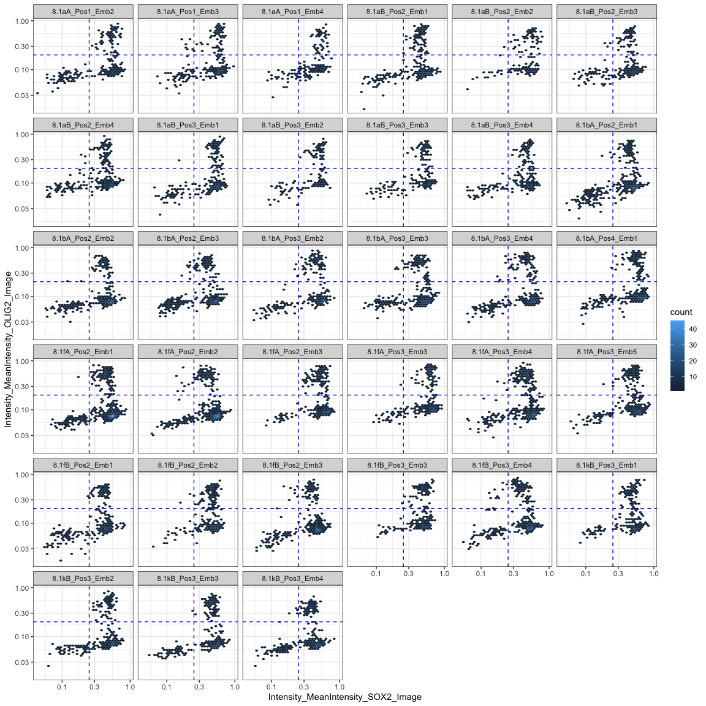
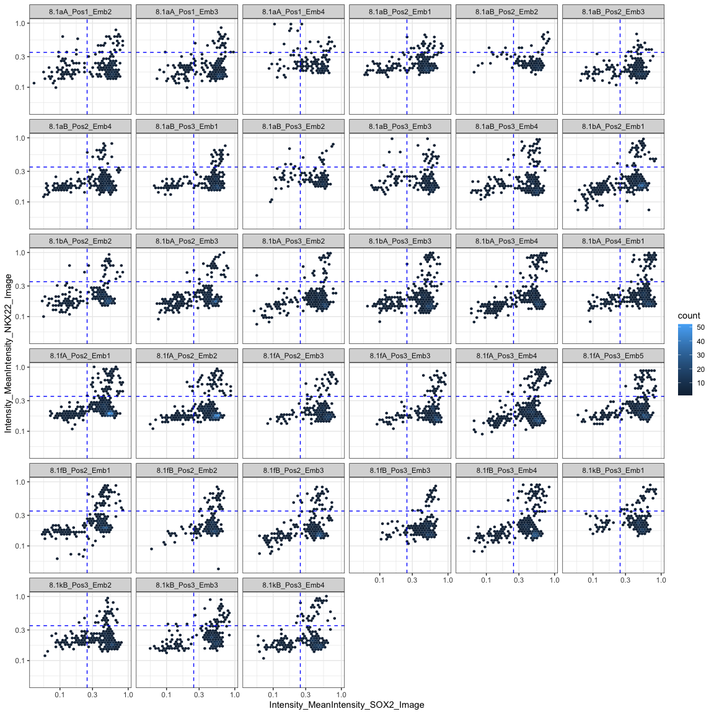
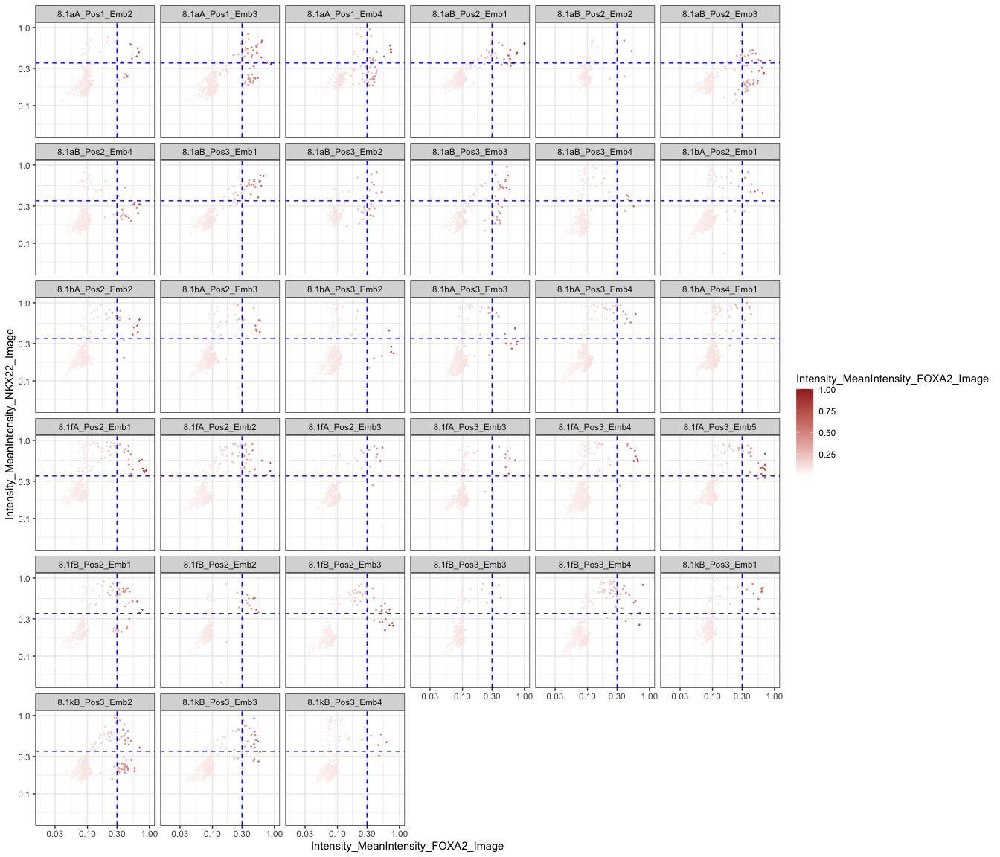
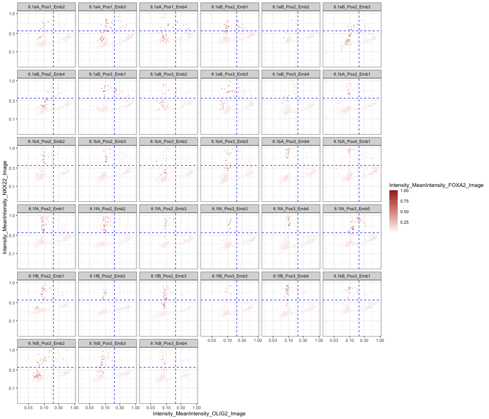
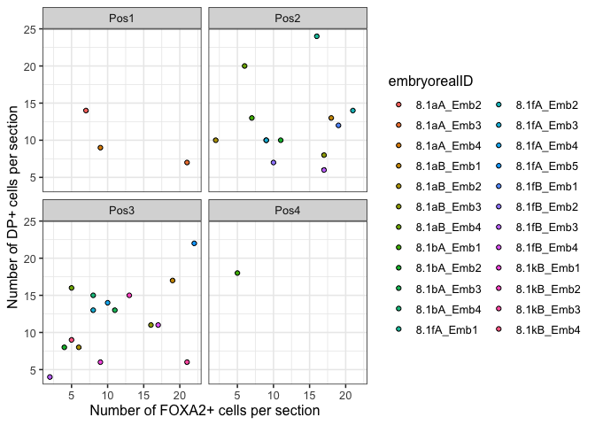
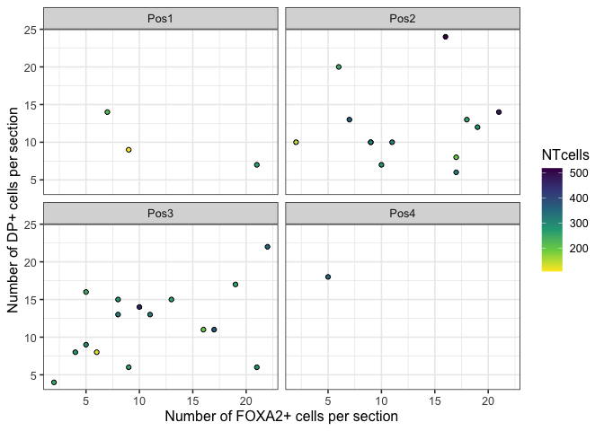
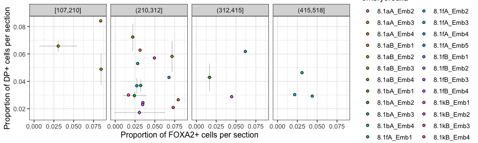

Segmentation analysis FOXA2 cKO
================

``` r
rm(list=ls())

library(RColorBrewer)
library(tidyverse)
```

    ## Warning: package 'stringr' was built under R version 4.2.3

# Segmentation analysis

This is from the table generated by Cell Profiler

### Set dirs

``` r
workingdir="~/Dropbox (The Francis Crick)/DP_cisReg/"
subworkinput="inputs_foxa2KOsegment_1/"
```

## Colors and shapes

Before more plotting, let’s get some metadata organised

``` r
sorted_gate <- c("pMN","DP","p3","DN")

shapes4_manual = c(18,15,16,17) # these are block
shapes5_manual = c(25,21,22,23,24) # these are filled
shapes4_fill_manual = c(23,21,22,24)
 

color_gates <- c("#e60000","#cd00cd","#0073e6","#696969")

# for Days
colors_greys <- c("#f6f6f6","#808080","#333333")
```

### import data

``` r
segment_cp <- read.csv(file=paste0(workingdir,subworkinput,"Joaquina__Dec_6_2023masks_objects.csv"),header=TRUE, stringsAsFactors = FALSE)
#colnames(segment_cp)

segment_cp_clean <- segment_cp %>% select(c("ImageNumber","FileName_DAPI_Image","Intensity_MeanIntensity_DAPI_Image",
                      "Intensity_MeanIntensity_FOXA2_Image","Intensity_MeanIntensity_NKX22_Image",
                      "Intensity_MeanIntensity_OLIG2_Image","Intensity_MeanIntensity_SOX2_Image",
                      "Location_Center_X","Location_Center_Y"))  %>%
                    rename("embryoID"="FileName_DAPI_Image") %>%
                    mutate(embryoID=gsub("C1-","",embryoID)) %>%
                    mutate(embryoID=gsub(".tif","",embryoID))
```

#### Has any of this worked?

``` r
ggplot(segment_cp_clean %>% filter(ImageNumber=="4"), aes(x=Location_Center_X,y=-Location_Center_Y)) +
  geom_point() +
  geom_point(aes(color=Intensity_MeanIntensity_FOXA2_Image))+
  ggtitle(segment_cp_clean[segment_cp_clean$ImageNumber=="4","embryoID"]) +
  coord_fixed(ratio = 1, xlim = NULL, ylim = NULL, expand = TRUE, clip = "on") +
  theme_bw()
```

<!-- -->

``` r
ggplot(segment_cp_clean, aes(x=Location_Center_X,y=-Location_Center_Y)) +
  #geom_point(size=0.01) +
  geom_point(size=0.1, aes(color=Intensity_MeanIntensity_FOXA2_Image))+
  scale_color_gradient2(low = "grey", mid = "white", high = "brown") +
  facet_wrap( ~ embryoID) +
  #coord_fixed(ratio = 1, xlim = NULL, ylim = NULL) +
  theme_bw()
```

<!-- -->

``` r
ggplot(segment_cp_clean, aes(x=Location_Center_X,y=-Location_Center_Y)) +
  #geom_point(size=0.01) +
  geom_point(size=0.1, aes(color=Intensity_MeanIntensity_SOX2_Image))+
  scale_color_gradient2(low = "grey", mid = "white", high = "brown") +
  facet_wrap( ~ embryoID) +
  #coord_fixed(ratio = 1, xlim = NULL, ylim = NULL, expand = TRUE, clip = "on") +
  theme_bw()
```

<!-- -->

## Find thresholds

``` r
sox2_thres = 0.25
nkx22_thress = 0.35
olig2_thress = 0.2
foxa2_thress = 0.3

ggplot(segment_cp_clean, aes(x=Intensity_MeanIntensity_SOX2_Image, y=Intensity_MeanIntensity_OLIG2_Image)) +
  geom_hex(binwidth = c(0.04, 0.04))  +
  geom_vline(xintercept=sox2_thres,  linetype="dashed", color = "blue") +
  geom_hline(yintercept=olig2_thress,  linetype="dashed", color = "blue") +
  scale_x_log10()+
  scale_y_log10() +
  facet_wrap(~ embryoID) +
  # coord_fixed(ratio = 1, xlim = NULL, ylim = NULL, expand = TRUE, clip = "on") +
  theme_bw()
```

<!-- -->

``` r
ggplot(segment_cp_clean, aes(x=Intensity_MeanIntensity_SOX2_Image, y=Intensity_MeanIntensity_NKX22_Image)) +
  geom_hex(binwidth = c(0.04, 0.04))  +
  geom_vline(xintercept=sox2_thres,  linetype="dashed", color = "blue") +
  geom_hline(yintercept=nkx22_thress,  linetype="dashed", color = "blue") +
  scale_x_log10()+
  scale_y_log10() +
  facet_wrap(~ embryoID) +
  # coord_fixed(ratio = 1, xlim = NULL, ylim = NULL, expand = TRUE, clip = "on") +
  theme_bw()
```

<!-- -->

``` r
ggplot(segment_cp_clean, aes(x=Intensity_MeanIntensity_OLIG2_Image, y=Intensity_MeanIntensity_NKX22_Image)) +
  geom_hex(binwidth = c(0.04, 0.04))  +
  geom_vline(xintercept=olig2_thress,  linetype="dashed", color = "blue") +
  geom_hline(yintercept=nkx22_thress,  linetype="dashed", color = "blue") +
  scale_x_log10()+
  scale_y_log10() +
  facet_wrap(~ embryoID) +
  # coord_fixed(ratio = 1, xlim = NULL, ylim = NULL, expand = TRUE, clip = "on") +
  theme_bw()
```

<!-- -->

``` r
ggplot(segment_cp_clean, aes(x=Intensity_MeanIntensity_FOXA2_Image, y=Intensity_MeanIntensity_NKX22_Image)) +
  geom_hex(binwidth = c(0.04, 0.04))  +
  geom_vline(xintercept=foxa2_thress,  linetype="dashed", color = "blue") +
  geom_hline(yintercept=nkx22_thress,  linetype="dashed", color = "blue") +
  scale_x_log10()+
  scale_y_log10() +
  facet_wrap(~ embryoID) +
  # coord_fixed(ratio = 1, xlim = NULL, ylim = NULL, expand = TRUE, clip = "on") +
  theme_bw()
```

<!-- -->

``` r
ggplot(segment_cp_clean, aes(x=Intensity_MeanIntensity_FOXA2_Image, y=Intensity_MeanIntensity_NKX22_Image)) +
  geom_point(size=0.2, aes(color=Intensity_MeanIntensity_FOXA2_Image)) +
  scale_color_gradient2(low = "grey", mid = "white", high = "brown") +
  geom_vline(xintercept=foxa2_thress,  linetype="dashed", color = "blue") +
  geom_hline(yintercept=nkx22_thress,  linetype="dashed", color = "blue") +
  scale_x_log10()+
  scale_y_log10() +
  facet_wrap(~ embryoID) +
  # coord_fixed(ratio = 1, xlim = NULL, ylim = NULL, expand = TRUE, clip = "on") +
  theme_bw()
```

<!-- -->

``` r
ggplot(segment_cp_clean, aes(x=Intensity_MeanIntensity_OLIG2_Image, y=Intensity_MeanIntensity_NKX22_Image)) +
  geom_point(size=0.2, aes(color=Intensity_MeanIntensity_FOXA2_Image)) +
  scale_color_gradient2(low = "grey", mid = "white", high = "brown") +
  geom_hline(yintercept=nkx22_thress,  linetype="dashed", color = "blue") +
  geom_vline(xintercept=olig2_thress,  linetype="dashed", color = "blue") +
  scale_x_log10()+
  scale_y_log10() +
  facet_wrap(~ embryoID) +
  # coord_fixed(ratio = 1, xlim = NULL, ylim = NULL, expand = TRUE, clip = "on") +
  theme_bw()
```

<!-- -->

``` r
ggplot(segment_cp_clean, aes(x=Intensity_MeanIntensity_SOX2_Image, y=Intensity_MeanIntensity_NKX22_Image)) +
  geom_point(size=0.2, aes(color=Intensity_MeanIntensity_FOXA2_Image)) +
  scale_color_gradient2(low = "grey", mid = "white", high = "brown") +
  geom_vline(xintercept=sox2_thres,  linetype="dashed", color = "blue") +
  geom_hline(yintercept=nkx22_thress,  linetype="dashed", color = "blue") +
  scale_x_log10()+
  scale_y_log10() +
  facet_wrap(~ embryoID) +
  # coord_fixed(ratio = 1, xlim = NULL, ylim = NULL, expand = TRUE, clip = "on") +
  theme_bw()
```

<!-- -->

``` r
ggplot(segment_cp_clean, aes(x=Intensity_MeanIntensity_FOXA2_Image, y=Intensity_MeanIntensity_SOX2_Image)) +
  geom_point(size=0.2, aes(color=Intensity_MeanIntensity_FOXA2_Image)) +
  scale_color_gradient2(low = "grey", mid = "white", high = "brown") +
  geom_vline(xintercept=foxa2_thress,  linetype="dashed", color = "blue") +
  geom_hline(yintercept=sox2_thres,  linetype="dashed", color = "blue") +
  # scale_x_log10()+
  # scale_y_log10() +
  facet_wrap(~ embryoID) +
  # coord_fixed(ratio = 1, xlim = NULL, ylim = NULL, expand = TRUE, clip = "on") +
  theme_bw()
```

<!-- -->

### Steps

- Filter out gut:
  1.  by levels of SOX2
  2.  by requiring SOX2 and 1 other channel
  3.  WORKED: by position with respect to the pMN population
- Plot classify
- Plot number of Foxa2 cells vs DP

Classification based on Intensity_MeanIntensity_ANTIBODY_Image and the
thresholds above.

sox2_thres = 0.25 nkx22_thress = 0.35 olig2_thress = 0.2 foxa2_thress =
0.3

``` r
full_classified <- segment_cp_clean %>%
  mutate(celltype=if_else(Intensity_MeanIntensity_OLIG2_Image > olig2_thress & Intensity_MeanIntensity_NKX22_Image > nkx22_thress, "DP",
                          if_else(Intensity_MeanIntensity_NKX22_Image > nkx22_thress, "p3",
                                  if_else(Intensity_MeanIntensity_OLIG2_Image > olig2_thress, "pMN",
                                      if_else(Intensity_MeanIntensity_SOX2_Image > sox2_thres,"Sox2_notp3","othercell"))))) %>%
  mutate(foxa2_positive=if_else(Intensity_MeanIntensity_FOXA2_Image>foxa2_thress, "Foxa2","notFoxa2"))

ggplot(full_classified, aes(x=Location_Center_X,y=-Location_Center_Y)) +
  #geom_point(size=0.01) +
  geom_point(size=0.1, aes(color=celltype))+
  facet_wrap( ~ embryoID) +
  # coord_fixed(ratio = 1, xlim = NULL, ylim = NULL, expand = TRUE, clip = "on") +
  theme_bw()
```

<!-- -->

``` r
ggplot(full_classified, aes(x=Location_Center_X,y=-Location_Center_Y)) +
  #geom_point(size=0.01) +
  geom_point(size=0.1, aes(color=foxa2_positive))+
  facet_wrap( ~ embryoID) +
  # coord_fixed(ratio = 1, xlim = NULL, ylim = NULL, expand = TRUE, clip = "on") +
  theme_bw()
```

<!-- -->

#### Filter background SOX2+ FOXA2+ cells based on position

Cell that are positioned more than 5 standard deviations away from the
mean of the pMN population (dashed red line) will be excluded. Visualize
the excluded cells below.

``` r
full_classified_mean_pmnposition <- full_classified %>%
  filter(celltype %in% c("pMN")) %>%
  group_by(ImageNumber) %>%
  mutate(ave_y = mean(Location_Center_Y, na.rm = TRUE),
         sd_y = sd(Location_Center_Y, na.rm = TRUE))

dotsize=0.2


# ggplot(full_classified_filter_gut, aes(x=Location_Center_X, y=-Location_Center_Y)) +
#   geom_point(size=dotsize,aes(color=Intensity_MeanIntensity_FOXA2_Image)) +
#   scale_color_continuous(type = "viridis") +
#   expand_limits(y=c(0,-1024),x=c(0,1024)) +
#   geom_hline(data=full_classified_filter_gut, aes(yintercept=-(ave_y+2.5*sd_y)),linetype='dashed', col = 'red') +
#   facet_wrap(~ embryoID) +
#   coord_fixed(ratio = 1) +
#   theme_bw(base_size = 8)

ggplot(full_classified, aes(x=Location_Center_X, y=-Location_Center_Y)) +
  geom_point(size=dotsize,aes(color=Intensity_MeanIntensity_FOXA2_Image)) +
  scale_color_continuous(type = "viridis") +
  expand_limits(y=c(0,-1024),x=c(0,1024)) +
  geom_hline(data=full_classified_mean_pmnposition, aes(yintercept=-(ave_y+5*sd_y)),linetype='dashed', col = 'red') +
  facet_wrap(~ embryoID) +
  # coord_fixed(ratio = 1) +
  theme_bw(base_size = 8)
```

<!-- -->

Identify y pos of cells to be filtered

``` r
full_classified_to_be_filtered <- full_classified_mean_pmnposition %>%
  mutate(pMN_y5sd_filter=ave_y+5*sd_y) %>% 
  select(ImageNumber,embryoID,pMN_y5sd_filter) %>% unique()
```

Re-classify after positional filter

``` r
classified_filtered <- full_classified %>%
  left_join(full_classified_to_be_filtered, by = c("ImageNumber","embryoID")) %>% 
  group_by(ImageNumber,embryoID) %>%
  filter(Location_Center_Y < pMN_y5sd_filter)
 
 
ggplot(classified_filtered, aes(x=Location_Center_X,y=-Location_Center_Y)) +
  geom_point(size=0.1, aes(color=celltype))+
  facet_wrap( ~ embryoID) +
  # coord_fixed(ratio = 1, xlim = NULL, ylim = NULL, expand = TRUE, clip = "on") +
  theme_bw()
```

<!-- -->

``` r
ggplot(classified_filtered, aes(x=Location_Center_X,y=-Location_Center_Y)) +
  geom_point(size=0.1, aes(color=foxa2_positive))+
  facet_wrap( ~ embryoID) +
  # coord_fixed(ratio = 1, xlim = NULL, ylim = NULL, expand = TRUE, clip = "on") +
  theme_bw()
```

<!-- -->

## the plot

``` r
# classified_filtered

classified_filtered_celltype_counts <- classified_filtered %>%
  mutate(celltype = factor(celltype, levels = c("DP","p3","pMN","Sox2_notp3","othercell"))) %>%
  # mutate(foxa2_positive = factor(foxa2_positive, levels = c("Foxa2","notFoxa2"))) %>%
  group_by(embryoID) %>%
  count(celltype,.drop=FALSE)

classified_foxa2_counts <- classified_filtered %>%
  # mutate(celltype = factor(celltype, levels = c("DP","p3","pMN","Sox2_notp3","othercell"))) %>%
  mutate(foxa2_positive = factor(foxa2_positive, levels = c("Foxa2","notFoxa2"))) %>%
  group_by(embryoID) %>%
  count(foxa2_positive,.drop=FALSE)

classified_foxa2_counts_wide <- classified_foxa2_counts %>%
  pivot_wider(names_from = "foxa2_positive", values_from = "n")

classified_filtered_celltype_and_FOXA2 <- classified_filtered_celltype_counts %>%
  pivot_wider(names_from = "celltype", values_from = "n") %>%
  left_join(classified_foxa2_counts_wide, by="embryoID") %>%
  separate(embryoID, into = c("block","pos","emb"), sep = "_",remove = FALSE) %>%
  mutate(embryorealID = paste(block,emb, sep="_"))
```

No clear trend with just cell numbers

``` r
ggplot(classified_filtered_celltype_and_FOXA2, aes(x=Foxa2, y=DP)) +
  geom_point(aes(fill=embryorealID), color="black", shape=21) +
  ylab("Number of DP+ cells per section") +
  xlab("Number of FOXA2+ cells per section") +
  facet_wrap( ~pos) +
  theme_bw(base_size = 12)
```

<!-- -->

Is it just bigger embryos have more cells?

``` r
ggplot(classified_filtered_celltype_and_FOXA2, aes(x=Foxa2, y=p3)) +
  geom_point(aes(fill=embryorealID), color="black", shape=21) +
  ylab("Number of p3 cells per section") +
  xlab("Number of FOXA2+ cells per section") +
  facet_wrap( ~pos) +
  theme_bw(base_size = 12)
```

<!-- -->

Proportions instead?

The amount of total cells considered should be DP+p3+pMN+Sox2_notp3

``` r
classified_filtered_celltype_and_FOXA2_prop <- classified_filtered_celltype_and_FOXA2 %>%
  mutate(NTcells=sum(DP,p3,pMN,Sox2_notp3)) %>%
  mutate(prop_DP = DP/NTcells) %>%
  mutate(prop_FOXA2 = Foxa2/NTcells)
```

``` r
ggplot(classified_filtered_celltype_and_FOXA2_prop, aes(x=prop_FOXA2, y=prop_DP)) +
  geom_point(aes(fill=embryorealID), color="black", shape=21) +
  ylab("Proportion of DP+ cells per section") +
  xlab("Proportion of FOXA2+ cells per section") +
  facet_wrap( ~pos) +
  theme_bw(base_size = 12)
```

<!-- -->

``` r
ggplot(classified_filtered_celltype_and_FOXA2_prop, aes(x=prop_FOXA2, y=prop_DP)) +
  geom_point(aes(fill=NTcells), color="black", shape=21) +
  scale_fill_viridis_c(direction=-1) +
  #scale_fill_gradient2(low = "grey", mid = "white", high = "brown") +
  ylab("Proportion of DP+ cells per section") +
  xlab("Proportion of FOXA2+ cells per section") +
  facet_wrap( ~pos) +
  theme_bw(base_size = 12)
```

<!-- -->

``` r
ggplot(classified_filtered_celltype_and_FOXA2_prop, aes(x=Foxa2, y=DP)) +
  geom_point(aes(fill=NTcells), color="black", shape=21) +
  scale_fill_viridis_c(direction=-1) +
  ylab("Number of DP+ cells per section") +
  xlab("Number of FOXA2+ cells per section") +
  facet_wrap( ~pos) +
  theme_bw(base_size = 12)
```

<!-- -->

``` r
classified_filtered_celltype_and_FOXA2_prop_ave <- classified_filtered_celltype_and_FOXA2_prop %>%
  group_by(embryorealID) %>%
  summarise(mean_propDP=mean(prop_DP),
         sd_propDP=sd(prop_DP),
         sd_propFOXA2=sd(prop_FOXA2),
         mean_propFOXA2=mean(prop_FOXA2),
         mean_NTcell=mean(NTcells))


ggplot(classified_filtered_celltype_and_FOXA2_prop_ave, aes(x=embryorealID, y=mean_propDP)) +
  geom_col(aes(fill=embryorealID)) +
  geom_point(data = classified_filtered_celltype_and_FOXA2_prop, aes(x=embryorealID, y=prop_DP, fill=embryorealID,shape=pos), color="black") +
  theme_bw() +theme(axis.text.x = element_text(angle = 90, vjust = 0.5, hjust=1))
```

<!-- -->

``` r
ggplot(classified_filtered_celltype_and_FOXA2_prop_ave, aes(x=embryorealID, y=mean_propFOXA2)) +
  geom_col(aes(fill=embryorealID)) +
  geom_point(data = classified_filtered_celltype_and_FOXA2_prop, aes(x=embryorealID, y=prop_FOXA2, fill=embryorealID,shape=pos), color="black") +
  theme_bw() +theme(axis.text.x = element_text(angle = 90, vjust = 0.5, hjust=1))
```

<!-- -->

``` r
ggplot(classified_filtered_celltype_and_FOXA2_prop_ave, aes(x=embryorealID, y=mean_NTcell)) +
  geom_col(aes(fill=embryorealID)) +
  geom_point(data = classified_filtered_celltype_and_FOXA2_prop, aes(x=embryorealID, y=NTcells, fill=embryorealID,shape=pos), color="black") +
  theme_bw() +theme(axis.text.x = element_text(angle = 90, vjust = 0.5, hjust=1))
```

<!-- -->

``` r
ggplot(classified_filtered_celltype_and_FOXA2_prop_ave, aes(x=mean_propFOXA2, y=mean_propDP)) +
  geom_linerange(aes(xmin = mean_propFOXA2-sd_propFOXA2,xmax = mean_propFOXA2+sd_propFOXA2), color="#cecece") + 
  geom_linerange(aes(ymin = mean_propDP+sd_propDP,ymax = mean_propDP-sd_propDP), color="#cecece") + 
  geom_point(aes(fill=embryorealID), color="black", shape=21) +
  ylab("Proportion of DP+ cells per section") +
  xlab("Proportion of FOXA2+ cells per section") +
  theme_bw(base_size = 12)
```

    ## Warning: Removed 15 rows containing missing values (`geom_segment()`).
    ## Removed 15 rows containing missing values (`geom_segment()`).

<!-- -->

``` r
ggplot(classified_filtered_celltype_and_FOXA2_prop_ave, aes(x=mean_propFOXA2, y=mean_propDP)) +
  geom_linerange(aes(xmin = mean_propFOXA2-sd_propFOXA2,xmax = mean_propFOXA2+sd_propFOXA2), color="#cecece") + 
  geom_linerange(aes(ymin = mean_propDP+sd_propDP,ymax = mean_propDP-sd_propDP), color="#cecece") + 
  geom_point(aes(fill=mean_NTcell), color="black", shape=21) +
  scale_fill_viridis_c(direction=-1) +
  ylab("Proportion of DP+ cells per section") +
  xlab("Proportion of FOXA2+ cells per section") +
  theme_bw(base_size = 12)
```

    ## Warning: Removed 15 rows containing missing values (`geom_segment()`).
    ## Removed 15 rows containing missing values (`geom_segment()`).

<!-- -->

``` r
# 4 bins of equal length

classified_filtered_celltype_and_FOXA2_prop_ave$NTdiscrete <- cut_interval(classified_filtered_celltype_and_FOXA2_prop_ave$mean_NTcell, 4)

ggplot(classified_filtered_celltype_and_FOXA2_prop_ave, aes(x=mean_propFOXA2, y=mean_propDP)) +
  geom_linerange(aes(xmin = mean_propFOXA2-sd_propFOXA2,xmax = mean_propFOXA2+sd_propFOXA2), color="#cecece") + 
  geom_linerange(aes(ymin = mean_propDP+sd_propDP,ymax = mean_propDP-sd_propDP), color="#cecece") + 
  geom_point(aes(fill=embryorealID), color="black", shape=21) +
  ylab("Proportion of DP+ cells per section") +
  xlab("Proportion of FOXA2+ cells per section") +
  facet_wrap(~ NTdiscrete, nrow = 1) +
  theme_bw(base_size = 12)
```

    ## Warning: Removed 1 rows containing missing values (`geom_segment()`).

    ## Warning: Removed 9 rows containing missing values (`geom_segment()`).

    ## Warning: Removed 2 rows containing missing values (`geom_segment()`).

    ## Warning: Removed 3 rows containing missing values (`geom_segment()`).

    ## Warning: Removed 1 rows containing missing values (`geom_segment()`).

    ## Warning: Removed 9 rows containing missing values (`geom_segment()`).

    ## Warning: Removed 2 rows containing missing values (`geom_segment()`).

    ## Warning: Removed 3 rows containing missing values (`geom_segment()`).

<!-- -->

``` r
ggplot(classified_filtered_celltype_and_FOXA2_prop_ave, aes(x=mean_propFOXA2, y=mean_propDP)) +
  geom_linerange(aes(xmin = mean_propFOXA2-sd_propFOXA2,xmax = mean_propFOXA2+sd_propFOXA2), color="#cecece") + 
  geom_linerange(aes(ymin = mean_propDP+sd_propDP,ymax = mean_propDP-sd_propDP), color="#cecece") + 
  geom_point(aes(fill=mean_NTcell), color="black", shape=21) +
  scale_fill_viridis_c(direction=-1) +
  ylab("Proportion of DP+ cells per section") +
  xlab("Proportion of FOXA2+ cells per section") +
  facet_wrap(~ NTdiscrete, nrow = 1) +
  theme_bw(base_size = 12)
```

    ## Warning: Removed 1 rows containing missing values (`geom_segment()`).

    ## Warning: Removed 9 rows containing missing values (`geom_segment()`).

    ## Warning: Removed 2 rows containing missing values (`geom_segment()`).

    ## Warning: Removed 3 rows containing missing values (`geom_segment()`).

    ## Warning: Removed 1 rows containing missing values (`geom_segment()`).

    ## Warning: Removed 9 rows containing missing values (`geom_segment()`).

    ## Warning: Removed 2 rows containing missing values (`geom_segment()`).

    ## Warning: Removed 3 rows containing missing values (`geom_segment()`).

<!-- -->

``` r
# classified_filtered_celltype_and_FOXA2_prop

# 4 bins of equal length

classified_filtered_celltype_and_FOXA2_prop$NTdiscrete <- cut_interval(classified_filtered_celltype_and_FOXA2_prop$NTcells, 4)

ggplot(classified_filtered_celltype_and_FOXA2_prop, aes(x=Foxa2, y=DP)) +
  # geom_linerange(aes(xmin = mean_propFOXA2-sd_propFOXA2,xmax = mean_propFOXA2+sd_propFOXA2), color="#cecece") + 
  # geom_linerange(aes(ymin = mean_propDP+sd_propDP,ymax = mean_propDP-sd_propDP), color="#cecece") + 
  geom_point(aes(fill=embryorealID), color="black", shape=21) +
  ylab("Number of DP+ cells per section") +
  xlab("Number of FOXA2+ cells per section") +
  facet_wrap(~ NTdiscrete, nrow = 1) +
  theme_bw(base_size = 12)
```

<!-- -->

``` r
sessionInfo()
```

    ## R version 4.2.2 (2022-10-31)
    ## Platform: aarch64-apple-darwin20 (64-bit)
    ## Running under: macOS Ventura 13.6.2
    ## 
    ## Matrix products: default
    ## BLAS:   /Library/Frameworks/R.framework/Versions/4.2-arm64/Resources/lib/libRblas.0.dylib
    ## LAPACK: /Library/Frameworks/R.framework/Versions/4.2-arm64/Resources/lib/libRlapack.dylib
    ## 
    ## locale:
    ## [1] en_US.UTF-8/en_US.UTF-8/en_US.UTF-8/C/en_US.UTF-8/en_US.UTF-8
    ## 
    ## attached base packages:
    ## [1] stats     graphics  grDevices utils     datasets  methods   base     
    ## 
    ## other attached packages:
    ##  [1] lubridate_1.9.3    forcats_1.0.0      stringr_1.5.1      dplyr_1.1.3       
    ##  [5] purrr_1.0.2        readr_2.1.4        tidyr_1.3.0        tibble_3.2.1      
    ##  [9] ggplot2_3.4.4      tidyverse_2.0.0    RColorBrewer_1.1-3
    ## 
    ## loaded via a namespace (and not attached):
    ##  [1] highr_0.10        pillar_1.9.0      compiler_4.2.2    tools_4.2.2      
    ##  [5] digest_0.6.33     viridisLite_0.4.2 lattice_0.22-5    timechange_0.2.0 
    ##  [9] evaluate_0.23     lifecycle_1.0.4   gtable_0.3.4      pkgconfig_2.0.3  
    ## [13] rlang_1.1.2       cli_3.6.1         rstudioapi_0.15.0 yaml_2.3.7       
    ## [17] hexbin_1.28.3     xfun_0.41         fastmap_1.1.1     withr_2.5.2      
    ## [21] knitr_1.45        generics_0.1.3    vctrs_0.6.4       hms_1.1.3        
    ## [25] grid_4.2.2        tidyselect_1.2.0  glue_1.6.2        R6_2.5.1         
    ## [29] fansi_1.0.5       rmarkdown_2.25    farver_2.1.1      tzdb_0.4.0       
    ## [33] magrittr_2.0.3    scales_1.2.1      htmltools_0.5.7   colorspace_2.1-0 
    ## [37] labeling_0.4.3    utf8_1.2.4        stringi_1.8.1     munsell_0.5.0
