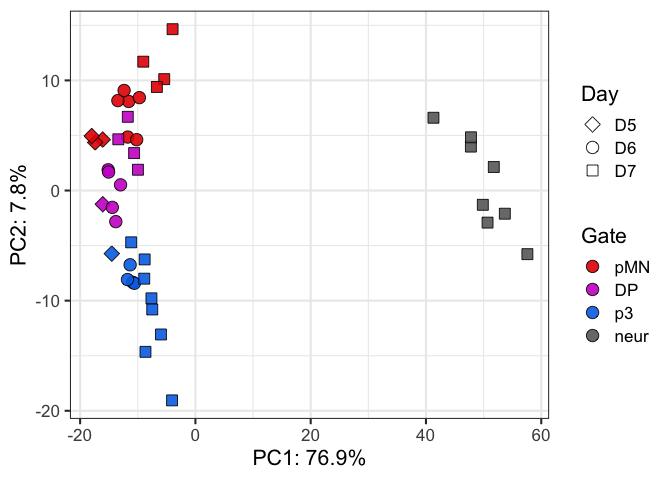
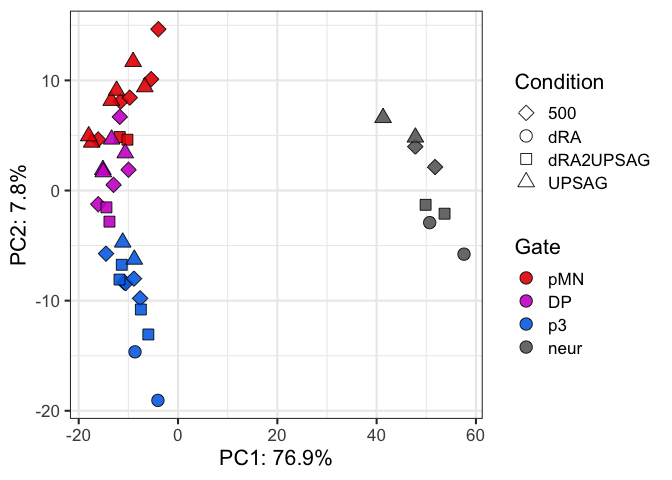
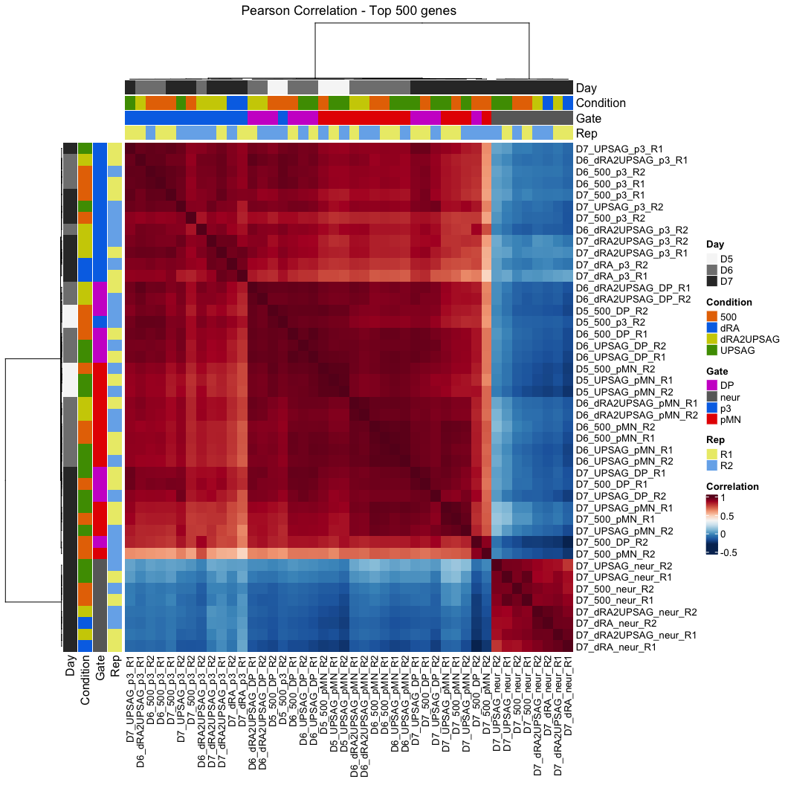
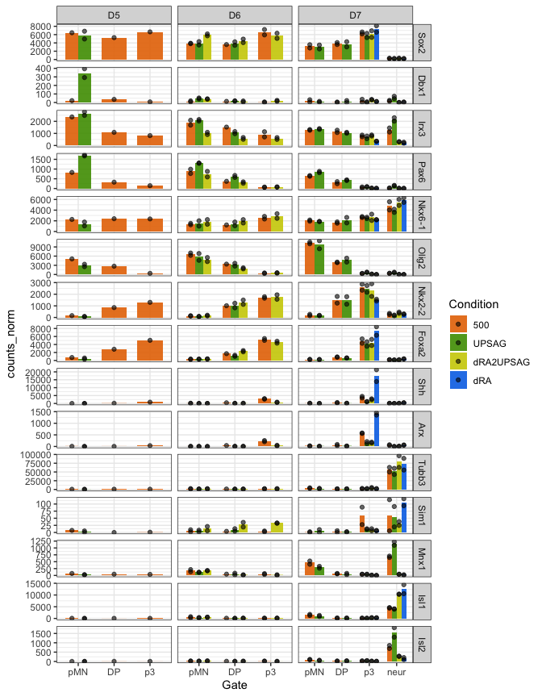

Pilot CaTS-RNA summary to share
================

## Plot PCAs

#### PC1 is dominated by neurons vs progenitor

``` r
ggplot(vsd_pca_plot, aes(x=PC1,y=PC2,fill=Gate,shape=Day)) +
  scale_fill_manual(values = color_gates) +
  geom_point(size=4, alpha=0.9) +
  guides(fill = guide_legend(override.aes=list(shape=21))) +
  scale_shape_manual(values = shapes4_fill_manual) +
  labs(x=paste0("PC1: ",round(var_explained[1]*100,1),"%"),
       y=paste0("PC2: ",round(var_explained[2]*100,1),"%")) +
  theme_bw(base_size=16)
```

<!-- -->

#### Compared to that, even the temporal transition is quite minimal

``` r
ggplot(vsd_pca_plot, aes(x=PC1,y=PC2,fill=Day,shape=Gate)) +
  scale_fill_manual(values = colors_greys) +
  geom_point(size=4, alpha=0.9) +
  guides(fill = guide_legend(override.aes=list(shape=21))) +
  scale_shape_manual(values = shapes4_fill_manual) +
  labs(x=paste0("PC1: ",round(var_explained[1]*100,1),"%"),
       y=paste0("PC2: ",round(var_explained[2]*100,1),"%")) +
  theme_bw(base_size=16)
```

<!-- -->

#### PC2 seems to be driven by the sorted Gates

- DP nicely positioned between pMN and p3. Which condition they come
  from does not seem as critical, but they are colored in the next plot.

``` r
ggplot(vsd_pca_plot, aes(x=PC1,y=PC2,fill=Gate,shape=Condition)) +
  scale_fill_manual(values = color_gates) +
  geom_point(size=4, alpha=0.9) +
  guides(fill = guide_legend(override.aes=list(shape=21))) +
  scale_shape_manual(values = shapes4_fill_manual) +
  labs(x=paste0("PC1: ",round(var_explained[1]*100,1),"%"),
       y=paste0("PC2: ",round(var_explained[2]*100,1),"%")) +
  theme_bw(base_size=16)
```

<!-- -->

#### Colored by condition

Maybe downRA is a bit more different than the rest.

``` r
ggplot(vsd_pca_plot, aes(x=PC1,y=PC2,fill=Condition,shape=Gate)) +
  scale_fill_manual(values = colors_conditions) +
  geom_point(size=4, alpha=0.9) +
  guides(fill = guide_legend(override.aes=list(shape=21))) +
  scale_shape_manual(values = shapes4_fill_manual) +
  labs(x=paste0("PC1: ",round(var_explained[1]*100,1),"%"),
       y=paste0("PC2: ",round(var_explained[2]*100,1),"%")) +
  theme_bw(base_size=16)
```

<!-- -->

#### Maybe (only maybe) DP at later timepoints a bit more similar to pMN

This is PCA so distances does matter but still, further analysis needed.

``` r
ggplot(vsd_pca_plot, aes(x=PC1,y=PC2,fill=Gate,shape=Day)) +
  scale_fill_manual(values = color_gates) +
  geom_point(size=4, alpha=0.9) +
  guides(fill = guide_legend(override.aes=list(shape=21))) +
  scale_shape_manual(values = shapes4_fill_manual) +
  labs(x=paste0("PC1: ",round(var_explained[1]*100,1),"%"),
       y=paste0("PC2: ",round(var_explained[2]*100,1),"%")) +
  theme_bw(base_size=16)
```

<!-- -->

There might be some outliers in the other PCs but as you can see it’ll
be very little variance.

### Correlation Heatmaps - based on 500 top genes

Mainly cluster by sorted gate

``` r
Heatmap(cor_vsd, name="Correlation", col=hm_colors,
        cluster_columns = TRUE, cluster_rows = TRUE,
        #show_column_dend = FALSE,
        #row_dend_side = "right", column_dend_side = "bottom",
        # cluster methods for rows and columns
        clustering_distance_columns = function(x) as.dist(1 - cor(t(x))),
        clustering_method_columns = 'ward.D2',
        clustering_distance_rows = function(x) as.dist(1 - cor(t(x))),
        clustering_method_rows = 'ward.D2',
        column_dend_height = unit(2, "cm"), row_dend_width = unit(2, "cm"),
        row_names_gp = gpar(fontsize = 10),column_names_gp = gpar(fontsize = 10),
        left_annotation = heatmap_ann_row, top_annotation = heatmap_ann,
        column_title = "Pearson Correlation - Top 500 genes")
```

<!-- -->

#### Looking at some key genes: colored by condition

- p3 from dRA express floor plate markes: expected by reassuring.

- The rest of progenitors: express markers of their gate, regarless of
  condition of origin (500, upSAG, dRA2UPSAG)

- Neurons: UpSAG and 500 SAG are making Motor Neurons. What neurons are
  the other conditions making?

- The exception is Dbx1 but remember that comes from having been in
  0-SAG for 1 day and we have seen those pMN take 1 day to lower the
  levels of Pax6 (by flow). Dbx1 expression is consistent with their
  transitioning from p0.

``` r
geneOI <- c("Sox2","Dbx1","Irx3","Pax6","Nkx6-1","Olig2","Nkx2-2","Foxa2",
            "Shh","Arx",
            "Tubb3","Sim1","Mnx1","Isl1","Isl2")


ggplot(dds_counts_plot %>% filter(geneid %in% geneOI) %>% mutate(geneid=factor(geneid, levels=geneOI)), 
       aes(x=Gate,y=counts_norm)) +
  stat_summary(aes(fill=Condition),
    fun = mean, geom="bar", alpha=0.9, width=0.7,position=position_dodge(0.7)) +
  geom_point(aes(fill=Condition), alpha=0.6, position = position_dodge(width = 0.7),color="black") +
  #geom_col(position="dodge",aes(fill=DayGate)) +
  scale_fill_manual(values=colors_conditions) +
  scale_color_manual(values=colors_conditions) +
  scale_shape_manual(values=shapes4_fill_manual) +
  facet_grid(geneid ~ Day, scales = "free") +
  theme_bw()
```

<!-- -->

#### Now colored by gate

To spot differences in conditions or days.

- Apart from p3 from dRA being floor plate, I don’t see anything major.

``` r
ggplot(dds_counts_plot %>% filter(geneid %in% geneOI) %>% mutate(geneid=factor(geneid, levels=geneOI)), 
       aes(x=Day,y=counts_norm)) +
  stat_summary(aes(fill=Gate),
    fun = mean, geom="bar", alpha=0.9, width=0.7,position=position_dodge(0.7)) +
  geom_point(aes(fill=Gate), alpha=0.6, position = position_dodge(width = 0.7),color="black") +
  #geom_col(position="dodge",aes(fill=DayGate)) +
  scale_fill_manual(values=color_gates) +
  scale_color_manual(values=color_gates) +
  scale_shape_manual(values=shapes4_fill_manual) +
  facet_grid(geneid ~ Condition, scales = "free_y") +
  theme_bw()
```

<!-- -->

#### What next?

- Differential expression: for conditions and gates with 2 replicates
- Interrogating other genes (i.e. the ones from Hynek’s human DP)
