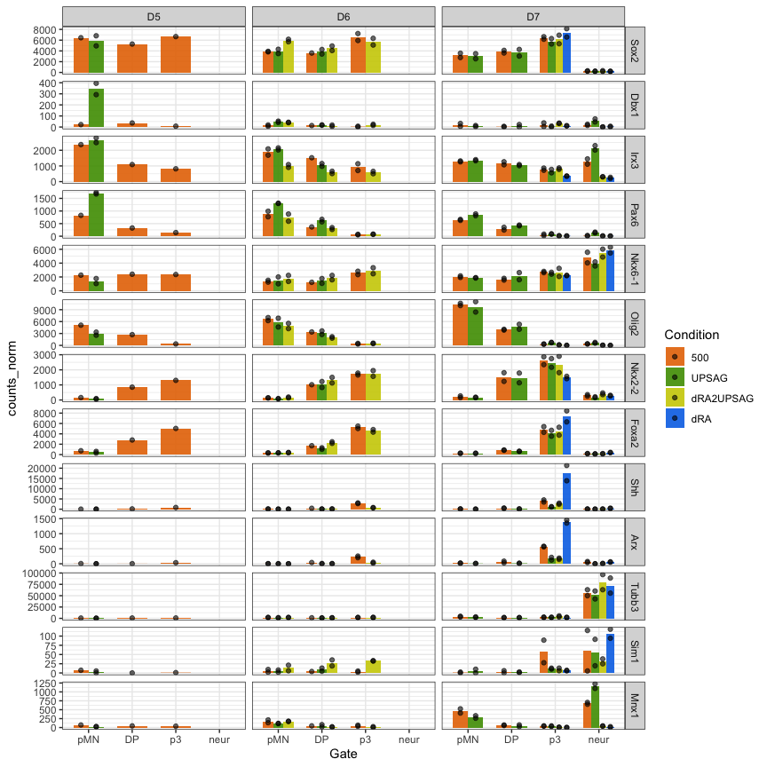
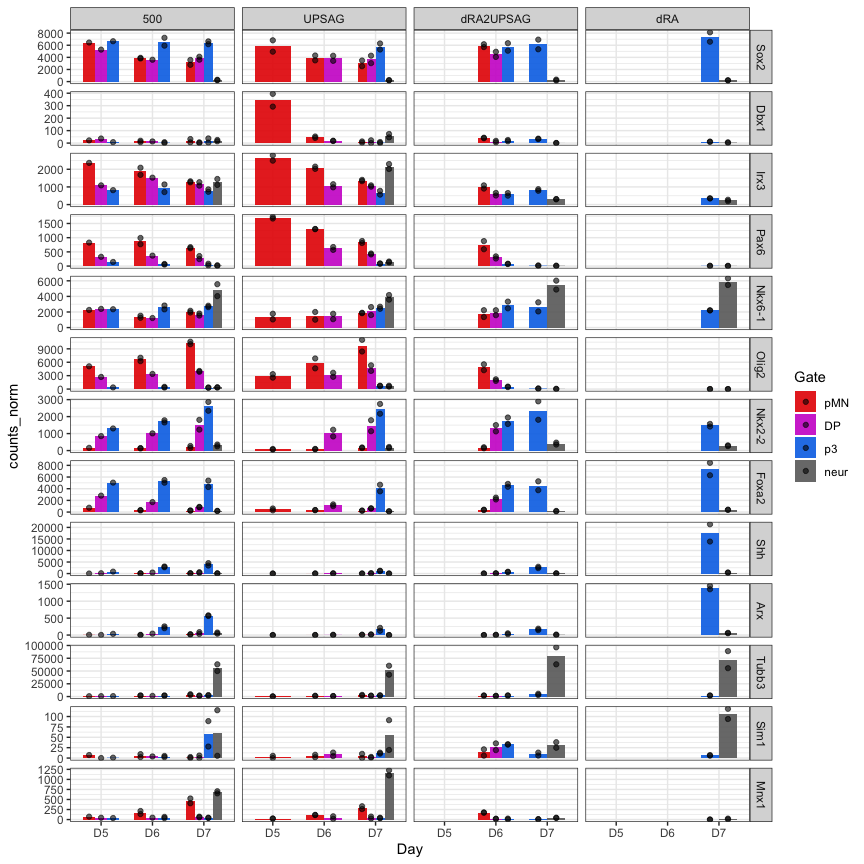
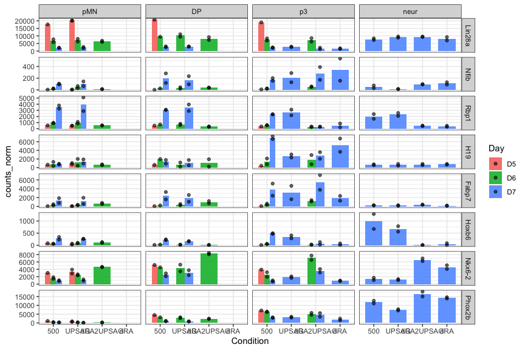

R_quick_plot genes
================

# RNA analysis

Gene plotting with output from previous script.

``` r
rm(list=ls())

library(RColorBrewer)
library(tidyverse)
library(ComplexHeatmap)
```

### Set dirs

``` r
workingdir="~/Dropbox (The Francis Crick)/DP_cisReg/"
subworkinput="outputs_RNApilot_1/"
```

## Load RNA data

Normalised RNA counts

``` r
dds_counts <- read.table(paste0(workingdir,subworkinput,"featurecounts.normCounts.txt"),stringsAsFactors =FALSE)
```

## Colors and shapes

Before more plotting, let’s get some metadata organised

``` r
sorted_gate <- c("pMN","DP","p3","neur")
sorted_conditions <- c("500","UPSAG","dRA2UPSAG","dRA")


shapes4_manual = c(18,15,16,17) # these are block
shapes5_manual = c(25,21,22,23,24) # these are filled
shapes4_fill_manual = c(23,21,22,24)
# 
# # for Days
# red_colors <- c("#fadede","#f3aaaa","#e96666","#cf1e1e")


#color_gates <- c("#b30000","#800080","#009640","#696969")
#color_gates <- c("#b30000","#9a009a","#005ab3","#696969")
color_gates <- c("#e60000","#cd00cd","#0073e6","#696969")

# for Days
colors_greys <- c("#f6f6f6","#808080","#333333")

# conditions
#colors_conditions <- c("#b81bb8","#b81b1b","#1bb81b","#1bb8b8")
colors_conditions <- c("#e67300","#4d9a00","#cdcd00","#0073e6")
```

## Genes to look at

``` r
dds_counts_plot <- dds_counts %>% 
  as.data.frame() %>%
  rownames_to_column("geneid") %>%
  gather(sampleid, counts_norm, starts_with("D")) %>%
  separate(sampleid,into=c("Day","Condition","Gate","Rep"), sep="_", remove=FALSE) %>%
  mutate(DayGate=factor(paste(Day,Gate,sep="_")),
         DayCondition=paste(Day,Condition),
         Gate=factor(Gate, levels=sorted_gate),
         Condition=factor(Condition, levels=sorted_conditions))
```

### Basic QC

``` r
geneOI <- c("Sox2","Dbx1","Irx3","Pax6","Nkx6-1","Olig2","Nkx2-2","Foxa2","Shh","Arx","Tubb3","Sim1","Mnx1")


ggplot(dds_counts_plot %>% filter(geneid %in% geneOI) %>% mutate(geneid=factor(geneid, levels=geneOI)), 
       aes(x=Gate,y=counts_norm)) +
  stat_summary(aes(fill=Condition),
    fun = mean, geom="bar", alpha=0.9, width=0.7,position=position_dodge(0.7)) +
  geom_point(aes(fill=Condition), alpha=0.6, position = position_dodge(width = 0.7),color="black") +
  #geom_col(position="dodge",aes(fill=DayGate)) +
  scale_fill_manual(values=colors_conditions) +
  scale_color_manual(values=colors_conditions) +
  scale_shape_manual(values=shapes4_fill_manual) +
  facet_grid(geneid ~ Day, scales = "free_y") +
  theme_bw()
```

<!-- -->

``` r
ggplot(dds_counts_plot %>% filter(geneid %in% geneOI) %>% mutate(geneid=factor(geneid, levels=geneOI)), 
       aes(x=Day,y=counts_norm)) +
  stat_summary(aes(fill=Gate),
    fun = mean, geom="bar", alpha=0.9, width=0.7,position=position_dodge(0.7)) +
  geom_point(aes(fill=Gate), alpha=0.6, position = position_dodge(width = 0.7),color="black") +
  #geom_col(position="dodge",aes(fill=DayGate)) +
  scale_fill_manual(values=color_gates) +
  scale_color_manual(values=color_gates) +
  scale_shape_manual(values=shapes4_fill_manual) +
  facet_grid(geneid ~ Condition, scales = "free_y") +
  theme_bw()
```

<!-- -->

### Temporal genes from pilot analysis

p3 d6 to d7

``` r
geneOI <- c("Lin28a","Nfib","Rbp1","Duxbl3","Duxbl2","Hoxb6","Krtap5-2","Phox2b")


ggplot(dds_counts_plot %>% filter(geneid %in% geneOI) %>% mutate(geneid=factor(geneid, levels=geneOI)), 
       aes(x=Condition,y=counts_norm)) +
  stat_summary(aes(fill=Day),
    fun = mean, geom="bar", alpha=0.9, width=0.7,position=position_dodge(0.7)) +
  geom_point(aes(fill=Day), alpha=0.6, position = position_dodge(width = 0.7),color="black") +
  #geom_col(position="dodge",aes(fill=DayGate)) +
  #scale_fill_manual(values=color_gates) +
  #scale_color_manual(values=color_gates) +
  scale_shape_manual(values=shapes4_fill_manual) +
  facet_grid(geneid ~ Gate, scales = "free_y") +
  theme_bw()
```

<!-- -->

``` r
sessionInfo()
```

    ## R version 4.2.2 (2022-10-31)
    ## Platform: aarch64-apple-darwin20 (64-bit)
    ## Running under: macOS Ventura 13.2.1
    ## 
    ## Matrix products: default
    ## BLAS:   /Library/Frameworks/R.framework/Versions/4.2-arm64/Resources/lib/libRblas.0.dylib
    ## LAPACK: /Library/Frameworks/R.framework/Versions/4.2-arm64/Resources/lib/libRlapack.dylib
    ## 
    ## locale:
    ## [1] en_US.UTF-8/en_US.UTF-8/en_US.UTF-8/C/en_US.UTF-8/en_US.UTF-8
    ## 
    ## attached base packages:
    ## [1] grid      stats     graphics  grDevices utils     datasets  methods  
    ## [8] base     
    ## 
    ## other attached packages:
    ##  [1] ComplexHeatmap_2.15.4 lubridate_1.9.2       forcats_1.0.0        
    ##  [4] stringr_1.5.0         dplyr_1.1.2           purrr_1.0.1          
    ##  [7] readr_2.1.4           tidyr_1.3.0           tibble_3.2.1         
    ## [10] ggplot2_3.4.2         tidyverse_2.0.0       RColorBrewer_1.1-3   
    ## 
    ## loaded via a namespace (and not attached):
    ##  [1] shape_1.4.6         circlize_0.4.15     GetoptLong_1.0.5   
    ##  [4] tidyselect_1.2.0    xfun_0.39           colorspace_2.1-0   
    ##  [7] vctrs_0.6.3         generics_0.1.3      htmltools_0.5.5    
    ## [10] stats4_4.2.2        yaml_2.3.7          utf8_1.2.3         
    ## [13] rlang_1.1.1         pillar_1.9.0        glue_1.6.2         
    ## [16] withr_2.5.0         BiocGenerics_0.44.0 matrixStats_1.0.0  
    ## [19] foreach_1.5.2       lifecycle_1.0.3     munsell_0.5.0      
    ## [22] gtable_0.3.3        GlobalOptions_0.1.2 codetools_0.2-19   
    ## [25] evaluate_0.21       labeling_0.4.2      knitr_1.43         
    ## [28] tzdb_0.4.0          IRanges_2.32.0      fastmap_1.1.1      
    ## [31] doParallel_1.0.17   parallel_4.2.2      fansi_1.0.4        
    ## [34] highr_0.10          scales_1.2.1        S4Vectors_0.36.2   
    ## [37] farver_2.1.1        rjson_0.2.21        hms_1.1.3          
    ## [40] png_0.1-8           digest_0.6.33       stringi_1.7.12     
    ## [43] clue_0.3-64         cli_3.6.1           tools_4.2.2        
    ## [46] magrittr_2.0.3      cluster_2.1.4       crayon_1.5.2       
    ## [49] pkgconfig_2.0.3     timechange_0.2.0    rmarkdown_2.22     
    ## [52] rstudioapi_0.14     iterators_1.0.14    R6_2.5.1           
    ## [55] compiler_4.2.2
