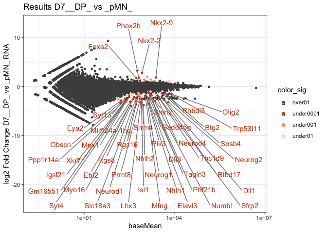
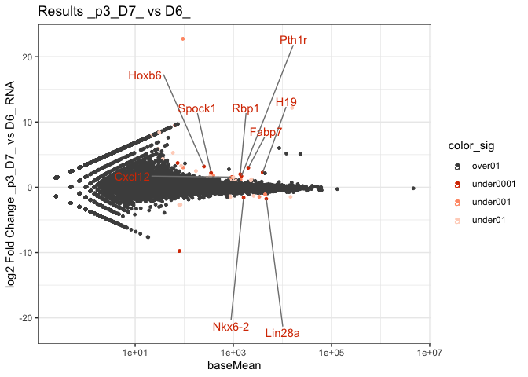
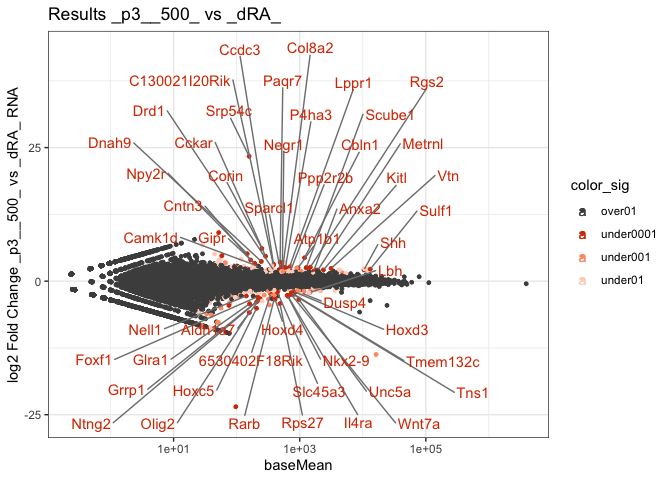

RNA_3_diffexpression
================

# RNA analysis

Differential expression between gates, conditions and timepoints

``` r
rm(list=ls())

library(DESeq2)
library(RColorBrewer)
library(tidyverse)
library(ComplexHeatmap)
library(tximport)
library(ggrepel)
```

### Set dirs

``` r
workingdir="~/Dropbox (The Francis Crick)/DP_cisReg/"
subworkinput="inputs_RNApilot/"
outdir="outputs_RNApilot_3_diffexpression/"

ifelse(!dir.exists(file.path(workingdir,outdir)), dir.create(file.path(workingdir,outdir)), "Directory exists")
```

    ## [1] "Directory exists"

``` r
# suboutdir1="output_Domain_Specific/"
# ifelse(!dir.exists(file.path(workingdir,outdir,suboutdir1)), dir.create(file.path(workingdir,outdir,suboutdir1)), "Directory exists")
# suboutdir2="output_Time_Specific/"
# ifelse(!dir.exists(file.path(workingdir,outdir,suboutdir2)), dir.create(file.path(workingdir,outdir,suboutdir2)), "Directory exists")
# 
```

## Load data

For RNA analysis, we are using the output of star_salmon so the import
to deseq is a bit more complicated.

``` r
#salmon counts from pipeline, import
path_files =  list.files(paste0(workingdir,subworkinput)) 
samples = data.frame(run=path_files, stringsAsFactors = FALSE) %>%
  filter(str_detect(run, "^D"))

files <- file.path(paste0(workingdir,subworkinput), samples$run, "quant.sf")
names(files) <- samples$run
all(file.exists(files))
```

    ## [1] TRUE

``` r
#from pipeline
tx2gene = read_tsv(paste0(paste0(workingdir,subworkinput),"/salmon_tx2gene.tsv"))
```

    ## New names:
    ## Rows: 35118 Columns: 3
    ## ── Column specification
    ## ──────────────────────────────────────────────────────── Delimiter: "\t" chr
    ## (3): NM_001011874, Xkr4...2, Xkr4...3
    ## ℹ Use `spec()` to retrieve the full column specification for this data. ℹ
    ## Specify the column types or set `show_col_types = FALSE` to quiet this message.
    ## • `Xkr4` -> `Xkr4...2`
    ## • `Xkr4` -> `Xkr4...3`

``` r
txi.salmon <- tximport(files, type = "salmon", tx2gene = tx2gene)
```

    ## reading in files with read_tsv
    ## 1 2 3 4 5 6 7 8 9 10 11 12 13 14 15 16 17 18 19 20 21 22 23 24 25 26 27 28 29 30 31 32 33 34 35 36 37 38 39 40 41 42 43 44 45 
    ## transcripts missing from tx2gene: 1
    ## summarizing abundance
    ## summarizing counts
    ## summarizing length

## Colors and shapes

``` r
sorted_gate <- c("pMN","DP","p3","neur")
sorted_conditions <- c("500","UPSAG","dRA2UPSAG","dRA")


shapes4_manual = c(18,15,16,17) # these are block
shapes5_manual = c(25,21,22,23,24) # these are filled
shapes4_fill_manual = c(23,21,22,24)
 

color_gates <- c("#e60000","#cd00cd","#0073e6","#696969")

# for Days
colors_greys <- c("#f6f6f6","#808080","#333333")

# conditions

colors_conditions <- c("#e67300","#4d9a00","#cdcd00","#0073e6")
```

## Differential analysis between domains for a given timepoint and condition

The lapply is not running yet because I need to filter the comparisons
with enough samples.

Targeted diff analysis in subsets of samples: - for each timepoint: diff
expression between domains

- make a extra lapply to go through conditions

This DESeq2 analysis is done by subsetting samples. I subset the
`txi.salmon$counts` table and then use `DESeqDataSetFromMatrix` with
`round(sub_counts)` to perform the differential analysis.

``` r
count_matrix <- txi.salmon$counts %>%
  as.data.frame()


#subset 
timepoint=c("D5_","D6_","D7_")
#matrix
allgates=matrix(c("_pMN_","_p3_","_pMN_","_DP_","_p3_","_DP_"),
                 nrow=2,
                 ncol=3)
geno="_500_"

comparisons <- allgates

# count_matrix <- count_table %>%
#   column_to_rownames("Geneid")


x=3
y=2

## many comparisons do not have 2 reps and 2 conditions

# PairWiseDEseq <- lapply(c(1:length(timepoint)),function (x) {
#   lapply(c(1:ncol(allgates)), function (y) {
      timepoints <- timepoint[x]
      celltypes <- allgates[,y]
      sub_counts <- count_matrix %>%
        dplyr::select(contains(geno)  & contains(celltypes) & contains(timepoints))
      
      ## Make metadata file for DESeq
      genecolData_sub <- data.frame(Sample = colnames(sub_counts))
      genecolData_sub <- genecolData_sub %>% 
        separate(Sample,into=c("Day","Condition","Gate","Rep"), sep="_", remove=FALSE) %>%
        mutate(DayGate=factor(paste(Day,Gate,sep="_")),
              DayCondition=paste(Day,Condition),
              Experiment=paste(Condition,Rep,sep="_"),
              Gate=factor(Gate, levels=sorted_gate))
      genecolData_sub <- as.data.frame(unclass(genecolData_sub))
      
      
      dds_sub <- DESeqDataSetFromMatrix(countData =  round(sub_counts),
                              colData = genecolData_sub,
                              design = ~ Gate)
```

    ## converting counts to integer mode

    ## factor levels were dropped which had no samples

``` r
      dds_sub <- DESeq(dds_sub)
```

    ## estimating size factors

    ## estimating dispersions

    ## gene-wise dispersion estimates

    ## mean-dispersion relationship

    ## final dispersion estimates

    ## fitting model and testing

``` r
      vsd_sub <- varianceStabilizingTransformation(dds_sub,blind = FALSE)
      
      # Export normalized tables for plotting elsewhere
      dds_sub_counts <- counts(dds_sub, normalized = TRUE)
      vsd_sub_data <- assay(vsd_sub)
      
      results_sub <- results(dds_sub)

      # color significant
      results_sub_plot1 <- results_sub %>%
        as.data.frame() %>%
        rownames_to_column("geneid") %>%
        mutate(color_sig=case_when(padj < 0.1 & padj > 0.01 ~ "under01",
                                   padj < 0.01 & padj > 0.001 ~ "under001",
                                   padj < 0.001 & padj >0 ~ "under0001",
                                   TRUE ~ "over01"))
      
      #threshold <- 8
      ggplot(results_sub_plot1 %>% as.data.frame(), aes(x=baseMean, y=log2FoldChange, color=color_sig, label=geneid)) +
          geom_point(size=1) +
          # geom_point(data= results_sub_plot1[results_sub_plot1$log2FoldChange > threshold,],
          #           aes(x=baseMean, y=threshold), shape = 2, colour="#d83a00") +
          # geom_point(data= results_sub_plot1[results_sub_plot1$log2FoldChange < -threshold,],
          #           aes(x=baseMean, y=-threshold), shape = 2, colour="#d83a00") +
          #ylim(-threshold,threshold) +
          scale_x_log10() +
          scale_color_manual(values = c("gray30","#d83a00","#ff9b76","#ffd4c4")) +
          geom_text_repel(data = subset(results_sub_plot1, color_sig=="under0001" & baseMean > 100 & log2FoldChange > 0),
                  nudge_y = 10,
                  #nudge_x=-10,
                  #force_pull   = 10,
                  force         = 65,
                  max.overlaps = Inf,
                  box.padding = 0.5,
                  segment.color = "grey50",
                  direction     = "both") +
          geom_text_repel(data = subset(results_sub_plot1, color_sig=="under0001" & baseMean > 100 & log2FoldChange < 0),
                  nudge_y = -20,
                  #nudge_x=-10,
                  #force_pull   = 10,
                  force         = 65,
                  max.overlaps = Inf,
                  box.padding = 0.5,
                  segment.color = "grey50",
                  direction     = "both") +
          ylab(paste0("log2 Fold Change ",timepoints , celltypes[2]," vs ",celltypes[1] ," RNA")) +
          ggtitle(paste0("Results ",timepoints , celltypes[2]," vs ",celltypes[1])) +
          theme_bw() 
```

    ## Warning: Transformation introduced infinite values in continuous x-axis

    ## Warning: Removed 6401 rows containing missing values (`geom_point()`).

<!-- -->

``` r
      ## Export files
      
      # write.table(dds_sub_counts,
      # file = paste0(workingdir,outdir,suboutdir1,"CountsNormalized_",timepoints,celltypes[1],celltypes[2],".txt"),
      #     quote = FALSE, row.names = TRUE)
      # write.csv(vsd_sub_data,
      #     paste0(workingdir,outdir,suboutdir1,"VSData_",timepoints,celltypes[1],celltypes[2],".csv"),
      #     quote = FALSE)
      # write.table(results_sub,
      #     file = paste0(workingdir,outdir,suboutdir1,"Results_DESeq_",timepoints,celltypes[1],celltypes[2],".txt"),
      #     quote = FALSE, row.names = TRUE)

      results_return <- results_sub %>% as.data.frame() %>% rownames_to_column("Geneid")
      results_return$Comparison <- paste0("Comp_",timepoints,celltypes[1],celltypes[2])
#       results_return
# 
#   })
# }) 
```

## Differential analysis between timepoints for each domain and condition

For each gate: - differential analysis between timepoints for the same
condition: To do, extra lapply for conditions

``` r
#subset 
allgates=c("_pMN_","_p3_","_DP_")
#matrix
timepoints=matrix(c("D5_","D6_","D5_","D7_","D6_","D7_"),
                 nrow=2,
                 ncol=3)
geno="_500_"

comparisons <- timepoints

x=2
y=3

# PairWiseDEseq <- lapply(c(1:length(allgates)),function (x) {
#   lapply(c(1:ncol(timepoints)), function (y) {
      celltypes <- allgates[x]
      days <- timepoints[,y]
      sub_counts <- count_matrix %>%
        dplyr::select(contains(geno)  & contains(celltypes) & contains(days))
      
      ## Make metadata file for DESeq
      genecolData_sub <- data.frame(Sample = colnames(sub_counts))
      genecolData_sub <- genecolData_sub %>% 
        separate(Sample,into=c("Day","Condition","Gate","Rep"), sep="_", remove=FALSE) %>%
        mutate(DayGate=factor(paste(Day,Gate,sep="_")),
              DayCondition=paste(Day,Condition),
              Experiment=paste(Condition,Rep,sep="_"),
              Gate=factor(Gate, levels=sorted_gate))
      genecolData_sub <- as.data.frame(unclass(genecolData_sub))
         
      dds_sub <- DESeqDataSetFromMatrix(countData = round(sub_counts),
                                    colData = genecolData_sub,
                                    design = ~ Day)
```

    ## converting counts to integer mode

    ## Warning in DESeqDataSet(se, design = design, ignoreRank): some variables in
    ## design formula are characters, converting to factors

``` r
      dds_sub <- DESeq(dds_sub)
```

    ## estimating size factors

    ## estimating dispersions

    ## gene-wise dispersion estimates

    ## mean-dispersion relationship

    ## final dispersion estimates

    ## fitting model and testing

``` r
      vsd_sub <- varianceStabilizingTransformation(dds_sub,blind = FALSE)
      
      # Export normalized tables for plotting elsewhere
      dds_sub_counts <- counts(dds_sub, normalized = TRUE)
      vsd_sub_data <- assay(vsd_sub)
      
      results_sub <- results(dds_sub)
      
      ## plot MA custom plot 
      
      #plotMA(results_sub,ylim=c(-8,8))
      
      # color significant
      results_sub_plot1 <- results_sub %>%
        as.data.frame() %>%
        rownames_to_column("geneid") %>%
        mutate(color_sig=case_when(padj < 0.1 & padj > 0.01 ~ "under01",
                                   padj < 0.01 & padj > 0.001 ~ "under001",
                                   padj < 0.001 & padj >0 ~ "under0001",
                                   TRUE ~ "over01"))
      
      #threshold <- 8
      ggplot(results_sub_plot1 %>% as.data.frame(), aes(x=baseMean, y=log2FoldChange, color=color_sig, label=geneid)) +
          geom_point(size=1) +
          # geom_point(data= results_sub_plot1[results_sub_plot1$log2FoldChange > threshold,],
          #           aes(x=baseMean, y=threshold), shape = 2, colour="#d83a00") +
          # geom_point(data= results_sub_plot1[results_sub_plot1$log2FoldChange < -threshold,],
          #           aes(x=baseMean, y=-threshold), shape = 2, colour="#d83a00") +
          #ylim(-threshold,threshold) +
          scale_x_log10() +
          scale_color_manual(values = c("gray30","#d83a00","#ff9b76","#ffd4c4")) +
          geom_text_repel(data = subset(results_sub_plot1, color_sig=="under0001" & baseMean > 100 & log2FoldChange > 0),
                  nudge_y = 10,
                  #nudge_x=-10,
                  #force_pull   = 10,
                  force         = 65,
                  max.overlaps = Inf,
                  box.padding = 0.5,
                  segment.color = "grey50",
                  direction     = "both") +
          geom_text_repel(data = subset(results_sub_plot1, color_sig=="under0001" & baseMean > 100 & log2FoldChange < 0),
                  nudge_y = -20,
                  #nudge_x=-10,
                  #force_pull   = 10,
                  force         = 65,
                  max.overlaps = Inf,
                  box.padding = 0.5,
                  segment.color = "grey50",
                  direction     = "both") +
          ylab(paste0("log2 Fold Change ",celltypes , days[2]," vs ",days[1] ," RNA")) +
          ggtitle(paste0("Results ",celltypes , days[2]," vs ",days[1] )) +
          theme_bw() 
```

    ## Warning: Transformation introduced infinite values in continuous x-axis

    ## Warning: Removed 7353 rows containing missing values (`geom_point()`).

<!-- -->

``` r
      ## Export files
      
      # write.table(dds_sub_counts,
      # file = paste0(workingdir,outdir,suboutdir2,"CountsNormalized_",celltypes,days[1],days[2],".txt"),
      #     quote = FALSE, row.names = TRUE)
      # write.csv(vsd_sub_data,
      #     paste0(workingdir,outdir,suboutdir2,"VSData_",celltypes,days[1],days[2],".csv"),
      #     quote = FALSE)
      # write.table(results_sub,
      #     file = paste0(workingdir,outdir,suboutdir2,"Results_DESeq_",celltypes,days[1],days[2],".txt"),
      #     quote = FALSE, row.names = TRUE)

      results_return <- results_sub %>% as.data.frame() %>% rownames_to_column("Geneid")
      results_return$Comparison <- paste0("Comp_",celltypes,days[1],days[2])
      #results_return

#   })
# }) 
```

## Differential analysis between conditions for each domain and timepoint

Ongoing

For a given timepoint - differential analysis between conditions each
cell type

``` r
#subset 
allgates=c("_pMN_","_p3_","_DP_")
#matrix
comparisons=matrix(c("_dRA_","_500_","_dRA_","_dRA2UPSAG_","_500_","_dRA2UPSAG_"),
                 nrow=2,
                 ncol=3)
timepoint="D7_"


x=2
y=1

# PairWiseDEseq <- lapply(c(1:length(allgates)),function (x) {
#   lapply(c(1:ncol(timepoints)), function (y) {
      celltypes <- allgates[x]
      conditions <- comparisons[,y]
      sub_counts <- count_matrix %>%
        dplyr::select(contains(timepoint)  & contains(celltypes) & contains(conditions))
      
      ## Make metadata file for DESeq
      genecolData_sub <- data.frame(Sample = colnames(sub_counts))
      genecolData_sub <- genecolData_sub %>% 
        separate(Sample,into=c("Day","Condition","Gate","Rep"), sep="_", remove=FALSE) %>%
        mutate(DayGate=factor(paste(Day,Gate,sep="_")),
              DayCondition=paste(Day,Condition),
              Experiment=paste(Condition,Rep,sep="_"),
              Gate=factor(Gate, levels=sorted_gate))
      genecolData_sub <- as.data.frame(unclass(genecolData_sub))
         
      dds_sub <- DESeqDataSetFromMatrix(countData = round(sub_counts),
                                    colData = genecolData_sub,
                                    design = ~ Condition)
```

    ## converting counts to integer mode

    ## Warning in DESeqDataSet(se, design = design, ignoreRank): some variables in
    ## design formula are characters, converting to factors

``` r
      dds_sub <- DESeq(dds_sub)
```

    ## estimating size factors

    ## estimating dispersions

    ## gene-wise dispersion estimates

    ## mean-dispersion relationship

    ## final dispersion estimates

    ## fitting model and testing

``` r
      vsd_sub <- varianceStabilizingTransformation(dds_sub,blind = FALSE)
      
      # Export normalized tables for plotting elsewhere
      dds_sub_counts <- counts(dds_sub, normalized = TRUE)
      vsd_sub_data <- assay(vsd_sub)
      
      results_sub <- results(dds_sub)
      
      ## plot MA custom plot 
      
      #plotMA(results_sub,ylim=c(-8,8))
      
      # color significant
      results_sub_plot1 <- results_sub %>%
        as.data.frame() %>%
        rownames_to_column("geneid") %>%
        mutate(color_sig=case_when(padj < 0.1 & padj > 0.01 ~ "under01",
                                   padj < 0.01 & padj > 0.001 ~ "under001",
                                   padj < 0.001 & padj >0 ~ "under0001",
                                   TRUE ~ "over01"))
      
      #threshold <- 8
      ggplot(results_sub_plot1 %>% as.data.frame(), aes(x=baseMean, y=log2FoldChange, color=color_sig, label=geneid)) +
          geom_point(size=1) +
          # geom_point(data= results_sub_plot1[results_sub_plot1$log2FoldChange > threshold,],
          #           aes(x=baseMean, y=threshold), shape = 2, colour="#d83a00") +
          # geom_point(data= results_sub_plot1[results_sub_plot1$log2FoldChange < -threshold,],
          #           aes(x=baseMean, y=-threshold), shape = 2, colour="#d83a00") +
          #ylim(-threshold,threshold) +
          scale_x_log10() +
          scale_color_manual(values = c("gray30","#d83a00","#ff9b76","#ffd4c4")) +
          geom_text_repel(data = subset(results_sub_plot1, color_sig=="under0001" & baseMean > 100 & log2FoldChange > 0),
                  nudge_y = 20,
                  #nudge_x=-10,
                  #force_pull   = 10,
                  force         = 65,
                  max.overlaps = Inf,
                  box.padding = 0.5,
                  segment.color = "grey50",
                  direction     = "both") +
          geom_text_repel(data = subset(results_sub_plot1, color_sig=="under0001" & baseMean > 100 & log2FoldChange < 0),
                  nudge_y = -20,
                  #nudge_x=-10,
                  #force_pull   = 10,
                  force         = 65,
                  max.overlaps = Inf,
                  box.padding = 0.5,
                  segment.color = "grey50",
                  direction     = "both") +
          ylab(paste0("log2 Fold Change ",celltypes , conditions[2]," vs ",conditions[1] ," RNA")) +
          ggtitle(paste0("Results ",celltypes , conditions[2]," vs ",conditions[1] )) +
          theme_bw() 
```

    ## Warning: Transformation introduced infinite values in continuous x-axis

    ## Warning: Removed 7108 rows containing missing values (`geom_point()`).

<!-- -->

``` r
      ## Export files
      
      # write.table(dds_sub_counts,
      # file = paste0(workingdir,outdir,suboutdir2,"CountsNormalized_",celltypes,days[1],days[2],".txt"),
      #     quote = FALSE, row.names = TRUE)
      # write.csv(vsd_sub_data,
      #     paste0(workingdir,outdir,suboutdir2,"VSData_",celltypes,days[1],days[2],".csv"),
      #     quote = FALSE)
      # write.table(results_sub,
      #     file = paste0(workingdir,outdir,suboutdir2,"Results_DESeq_",celltypes,days[1],days[2],".txt"),
      #     quote = FALSE, row.names = TRUE)

      results_return <- results_sub %>% as.data.frame() %>% rownames_to_column("Geneid")
      results_return$Comparison <- paste0("Comp_",celltypes,days[1],days[2])
      #results_return

#   })
# }) 
```

``` r
sessionInfo()
```

    ## R version 4.2.2 (2022-10-31)
    ## Platform: aarch64-apple-darwin20 (64-bit)
    ## Running under: macOS Ventura 13.2.1
    ## 
    ## Matrix products: default
    ## BLAS:   /Library/Frameworks/R.framework/Versions/4.2-arm64/Resources/lib/libRblas.0.dylib
    ## LAPACK: /Library/Frameworks/R.framework/Versions/4.2-arm64/Resources/lib/libRlapack.dylib
    ## 
    ## locale:
    ## [1] en_US.UTF-8/en_US.UTF-8/en_US.UTF-8/C/en_US.UTF-8/en_US.UTF-8
    ## 
    ## attached base packages:
    ## [1] grid      stats4    stats     graphics  grDevices utils     datasets 
    ## [8] methods   base     
    ## 
    ## other attached packages:
    ##  [1] ggrepel_0.9.3               tximport_1.26.1            
    ##  [3] ComplexHeatmap_2.15.4       lubridate_1.9.2            
    ##  [5] forcats_1.0.0               stringr_1.5.0              
    ##  [7] dplyr_1.1.2                 purrr_1.0.1                
    ##  [9] readr_2.1.4                 tidyr_1.3.0                
    ## [11] tibble_3.2.1                ggplot2_3.4.2              
    ## [13] tidyverse_2.0.0             RColorBrewer_1.1-3         
    ## [15] DESeq2_1.38.3               SummarizedExperiment_1.28.0
    ## [17] Biobase_2.58.0              MatrixGenerics_1.10.0      
    ## [19] matrixStats_1.0.0           GenomicRanges_1.50.2       
    ## [21] GenomeInfoDb_1.34.9         IRanges_2.32.0             
    ## [23] S4Vectors_0.36.2            BiocGenerics_0.44.0        
    ## 
    ## loaded via a namespace (and not attached):
    ##  [1] bitops_1.0-7           bit64_4.0.5            doParallel_1.0.17     
    ##  [4] httr_1.4.6             tools_4.2.2            utf8_1.2.3            
    ##  [7] R6_2.5.1               DBI_1.1.3              colorspace_2.1-0      
    ## [10] GetoptLong_1.0.5       withr_2.5.0            tidyselect_1.2.0      
    ## [13] bit_4.0.5              compiler_4.2.2         cli_3.6.1             
    ## [16] DelayedArray_0.24.0    labeling_0.4.2         scales_1.2.1          
    ## [19] digest_0.6.33          rmarkdown_2.22         XVector_0.38.0        
    ## [22] pkgconfig_2.0.3        htmltools_0.5.5        highr_0.10            
    ## [25] fastmap_1.1.1          rlang_1.1.1            GlobalOptions_0.1.2   
    ## [28] rstudioapi_0.14        RSQLite_2.3.1          farver_2.1.1          
    ## [31] shape_1.4.6            generics_0.1.3         jsonlite_1.8.5        
    ## [34] vroom_1.6.3            BiocParallel_1.32.6    RCurl_1.98-1.12       
    ## [37] magrittr_2.0.3         GenomeInfoDbData_1.2.9 Matrix_1.5-4.1        
    ## [40] Rcpp_1.0.10            munsell_0.5.0          fansi_1.0.4           
    ## [43] lifecycle_1.0.3        stringi_1.7.12         yaml_2.3.7            
    ## [46] zlibbioc_1.44.0        blob_1.2.4             parallel_4.2.2        
    ## [49] crayon_1.5.2           lattice_0.21-8         Biostrings_2.66.0     
    ## [52] annotate_1.76.0        circlize_0.4.15        hms_1.1.3             
    ## [55] KEGGREST_1.38.0        locfit_1.5-9.8         knitr_1.43            
    ## [58] pillar_1.9.0           rjson_0.2.21           geneplotter_1.76.0    
    ## [61] codetools_0.2-19       XML_3.99-0.14          glue_1.6.2            
    ## [64] evaluate_0.21          png_0.1-8              vctrs_0.6.3           
    ## [67] tzdb_0.4.0             foreach_1.5.2          gtable_0.3.3          
    ## [70] clue_0.3-64            cachem_1.0.8           xfun_0.39             
    ## [73] xtable_1.8-4           iterators_1.0.14       AnnotationDbi_1.60.2  
    ## [76] memoise_2.0.1          cluster_2.1.4          timechange_0.2.0
